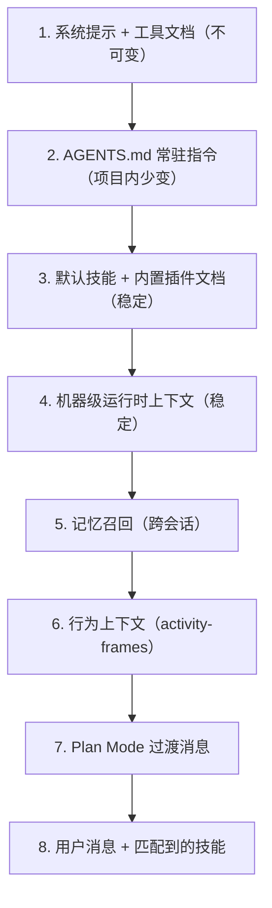

# Prompt System

`packages/core/src/prompt.ts` (approximately 34KB) is responsible for building all prompt templates; `SessionManager` assembles system messages in a fixed order at session creation (see [session-lifecycle](session-lifecycle.md)).

## Export surface (core index.ts)

- `getSystemPrompt(projectRoot, toolOptions)`: base system prompt + all tool documentation.
- `getCompactPrompt`: compact summary template (`COMPACT_PROMPT_BASE`, 9-section structure: primary request / key concepts / files and code / errors and fixes / problem solving / all user messages / to-dos / current work / optional next steps).
- `getRuntimeContext` / `getStableRuntimeContext`: machine-level runtime context (OS, shell path, node/python versions, installed tools rg/jq, etc.).
- `getDefaultSkillPrompt`: default skill prompt (`enabledSkills` filtered).
- `getPlanModePrompt`: Plan Mode prompt (`templates/prompts/plan.md`).
- `getExtensionRoot`, `getTools`: tool definitions (LLM function-calling shape).
- `buildSkillDocumentsPrompt`: skill → XML tag block (`<skill-name path="...">content</skill-name>`).

## System message chain order (cache-first)

Layers 1–4 form the **stable cache prefix**: DeepSeek prefix caching hits on consecutive leading bytes; the date/model lines change daily and per model, so they are deliberately not baked into the prefix, and are instead injected at the tail of each round's transient user message (see `activateSession`).

## Tool documentation templates

`packages/core/templates/tools/` (one `.md` template per built-in tool; `read.md.ejs` is EJS-rendered):

| Template | Corresponding tool |
| --- | --- |
| `bash.md` | bash (side-effect declaration spec, OS-Link guidance) |
| `read.md.ejs` | read (snippet contract description) |
| `write.md` | write |
| `edit.md` | edit (snippet required, unique match, batch count declaration) |
| `ask-user-question.md` | AskUserQuestion |
| `update-plan.md` | UpdatePlan |
| `web-search.md` | WebSearch |
| `web-fetch.md` | WebFetch |

`getSystemPrompt` reads each one, renders it, and appends it after the base system prompt.

## Skills injection

- Skill discovery and matching are covered in [session-lifecycle](session-lifecycle.md); this module handles rendering: `buildSkillDocumentsPrompt` wraps each skill document as an XML tag block and injects it into the system message.
- Large skill sharding (G3, `routing/skill-sharding.ts`): content exceeding the threshold is stored in shards and recalled/injected on demand (`SkillShardRecaller`), see [core/routing](../core/routing.md).
- Default skill template: `templates/skills/karpathy-guidelines.md` (injected as the default skill).
- Built-in plugin instruction documents: `templates/plugins/*/skill.plugin.md` (8 plugin packages), see [desktop/plugins](../desktop/plugins.md).

## Plan Mode

- `getPlanModePrompt` renders `templates/prompts/plan.md`: the first round is read-only and outputs `<proposed_plan>` etc. for user approval.
- Under Plan Mode, write/delete/Git change scopes force an ask (`PLAN_MODE_FORCE_ASK_SCOPES`), see [permission-system](permission-system.md).
- init command prompt template: `templates/prompts/init_command.md.ejs` (`renderInitCommandPrompt`).

## OS-Link command dictionary

`common/os-link.ts` maintains a cross-shell command dictionary (macOS/Windows/Linux + bash/zsh/fish/pwsh variants); `renderOsLinkPromptSection` injects it into the bash tool documentation, reducing the likelihood of the model mistyping commands in non-POSIX environments. Tests: `os-link.test.ts`.

## Runtime context

`getRuntimeContext` aggregates: OS platform, shell resolution path (`findGitBashPath`/`resolveShellPath`), node/python versions, `rg`/`jq` availability, encoding/locale. `getStableRuntimeContext` provides a stable subset that does not change across sessions.

## Focused tests

- `prompt.test.ts`: prompt chain assembly, tool document rendering, skill block format.
- `os-link.test.ts`: cross-shell dictionary and prompt rendering.
- `prefix-consistency.test.ts`: stable prefix invariant.

## Related pages

- [Session Lifecycle](session-lifecycle.md), [Message Conversion](message-conversion.md)
- [core/tools](../core/tools.md), [core/routing](../core/routing.md), [desktop/plugins](../desktop/plugins.md)