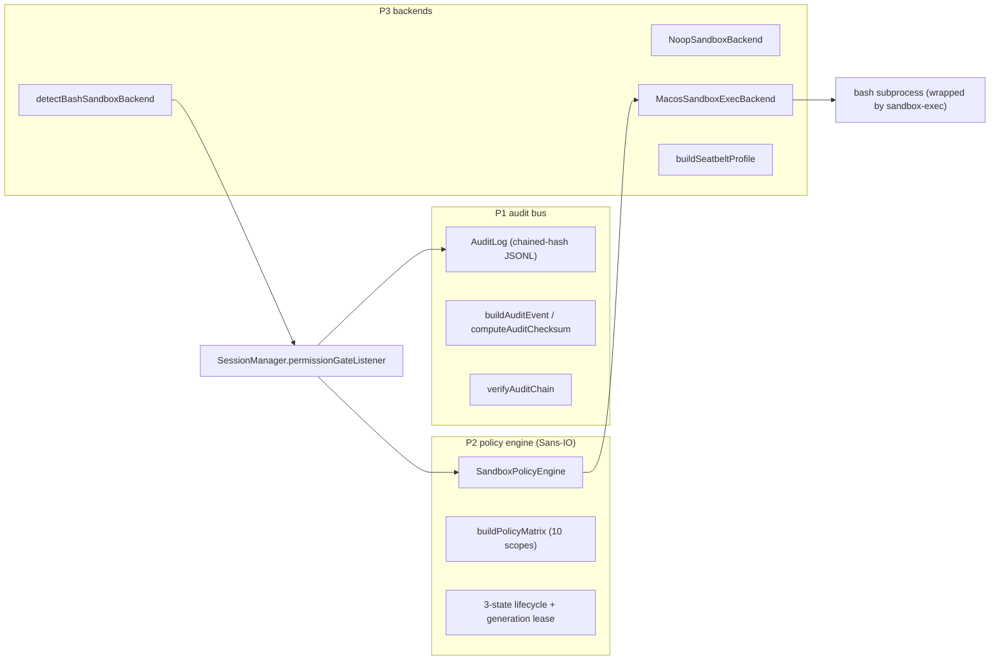

# Sandbox System (P1–P3)

The sandbox is a three-tier progressive implementation (specs/sandbox/design.md):

1. **P1 Side-Effect Audit Bus** (`sandbox/audit.ts`) — all side effects are auditable.
2. **P2 Sans-IO Policy Engine** (`sandbox/policy.ts`) — a pure-logic permission matrix + lifecycle + generation fencing.
3. **P3 Platform Backends** (`sandbox/backend/`) — the macOS `sandbox-exec` backend turns policy into a Seatbelt profile.

## P1 Side-Effect Audit Bus (`sandbox/audit.ts`)

- `AuditLog`: per-session append-only chained-hash JSONL audit log (via `getSessionAuditLog`).
- Three event types (`AuditEventType`): tool execution, file changes, process spawning, and other side-effect traces.
- `buildAuditEvent`/`canonicalJson`/`computeAuditChecksum`/`serializeAuditEvent`: event serialization and checksums (`canonicalJson` key sorting guarantees determinism).
- `verifyAuditChain`: validates chain integrity from start to end (tamper-evident/loss-evident), returning `firstBadIndex` — a **torn tail** still reports the number of verified entries (fail-open reads: audit entries after a bad/missing line remain readable).
- `parseAuditLine`/`readAuditEvents`: read side; the write side is fail-open (a write failure does not block the main flow).
- Tests: `audit.test.ts` (tampering with any single entry breaks the chain at that index).

## P2 Sans-IO Policy Engine (`sandbox/policy.ts`)

- `resolveScopeVerdict(scope, settings)`: single-scope verdict, with precedence mirroring `permissions.ts` (deny > ask > allow > defaultMode).
- `buildPolicyMatrix(settings)`: resolves all 10 scopes in one pass.
- `SandboxPolicyEngine`: 3-state lifecycle `creating → active → dead`; `beginGeneration()` issues a lease with a generation number; `decide(lease, scope)` is **fail-closed** — any non-active engine or expired (fenced) lease is always denied, no matter what the matrix says.
- `updateSettings` only affects future decisions; `kill()` is the only terminal-state entry point (host `dispose()`).
- Tests: `sandbox-policy.test.ts`.

## P3 Backends (`sandbox/backend/`)

| File | Responsibility |
| --- | --- |
| `interface.ts` | `SandboxBackend` interface, `SandboxProbeResult`, `SandboxBackendStatus` (degradation is never silent) |
| `noop.ts` | `NoopSandboxBackend`: pass-through backend when no sandbox is present |
| `macos-sandbox-exec.ts` | `MacosSandboxExecBackend` + `buildSeatbeltProfile` + `createMacosBackend` + `defaultTempWriteRoots`; generates a macOS Seatbelt profile from `PathGrant` (same-origin canonicalization of grant roots) |
| `detect.ts` | `detectBashSandboxBackend`: probes available backends by platform |

## Bash Sandbox Wiring

- `SessionManager.deriveBashSandbox(sessionId, toolCall)` / `getOrCreateBashBackend`: resolves the backend per session (probe + cache) and passes `BashSandboxSpawner` to `ToolExecutor`; `getOrCreateBashBackend` returns `{ backend, probe }`, and even when probing fails it **reports every unavailable candidate** before falling back to the noop result (asserted by `sandbox-status.test.ts`). The macOS backend's `wrapShell` forces bash, injects git environment variables, and refuses to run when the probe fails (`sandbox-backend.test.ts`).
- Network clause snapshot: `deriveBashSandbox` snapshots the network scope from the session's current permission settings (`getNetworkClause`) and passes it to the execution layer along with the spawner — mid-flight changes to permission settings cannot let an already-approved command silently gain network access.
- Mandatory degradation reporting: the backend selection result is pushed to the renderer layer via `onSandboxStatusChanged` → `IpcEvent.SandboxStatusChanged` (the UI shows the degradation notice) and is written to the audit log.
- When quarantined with no backend, bash is forced to ask (see [permission-system](permission-system.md)).
- Windows/unprivileged environments: the test suite skips Seatbelt assertions and POSIX script cases by convention (commits 25038e0c, f1f154d6).

## Path Gates (`common/path-boundary.ts`)

- `gateRead`/`gateWrite`: execution-time path boundary gates (wired into write/edit/read handlers).
- `PathGrant`: derived per tool call from the session using the R2 algorithm (`derivePathGrantForToolCall`), passed through via `ToolExecutionContext.pathGrant`.
- `PathBoundaryError`: structured boundary-violation error; `configureFileUtilsWriteBoundary` gives the file-utils write boundary a backstop assertion (grant-aware + host-injected).
- `grantOutsideRootsFlags`/`GateVerdict`: verdict forms.
- Tests: `path-boundary.test.ts`, `path-grants.test.ts`, `tool-handlers.test.ts` (gate wiring).

## Focused Tests

- `audit.test.ts`, `sandbox-policy.test.ts`, `sandbox-backend.test.ts` (13KB, Seatbelt assertions), `sandbox-status.test.ts`, `path-boundary.test.ts`.

## Related Pages

- [Permission System](permission-system.md), [Session Lifecycle](session-lifecycle.md)
- [core/overview](../core/overview.md) (export surface), [core/tools](../core/tools.md) (bash handler)
- Design basis: `specs/sandbox/design.md` + `tasks.md` (implementation-level breakdown of P0–P3).