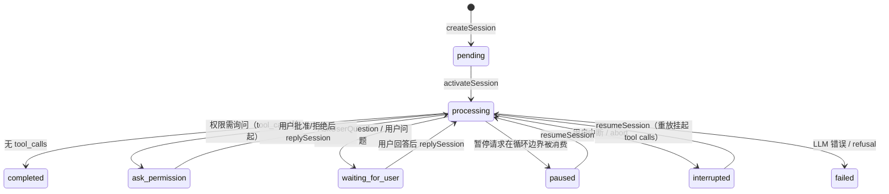
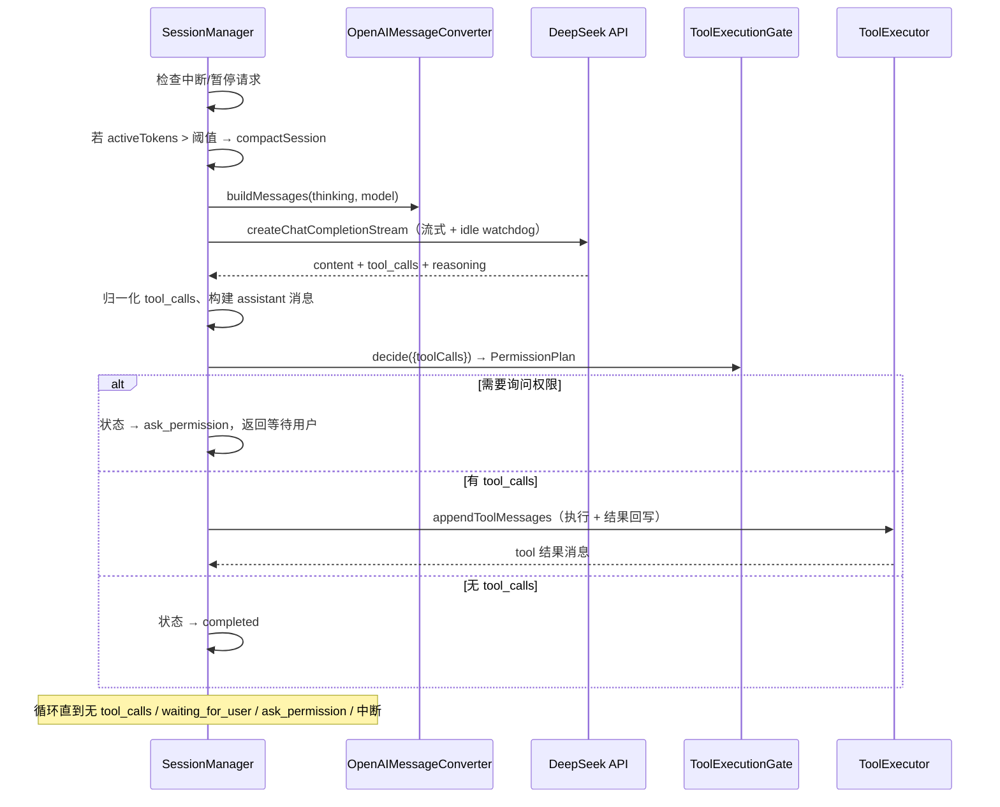

# Session Lifecycle and the LLM Tool-Calling Loop

`SessionManager` is the heart of the core engine: it manages the session state machine, the LLM tool-calling loop, compaction, persistence, Skills injection, built-in MCP server augmentation, and various finalization hooks. Since 2026-08-26 (commit f25770c4) the implementation lives in a **six-layer inheritance chain** — `session-manager-base.ts` (fields + constructor + LLM client/stream core) → `session-manager-mcp.ts` → `session-manager-skills.ts` → `session-manager-persistence.ts` → `session-manager-lifecycle.ts` → `session-manager-tasks.ts` — plus six module-level helpers (`session-types.ts`/`session-usage.ts`/`session-stream.ts`/`session-mcp-hints.ts`/`session-helpers.ts`/`session-constants.ts`). `packages/core/src/session.ts` is now a thin 97-line **composition root** that re-exports the stable public surface and defines `dispose()`; the split was AST-driven and byte-faithful (the module's public exports are unchanged). Upward references from lower layers are declared as `protected abstract` contracts. At construction time, the host (desktop `SessionBridge`) injects:

- `createOpenAIClient` / `createSecondaryClient` (client factories, see [common-utilities](../core/common-utilities.md))
- `fetchWebPage` (WebFetch's rendering/static fetcher, for which the desktop injects an offscreen Chromium version)
- Callback set: `onAssistantMessage`, `onSessionEntryUpdated`, `onLlmStreamProgress`, `onMcpStatusChanged`, `onSandboxStatusChanged`, `onProcessStdout`
- `getResolvedSettings` (settings snapshot)
- `memoryProvider` (the `MemoryProvider` interface implemented by `@deeporca/memory`)

## Session State Machine

Session entry (`SessionEntry`) states: `pending` → `processing` → `completed` | `failed` | `interrupted` | `ask_permission` | `waiting_for_user` | `paused`.

## Session Creation and Reply

- `handleUserPrompt(userPrompt)` routes to `createSession` (no active session) or `replySession` (active session), in both cases attaching the `AbortController` to `activePromptController`.
- `createSession`:
  1. Generates a UUID, initializes the file-history branch, writes the index entry (**flushing immediately, bypassing the debounce**), and prunes the oldest sessions beyond `MAX_SESSION_ENTRIES` (50 entries).
  2. Appends system messages in "most stable → most volatile" order: system prompt + tool documentation → AGENTS.md standing instructions → default skills + built-in plugin documentation → machine-level runtime context (a cache-friendly prefix design: the date/model line is deliberately absent from the persisted prefix and is instead injected per turn at **request time** as a transient user-message tail via `OpenAIMessageConverter.applyTurnTail` — see [message conversion](message-conversion.md)).
  3. Memory recall (`memoryProvider.recall`, **2-second race**, proceeding without memory on timeout), behavioral context, and Plan Mode transition messages.
  4. LLM skill matching (`identifyMatchingSkillNames`: candidate skill names + descriptions are sent to the model, which returns the matching names as JSON) and skill message injection.
  5. `activateSession` enters the loop.
- `replySession` has three branches (each ultimately re-enters `activateSession`):
  1. **Permission-reply continuation**: `hasUserPermissionReplies(userPrompt)` and there are trailing pending tool calls → call `activateSession(sessionId, controller, userPrompt)` directly (`buildPermissionToolExecution` synthesizes the tool message; see [permission system](permission-system.md)).
  2. **`/continue` fast path**: `isContinuePrompt(userPrompt)` (the text is exactly `/continue` with no images/skills) → call `activateSession` directly.
  3. **Normal reply**: update the entry to pending, append the Plan Mode transition, record the user-prompt checkpoint (detecting files the user manually modified and injecting a prompt), run skill matching (`identifyMatchingSkillNames`) with `appendSkillMessages` injection, and then call `activateSession`.

## Activation Loop (activateSession)

The core of `activateSession` is the `runActivationLoop` closure (each run carries independent state, which makes failure replay easier):

Loop essentials:

- Iteration cap `maxIterations = 80000` (a cost guardrail of roughly 1K RMB).
- Each iteration checks `isInterrupted` and `consumePauseRequest` (pauses are consumed at **two checkpoints**: at iteration start and after the assistant message is appended — the latter keeps tool calls pending so that, on resume, they execute through the trailing-pending path).
- Permission checks go through `toolExecutionGate.decide` (the first listener is the built-in permission check), and the decision is persisted with the assistant message's `meta.permissions`.
- Streaming responses are handled by `createChatCompletionStream`, paired with `withStreamIdleTimeout` (an idle watchdog, default 300s, configurable via `settings.streamIdleTimeoutMs`).
- Tool execution goes through `appendToolMessages` → `ToolExecutor.executeToolCalls` (see [core/tools](../core/tools.md)).

## Auto-Recovery (runActivationLoopWithAutoRecovery)

Exactly-once auto-recovery: `classifyLlmError` classifies the error as `CONTEXT_WINDOW_EXCEEDED` → compact and retry; `TIMEOUT` → retry as-is; all other errors, or a second failure, take the original failure path; abort and quota errors are never retried.

## Compaction (compactSession)

- Threshold: `settings.compactTokenThreshold` is the user override; otherwise it comes from the model-family registry (`getCompactPromptTokenThreshold`, DeepSeek V4 512K, others 128K).
- Selects the earlier 2/3 of non-system messages, generates a summary with the LLM (the `getCompactPrompt` template), marks old messages with `compacted: true`, and inserts an invisible system summary message; the original messages remain in the JSONL for auditing and UI display.
- Two-phase compaction details are in `compaction.test.ts`.

## Persistence

Storage location `~/.deeporca/projects/<project-code>/`:

| Path | Description |
| --- | --- |
| `sessions-index.json` | Session index: list + per-session summary (status, usage, usagePerModel, active tokens, tracked processes) |
| `<session-id>.jsonl` | Line-delimited JSON messages (including fields such as `compacted`, `checkpointHash`, and `meta`) |
| `file-history/.git` | Internal Git repository, used only for `/undo` code snapshots, not the project repository |

### ⚠️ Session-Index Debounce Invariant (Read Before Changing)

`loadSessionsIndex`/`saveSessionsIndex` index writes are **debounced (250ms)**, and the write target is the in-memory `pendingIndex`. Therefore:

- **Reads must prefer `pendingIndex` over the disk file.**
- `updateSessionEntry` is load→mutate→save and runs roughly 17 times within one streaming turn — if it reads a stale disk file, two updates in the same window each rebase on the old state, and the first update is **permanently lost** (this once corrupted the usage/usagePerModel accounting and dropped `permission_denied`).
- Terminal, user-visible decisions (create/delete/deny) call `flushSessionsIndex()` to bypass the debounce.
- `pendingIndex` holds the **in-memory form** (`processes` is a `Map`) and **must not** be passed through `normalizeSessionEntry` — that function expects the disk form, and its `Object.entries()` will silently drop every tracked process.

### Persistence Hardening (b316f3a7 — Read Before Changing)

- **flushSessionsIndex 顺序不变式**：`pendingIndex` 的清除点位于 rename **成功之后**——旧代码在写盘前清空，写失败时内存权威快照丢失、后续读回落过期磁盘文件（usage/permission_denied 永久丢失型损坏的根因之一）；失败保留快照可重试。debounce 定时器与 `dispose` 调用都有保护。
- **disposed 守卫**：`saveSessionsIndex`/`flushSessionsIndex` 检查 `this.disposed`——`reload()`/重建窗口换新 SessionManager 后，旧实例 abort-catch 的迟滞 `updateSessionEntry` 不得用陈旧快照覆盖新实例的索引。`dispose()` 里 `disposed = true` 必须**最后**翻转（其前仍要跑完最后的 index flush 与 A2UI surface 持久化）。
- **`saveSessionMessages` 原子写**：temp + rename 写 JSONL——compaction/undo/检查点重写中途崩溃不再截断丢失未压缩的尾部消息。
- **`appendSessionMessage` 镜像追加**：新消息镜像追加进内存缓存而非整体失效——消除激活循环每迭代全量重读重解析 JSONL 的 O(会话字节) 开销；附带索引落盘去 pretty-print 与 `assistantThinking` 持久化截断（2048 字符，渲染层零消费）。
- **开机清扫**：启动时残留 `processing` 条目清扫为 `interrupted`（挂起的 Resume 路径复活），以 `SWEEP_FAIL_REASON = "application restarted mid-run"` 标记判别——合成语义仍走保守的 outcome-unknown（不降级为 not-started，维持 29801ee0 的崩溃合成安全语义）。

## File History and Undo

- A new session initializes an internal branch named after the session ID; before user input, `recordUserPromptCheckpoint` records the state of tracked files; before and after a tool mutates files, checkpoints are recorded on demand (`prepareFileMutationCheckpoint`/`recordFileMutationCheckpoint`).
- The `checkpointHash` on user messages links conversation position to code state; `restoreUndo` supports two modes, `conversation` and `code-and-conversation`.
- Snapshots cover only tracked files; unrelated files are never rewritten by `/undo`.
- `GitFileHistory`'s `spawnSync` git calls carry a **10s hard timeout** (`GIT_SYNC_TIMEOUT_MS`) — a slow network drive or antivirus blocking git can no longer hang the host main thread forever (b316f3a7).

## Finalization Hooks (activateSession finally)

After an activation turn finishes, the following run in order: `maybeNotifyTaskCompletion` (system notification), `maybeSyncCodegraphIndex`, `maybeSyncCrgIndex`, `maybeSyncWikiIndex` (lazy knowledge-index sync), `maybeRunDiagnosticsCheck`, `maybeCaptureMemory` (memory capture, see [workflows/memory-pipeline](../workflows/memory-pipeline.md)).

## Other Responsibilities

- **Built-in MCP augmentation**: `augmentMcpServersWithBuiltins` conditionally appends the codegraph/serena/skill-spector/dembrandt servers based on the project and resolves GitMCP placeholder configuration; see [core/mcp](../core/mcp.md). `McpManager.refreshServerTools` gained a **per-server mutex** (b316f3a7): concurrent `tools/list-changed` notifications no longer double-register the same tool names, which previously made the OpenAI endpoint reject the whole request with a 400.
- **Skill discovery and injection**: skill scan roots `.deeporca/skills/` → `.agents/skills/` → user-level → bundled; `SKILL.md` frontmatter (name/description); LLM self-matching; sharding (`maybeShardSkillContent`, G3).
- **Background LLM**: `createBackgroundLlm`/`judgeViaLlm` for single-turn judgments used by the task tree, actions, skill matching, and so on.
- **Silent subagents**: `runSubagent` supports `silent: true` (hidden from lists/streams; the bridge also filters `isSilentSubagent` entries from the entry feed, see [desktop/session-bridge](../desktop/session-bridge.md)).
- **Sessionless background LLM task** (`runBackgroundLlmTask`, R2-2): skill-driven LLM loop with **no session at all** — no sessions-index entry, no message JSONL, no active-session switch, nothing streamed to the conversation view (invariant locked by `background-task.test.ts`). Powers `index.build-all`'s arch-scan stage and standalone `arch-scan.run` (via `ActionContext.runBackgroundTask`). Contract: narrow tool surface (`read`/`bash` + `mcp__a2ui__`/`mcp__codegraph__`/`mcp__serena__`), 80-iteration cap, cancellation via an adopted `AbortSignal` (stops at the next iteration boundary; produced arch surfaces are still flushed), A2UI surface-stamp-scoped flush into the target root's `.deeporca/prototypes/`. **Deliberately not gated by the session permission system**: issuing the build instruction IS the blanket pre-approval for this narrow tool surface (decision 2026-08-23, design-r2.md §三 R3-4); artifacts display only in the Index & Knowledge module.
- **Session locale**: `configureSessionLocale`/`formatSessionPrompt` (zh/en prompt templates). The desktop also forwards the app UI locale here and to the OpenWiki CLI `--language` flag (see [desktop/knowledge-indexing](../desktop/knowledge-indexing.md)).

## Focused Tests

- `session.test.ts` (split 2026-08-26 into three files with a shared helper; ~95 tests across the trio, byte-identical to the pre-split suite): covers the full session creation/reply/compaction/recovery/permissions paths; `session-persistence.test.ts` covers index debounce/flush ordering/atomic message writes/sweep; `session-skills-mcp.test.ts` covers skill discovery/injection and MCP augmentation. Shared setup lives in `session-test-utils.ts` (`registerSessionTestCleanup` restores fetch/HOME and cleans temp dirs).
- `background-task.test.ts`: sessionless background task leaves zero session residue.
- `compaction.test.ts`, `resume-synthesis.test.ts`: compaction and resume synthesis.
- `tool-execution-gate.test.ts`: execution-layer gate semantics.
- `memory-leak.test.ts`: message cache and process cleanup.
- `prefix-consistency.test.ts`: cache-friendly prefix stability.

## Related Pages

- [Prompt System](prompt-system.md), [Message Conversion](message-conversion.md), [Permission System](permission-system.md)
- [core/tools](../core/tools.md), [core/mcp](../core/mcp.md), [core/actions](../core/actions.md)
- [workflows/llm-tool-loop](../workflows/llm-tool-loop.md), [workflows/memory-pipeline](../workflows/memory-pipeline.md)