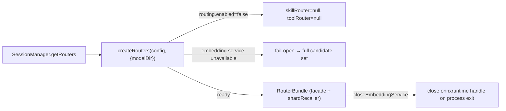

# Semantic Routing

`packages/core/src/routing/` implements embedding-based recall that narrows the content reaching the LLM: full candidate set of skills/tools → the subset most relevant to the current turn. Designed according to `specs/skill-routing/design.md`.

## Two-Layer Routing

- **M1–M3 single routing**: `SkillRouter.shortlist` (skill shortlist) + `ToolRouter.select` (MCP tool gated selection).
- **M4 compositional routing**: `SkillRouter.composeRoute` — Decompose-Retrieve-Compose pipeline (Gao 2026, "Compositional Skill Routing for LLM Agents"): `runSad` (SAD decomposition) + `composePlan`/`detectDependencies`/`ioTypeCoercion`/`keywordCooccurrence` (Composer compatibility planning).

## Key Components

| File | Responsibility |
| --- | --- |
| `embedding-loader.ts` | Dynamically imports `@deeporca/embedding` (keeps core module loading fast, gracefully degrades when the model is missing); `configureRoutingModelDir`/`configureRoutingLogger`/`closeEmbeddingService` |
| `vector-index.ts` | `VectorIndex`: embedding vector index and hits |
| `skill-router.ts` | `SkillRouterImpl` (shortlist/composeRoute) |
| `tool-router.ts` | `ToolRouterImpl` (gates MCP tools by token budget) |
| `routing-facade.ts` | `RoutingFacade`: **session-level decision point** (G2 freezes the tool set: decided once per session, then byte-level unchanged; R1 invalidation reroutes) |
| `skill-sharding.ts` + `skill-shard-recaller.ts` | G3 large-skill shard storage and on-demand recall injection |
| `sad.ts` | SAD decomposition (jaccard category matching) |
| `composer.ts` | Composition planning (IO type coercion, keyword co-occurrence, dependency detection) |
| `telemetry.ts` | Routing event instrumentation (setRoutingEventSink) |
| `types.ts` | `RoutingConfig` (enabled/skillTopK/skillMinPool/mcpToolGating/mcpTokenBudget/pinnedServers), `RouterBundle` |

## Lifecycle and Degradation

- **fail-open**: any failure returns null/undefined, and the caller uses the full candidate set (routing must never block a session).
- Model directory resolution chain: `DEEPORCA_ROUTING_MODEL_DIR` env → `configureRoutingModelDir()` (host injection) → repository-relative fallback. Warmup is fire-and-forget — bad paths only surface asynchronously, so the host logger (`configureRoutingLogger`) must remain wired.
- **Load failure backoff**: after one load failure, **do not retry for 60 seconds** (`routing-hygiene.test.ts`: a recent failure is not retried on every prompt); closing during loading (`closeEmbeddingService` generational fencing) discards late-arriving service instances.
- The embedding service is a **process-level singleton** (holds onnxruntime native handles): `SessionManager.dispose()` only drops the router bundle; the host calls `closeEmbeddingService()` during application teardown.
- **Disk cache**: `vector-index` caches vectors to disk; cache hits during rebuild skip re-embedding (asserted in `routing.test.ts`).

## Session Integration

- `getRouters()` (lazy construction); `computeRoutedMcpTools`: full MCP tool set → routed subset (G2 gating + token budget).
- **RoutingFacade freezing semantics**: `decideToolRoute` decides once per session (`frozen` map), then remains **byte-level unchanged** until `invalidate`/`invalidateAll` (R1 invalidation rerouting); fail-open to full set when no tool router; `collectServerNames` uses servers declared but not connected that were hit by routing as lazy-connect hints (G2 data-flow loop closure).
- **ToolRouterImpl.select**: token budget estimation (uses real values when `schemaJson` is available), **server-level granularity** (an entire server either fully passes or is fully gated), `pinnedServers` always pass, `indexedSignature` changes trigger re-indexing, any error returns undefined → full tool set.
- **SkillRouterImpl.shortlist**: skips routing when candidate count ≤ `skillMinPool`; `isLoaded` skills pass through (do not consume topK slots); `composeRoute` returns null if the full pipeline fails.
- The skill shortlist (`identifyMatchingSkillNames`) merges matching skills into `userPrompt.skills` during createSession/replySession.
- Shard recall: `maybeShardSkillContent` — shards large skill content, and `SkillShardRecaller` recalls relevant shards by user prompt and injects them.

## Focused Tests

- `routing.test.ts` (26KB): shortlist/composeRoute/vector index.
- `routing-facade.test.ts`: session freezing and invalidation.
- `routing-gating.test.ts`: MCP gating budget and pinned servers.
- `routing-hygiene.test.ts`: routing hygiene (does not leak full sets, etc.).
- `skill-sharding.test.ts`, `skill-match-cache.test.ts`, `skill-metadata.test.ts`.

## Related Pages

- [Architecture/Prompt System](../architecture/prompt-system.md) (skill injection rendering)
- [embedding](../embedding/overview.md) (embedding service implementation)
- [Architecture/Session Lifecycle](../architecture/session-lifecycle.md) (RouterBundle consumption)
- [desktop/main-process](../desktop/main-process.md) (configureRoutingModelDir injection)