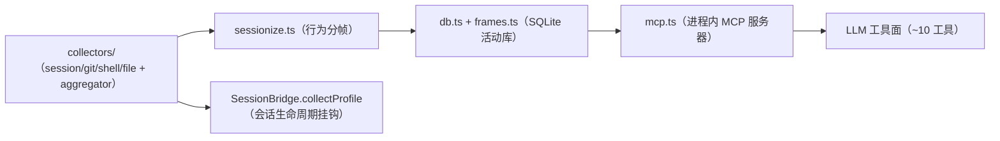

# Activity-Frames Behavior Memory

Activity-Frames is **session-level behavior memory**: it collects behavior frames such as "the user edited auth.ts and ran git commit in the last few minutes" and exposes them to the agent via an in-process MCP server. It complements `@deeporca/memory` (cross-project semantic memory: preferences/facts/persona):

- `@deeporca/memory`: "User prefers TypeScript + React"
- activity-frames: "Edited auth.ts and ran git commit in the last 5 minutes"

## Architecture

## Source Files (`main/tools/activity-frames/`)

| File | Responsibility |
| --- | --- |
| `mcp.ts` (491 lines) | In-process MCP server: registers ~10 tools (behavioral tools such as screen-capture) |
| `entities.ts` (14.4KB) | Entity models (Frame/Session/Event, etc.) |
| `sessionize.ts` (10.7KB) | Frames collected events into behavioral sessions |
| `db.ts` (6.4KB) | SQLite activity store |
| `frames.ts` (9.8KB) | Frame aggregation/querying |
| `time.ts`, `types.ts` | Time windows and types |
| `collectors/aggregator.ts` | Collection aggregation entry point |
| `collectors/session-collector.ts` (11.6KB) | Session event collection |
| `collectors/git-collector.ts` (5.9KB) | Git operation collection |
| `collectors/shell-collector.ts` (4.5KB) | Shell command collection |
| `collectors/file-collector.ts` (4.9KB) | File operation collection |

## core seam

`core/src/mcp/activity-frames-seam.ts`: `ACTIVITY_FRAMES_MCP_SERVER_NAME` + `configureActivityFramesServerBuilder`/`getActivityFramesServerBuilder`—the builder is injected at desktop startup, and core's `augmentMcpServersWithBuiltins` registers the server.

## Injection Points and Lifecycle

- Behavior context injection: when `settings.behaviorContext: true`, a compact BehavioralProfile summary is prepended to new sessions (hidden system message; opt-in, costs prompt tokens).
- Session lifecycle hooks: SessionBridge calls `collectProfile` as the session progresses.
- Pipeline B integrates with the task tree: `probeTaskRecallAtDecision` (core session) probes task memory at decision points.

## Focused Tests

- `activity-frames-core.test.ts` (12KB): core logic for framing/aggregation/querying.
- `app-boot.test.ts`: builder injection wiring.

## Related Pages

- [memory/overview](../memory/overview.md) (complementary positioning)
- [core/mcp](../core/mcp.md) (built-in MCP server list)
- [session-bridge](session-bridge.md) (collectProfile hook)