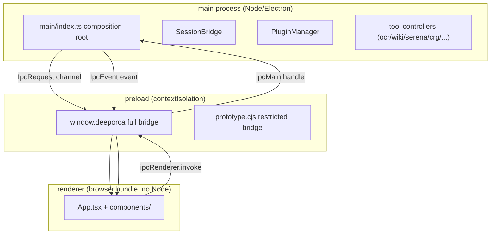

# @deeporca/desktop Overview

`@deeporca/desktop` is the Electron GUI client built on top of the `@deeporca/core` engine. `main`/`types`: `dist/main.js` (Electron main process). Dependencies: core, memory, react/react-dom, monaco-editor, @openuidev/lang-core (OpenUI Lang), streamdown/remark-breaks (markdown → React 渲染, replaces marked/dompurify), mermaid (架构图 SVG 渲染), @a2ui/react + @a2ui/web_core (官方 A2UI v0.9 协议引擎), @alibaba-group/open-code-review, @colbymchenry/codegraph.

## Three-Layer Architecture

- **main/**: contains the engine and all capabilities (`main/index.ts` composition root, `session-bridge.ts`, `action-ipc.ts`, tool controllers, plugin management).
- **preload/**: exposes a typed `window.deeporca` under contextIsolation (`preload/index.ts`); prototype windows use the restricted `preload/prototype.ts` (only the A2UI surface + window-close surface, no file/settings/Git/MCP).
- **renderer/**: React browser bundle (`App.tsx`, `components/`, `hooks/`, `i18n/`, `lib/`, `ui/`, `a2ui/`, `dd/`, `openui/`).
- **shared/ipc.ts**: dependency-free contract (types + `IpcRequest`/`IpcEvent` channel constants), bundled on both sides.

## Build Artifacts

`packages/desktop/build.mjs` (esbuild) produces:

| Artifact | Format | Description |
| --- | --- | --- |
| `dist/main.js` | ESM | Main process; node dependencies + core kept external |
| `dist/preload.cjs` | CJS | Required for sandboxed preload |
| `dist/prototype.cjs` | CJS | Prototype window preload (restricted) |
| `dist/renderer/` | Browser | React bundle + html/css (lazy-loaded, e.g., Monaco) |

See [build-and-vendoring](build-and-vendoring.md).

## Testing

`packages/desktop/src/tests/run-tests.mjs` (node:test + tsx + jsdom DOM harness). Covers: IPC contract/security, app startup path, gitmcp tools, dd packaging, design-store, activity-frames, safe-path, workspace-trust, streamdown markdown security boundary, a2ui processor/normalize/persistence, build-job stages, task trajectory, symbol-graph query, etc.

## Related Pages

- [main-process](main-process.md), [session-bridge](session-bridge.md), [ipc-contract](ipc-contract.md), [preload](preload.md)
- [renderer](renderer.md), [renderer-components](renderer-components.md)
- [plugins](plugins.md), [knowledge-indexing](knowledge-indexing.md), [design-system](design-system.md), [main-tools](main-tools.md), [activity-frames](activity-frames.md), [build-and-vendoring](build-and-vendoring.md)
- [Architecture Overview](../architecture/overview.md) (layer rules)