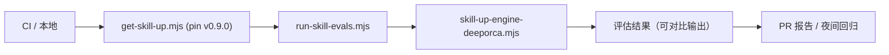

# 技能评估与升级 harness（specs/skill-eval）

技能评估体系让「技能质量」可回归（收官计划 A 线，commit 2c981422）：skill-up 引擎评估技能效果，结果可在 CI 中对比，防止技能更新引入质量回退。

## 组件

| 脚本 | 职责 |
| --- | --- |
| `scripts/get-skill-up.mjs`（11.5KB） | 下载 **pin 版本** skill-up 二进制（`SKILL_UP_VERSION = "v0.9.0"`），缓存本地，安全姿态（校验版本、避免任意远程执行） |
| `scripts/run-skill-evals.mjs`（13KB） | eval 运行器：定位 skill-up、构造数据集、执行评估、输出可对比结果 |
| `scripts/skill-up-engine-deeporca.mjs`（11.4KB） | DeepOrca 专用评估引擎（skill-up 的 deeporca 引擎适配） |

## 运行模式（`.github/workflows/skill-evals.yml`）

- **PR 报告模式**：PR 触发时运行，输出报告注释（质量对比）。
- **夜间模式**：定时全量评估，防回归漂移。
- 数据集存放：`packages/core/templates/plugins/*/evals/`（各插件包自带 eval 数据）。

## 数据流

## 聚焦验证

- 手动：`node scripts/run-skill-evals.mjs`（需本地 skill-up 就绪）。
- CI：`.github/workflows/skill-evals.yml`。

## 相关页面

- [plugins](plugins.md)（evals/ 数据集的宿主）
- [build-and-vendoring](build-and-vendoring.md)（同族脚本与 pin 策略）
