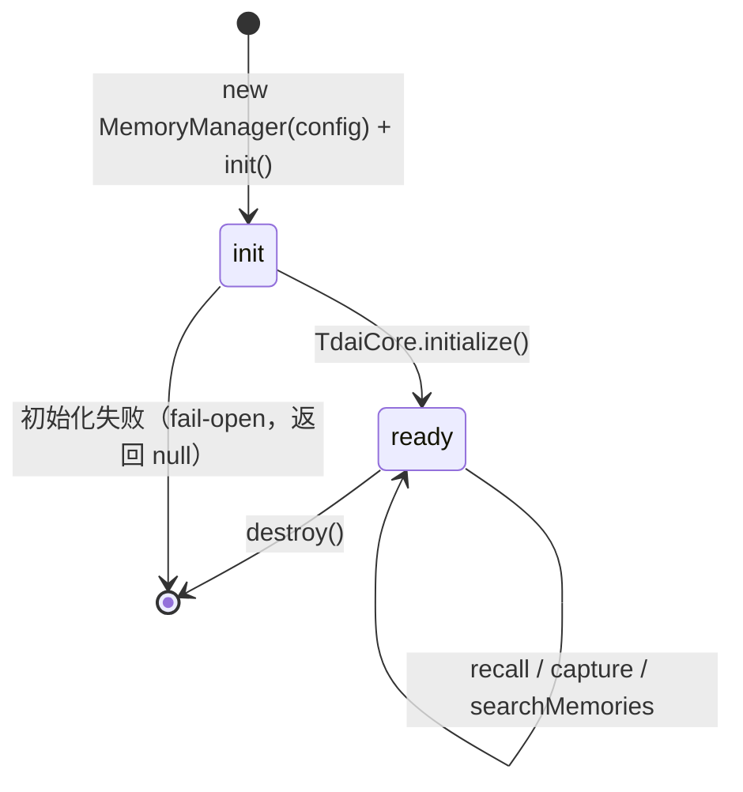

# "@deeporca/memory" 记忆流水线

`@deeporca/memory` 把 TDAI Core（TencentDB Agent Memory）作为**进程内库**集成（无 HTTP sidecar），提供跨会话语义记忆：L0 原始对话 → L1 原子事实 → L2 场景片段 → L3 用户 persona。被 desktop 消费，作为 `MemoryProvider` 注入 core（[session-bridge](../desktop/session-bridge.md)）。

## 入口与导出

- `src/index.ts`：`MemoryManager`、`DeepOrcaHostAdapter`、`MemoryUsageStats`。
- `src/memory-manager.ts`（17KB）：流水线管理器。
- `src/adapter.ts`（12KB）：TDAI HostAdapter + LLMRunner 实现。
- `src/runner-tools.ts`（8.9KB）：L2/L3 文件工具（沙箱化 read/write/edit）。
- `src/tdai/`：完全自包含的 TDAI Core fork（[tdai-core](tdai-core.md)）。

## MemoryManager 生命周期

- `init()`：`parseConfig` 官方解析器装配配置（capture/extraction/persona/pipeline/recall/embedding/storeBackend/bm25/llm/offload）；默认 `everyNConversations: 10`（settings.memory 可覆盖）、recall strategy "hybrid"、**`timeoutMs: 5000`**、`maxCharsPerMemory: 300`、`maxTotalRecallChars: 2000`；BM25 默认开启（`language: "zh"`）。
- `recall(query, sessionKey)`：`core.handleBeforeRecall`（混合检索）。
- `capture(turn)`：`core.handleTurnCommitted`——结构化 messages（带真实 id/timestamp）优先，否则合成两行；L0 记录跳过空 content；**lineage（system 角色）条目持久化到 L0 但排除在 L1 提取输入之外**（T4.3，`phase4-governance.test.ts` 断言）。L1 输出校验器：`sanitizeSourceMessageIds` 保留已知 id、重置幻觉 id（`l1-validation.test.ts`）。
- `searchMemories(query, limit)`：直接检索（知识面板用）。
- `getStats()`：从磁盘布局计数（conversations/records/scene_blocks/persona.md），不经过 TdaiCore，便宜且初始化中也可用。
- `clearProjectMemory()`：清空 L0-L3 后重建（知识面板「清空记忆」）。
- `destroy()`：关闭 SQLite/store/cleaner。

## DeepOrcaHostAdapter（`adapter.ts`）

- **LLM 桥**：直接 fetch OpenAI-compatible chat-completions（无 Vercel AI SDK 依赖），工具调用支持（`MAX_TOOL_ITERATIONS = 20` 轮）。
- **Telemetry**：`MemoryGenerationInfo` 每次 `run()` 发射一次（**含失败：`ok: false` + error 照常上报**），层经 `deriveLayer(taskId)` 派生（l1-extraction → l1、scene-extract-* → l2、persona-generation → l3、其余 other）；`DeepOrcaHostAdapter` 直连 fetch OpenAI runner（无 Vercel AI SDK），工具回路 `MAX_TOOL_ITERATIONS = 20`。
- **检索变体**：`buildRecallQueryVariants` 为 hybrid 检索生成多查询改写——**事件变体剥离时间表达式**（时间戳对跨时间检索无益）；`fuseByRrf`（RRF，k=60）融合。
- **Embedding 桥**：`provider: "none"`（默认，BM25/FTS 关键词）或 `"local-onnx"`（Granite 97M R2，经 `@deeporca/embedding`，需 `graniteModelDir`）。
- **Runner 工具**（`runner-tools.ts`）：L2/L3 需要写文件时经沙箱文件工具回路——`resolveSandboxedPath` 拒绝路径穿越（越界尝试**拒绝并回报给模型**而非写入）；`allowedFiles` 加固 L3 沙箱：`persona.md` 可写、`vectors.db` **永不**可写。
- **profile-sync 文件名包含性**（`tdai/core/profile/profile-sync.ts`，安全审计 2026-08-12 §5.1）：远端返回的 profile 文件名**只接受纯 basename**（`path.basename(filename) !== filename` → 拒绝），解析后必须落在临时拉取目录内——阻断 `../..` 或绝对路径把 writeFile 写到沙箱外（`profile-sync-security.test.ts`）。

## 生成审计与消耗可见性

- `createGenerationRecorder`：内存计数 + best-effort JSONL 审计（`<dataDir>/.metadata/generation-log.jsonl`）；写失败永不传播。
- `MemoryUsageStats`：calls/failedCalls/promptTokens/completionTokens/byLayer（l1/l2/l3/other）——知识面板的消耗可见性（specs/memory-remediation Phase 2）。

## 保留策略（Phase 4 / T4.2）

- `LocalMemoryCleaner`（tdai/utils/memory-cleaner.js）：每日 03:30 清理；L0 30 天 / L1 `max(90, retentionDays*3)` 天；**最低保留护栏**（不低于 50 L0 / 20 L1 行）；`retentionDays: 0` 禁用。
- 数据目录：`<userConfigRoot>/memory/<projectCode>`（**项目级隔离**——项目 A 学到的秘密不会在项目 B 召回；早期全局目录是跨项目数据泄漏向量）。

## 与 activity-frames 的定位

见 [activity-frames](../desktop/activity-frames.md)：memory = 跨项目语义记忆；activity-frames = 会话级行为帧。

## 聚焦测试（`src/tests/`）

- `capture.test.ts`（L0 记录）、`query-variants.test.ts`（hybrid 多查询改写 + fuseByRrf k=60）、`l1-validation.test.ts`（L1 输出校验器：幻觉 id 重置/批内去重/假精度日期软告警）、`runner-toolloop.test.ts`（L2/L3 工具回路 14.6KB）、`store-cache.test.ts`、`phase4-governance.test.ts`（保留/治理）、`generation-telemetry.test.ts`、`profile-sync-security.test.ts`、`phase0-stopgap.test.ts`。

## 相关页面

- [tdai-core](tdai-core.md)（fork 结构）
- [workflows/memory-pipeline](../workflows/memory-pipeline.md)（端到端）
- [desktop/main-process](../desktop/main-process.md)（startMemory/stopMemory/reconcileMemory）
