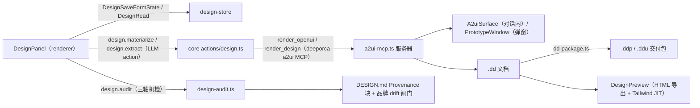

# 设计工作流

从设计面板到可交付设计产物的端到端路径。三大能力（原型/UI 设计稿/审计）共用设计 MCP 服务器与 design-store。

## 阶段

1. **设计输入**：DesignPanel 保存表单状态（`DesignSaveFormState`）；设计文档经 `design.materialize`（LLM 生成宏结构骨架）或 `design.extract`（从现有页面抽取令牌，dembrandt 品牌摄取）。
2. **渲染**：进程内设计 MCP 服务器（`deeporca-a2ui`，11 工具三族）的 `render_openui`/`render_design`/`render_surface` 产出对话内 surface 或原型窗口；原型窗口用受限 preload + `A2uiRequestPayload` 握手。
3. **审计闸门**：`design.audit`（三轴机检：宏结构/taste/门禁 12-19）+ dembrandt 版权拒绝清单 → DESIGN.md Provenance 块；**品牌 drift 闸门**（specs/ui-domain-regroup 后迁入设计面板）。
4. **交付**：`.dd` 文档 → `dd-package.ts` 构建 `.ddp`（原型包）/`.ddu`（UI 文档包）；HTML 导出（standalone，含 vendored Tailwind JIT）。
5. **持久化**：design-store（`<root>/.deeporca/designs/` 之类，经 DesignList/Read/Delete IPC）。

## 入口与 Action

- IPC：`DesignList/Read/Delete/SaveFormState/ReadFormState/ExportPackage`、`A2uiAction/A2uiOpenWindow/A2uiRequestPayload`（[ipc-contract](../desktop/ipc-contract.md)）。
- core actions：`design.materialize`、`design.extract`、`design.audit`、`bento.create`、`browser.*`（[core/actions](../core/actions.md)）。

## 相关页面与验证

- [desktop/design-system](../desktop/design-system.md)、[desktop/main-tools](../desktop/main-tools.md)
- 聚焦测试：`design-action.test.ts`、`design-audit.test.ts`、`dd-parser.test.ts`、`dd-package.test.ts`、`design-store.test.ts`、`a2ui-processor.test.ts`、`design-a2ui-boundary.test.ts`、core `design-dembrandt.test.ts`。
- 窄验证：`node packages/desktop/src/tests/run-tests.mjs packages/desktop/src/tests/dd-package.test.ts`
