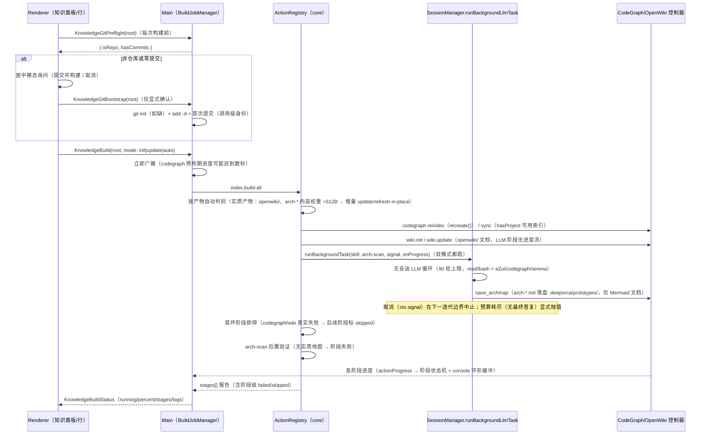

# 知识构建（一键串行流水线）

知识仪表盘的一键构建把知识源串成一条**可观测**的流水线，作业由 **main 进程的 BuildJobManager** 持有（renderer 是只读订阅），驱动 core 的 ActionRegistry 执行 `index.build-all`。



> 图：一键构建的端到端时序——renderer 先做 git preflight（必要时 bootstrap 引导），再发起 → BuildJobManager 持有作业 → index.build-all 串行执行三阶段（codegraph → wiki → arch-scan，**双模式都跑**）→ 阶段状态机 + console 日志回传 UI。

## 阶段与顺序

1. **CodeGraph 索引**：`codegraph.reindex`（SdkCodegraphController，SDK；已初始化且 db 含真实符号的工作区走增量 `sync`——路由输入是 `hasProject` 的**可用索引**判定）。`reindex` 用 `close()` + `CodeGraph.recreate(root)`（2026-08-28 修：`CodeGraph.init` 对已在盘上索引的项目抛 "already initialized"，重启后无内存实例可 uninitialize；recreate 是 SDK 文档化的 `codegraph index` 等价路径），完成后**后置校验**——0 符号（`kind NOT IN ('import','unknown','file')` 计数）抛 "CodeGraph indexed 0 symbols"，空 parse 不再读作绿色阶段。产物 `.codegraph/codegraph.db` 供符号子 tab SQLite 查询与符号关系图。
2. **OpenWiki 文档**：`wiki.init`/`wiki.update`（WikiCliController spawn vendored CLI；先写 CodeGraph/Serena connector 配置；**语言取自 app UI locale**）。wiki 阶段自身无进度流，heartbeat 每 20s 报「运行中 Ns · 已生成 N 页 / N pages written」（双语进度行）。**按产物内容权重自动判别**：`openwiki/` 有 >512B 的实质页 → 即使按 init 也走增量 update（83cc41a5）；**退出后实质页守卫**（`countSubstantialWikiPages`）——0 实质页即失败，hint 区分 `wiki-empty`（模型没驱动工具协议）与 `wiki-git`（仓库零提交，先 commit 再构建）。
3. **架构图**（**双模式都跑**——update 跳过 arch 曾被真机反馈为「架构图没有执行」）：`arch-scan.run` 经**无会话后台任务**执行（`runBackgroundTask`，R2-2）→ `save_archmap` 落盘 **Mermaid 文档** `.deeporca/prototypes/arch-<name>.md`（**仅 markdown**：`format`/`html` 参数与 `arch-*.html` 分层板 2026-08-28 退役）→ Knowledge 面板「架构图」子 tab 只渲染 ```mermaid 围栏。已有 `arch-*` 实质产物时走 **refresh-in-place 增量提示**（保持同名、只改受影响图，不删旧产物）。遗留 `arch-*.json`（A2UI surface）仍经 A2UI 预览路径渲染。完成后**后置验证**（`hasExistingArchmaps`：>512B 且 `.md` 含 mermaid fence）——模型全程没调 `save_archmap` 则阶段失败。

## 阶段可观测（R3-5）

- 每阶段状态机：`pending → running → done | failed | skipped`（`KnowledgeBuildStageState`，阶段 id：`codegraph`/`wiki`/`arch-scan`），加 `detail`/`error`/起止时间；console 日志环形缓冲（500 行）+ `updatedAt` 活性。
- **阶段失败表面化**：`index.build-all` 把阶段错误收进 `stages[]` 正常返回，BuildJobManager 逐阶段核对——失败的 wiki/arch 阶段不再显示为「完成」；action 抛错时仍 `running` 的阶段统一补标 failed。
- 首个广播立即发出：codegraph 预热期没有进度行的窗口内，行/知识 tab 也能看到 busy 状态。
- **进度文案双语化**（2026-08-26）：wiki-cli 心跳/强制结束/完成标记进度行「中文 / English」双语。

## 失败语义与取消

- **首坏阶段即停**（2026-08-28，spec design B1，`phase-actions.test.ts` 链停回归锁定）：codegraph/wiki 阶段**真实失败**后，后续阶段标 `skipped`（错误注明 "earlier stage failed"）而不是在残缺证据上继续（arch-scan 消费 wiki+codegraph 证据，继续跑只会烧 LLM token）；「控制器未注入」导致的 skipped **不阻断**（环境缺失 ≠ 失败）。
- **后置验证是阶段成功的一部分**：codegraph 0 符号、wiki 0 实质页、arch-scan 无实质地图都算阶段失败——resolved promise / exit 0 / 完成标记都不可信（真机 2026-08-28 三连：37B 骨架、exit 0、空 parse 全曾读作成功）。
- **后台任务预算耗尽显式失败**：`runBackgroundLlmTask` 在 80 轮上限内未产出最终答复（`finalContent === null`，通常是工具错误循环）抛错——调用方（arch-scan 阶段）记 failed 而非绿勾。
- 取消传播：构建 action 的 `ctx.signal` 接入后台任务——取消构建在下一迭代边界中止 LLM 循环（否则 80 轮扫描会无视取消跑满）；已产出的 surface 仍 flush。
- 会话零残留（R2-2 约束）：后台任务不建会话、不写消息 JSONL、不进会话列表、不流向会话视图（`background-task.test.ts` 锁定）。

## 入口

- IPC：`KnowledgeGitPreflight`/`KnowledgeGitBootstrap`（构建前置引导）、`KnowledgeBuild`/`KnowledgeBuildStatus`/`KnowledgeStatus`/`KnowledgeListSymbols`/`KnowledgeSymbolGraph`/`KnowledgeReadAgents`/`KnowledgeReadArchmap`/`MemoryRoutingStatus`（[ipc-contract](../desktop/ipc-contract.md)）。
- Action：`index.build-all`、`codegraph.*`、`wiki.*`、`crg.*`、`arch-scan.run`（[core/actions](../core/actions.md)）。

## 相关页面与验证

- [desktop/knowledge-indexing](../desktop/knowledge-indexing.md)、[core/actions](../core/actions.md)、[架构/会话生命周期](../architecture/session-lifecycle.md)（runBackgroundLlmTask）
- 聚焦测试：`build-job-manager.test.ts`（阶段/日志/失败表面化）、`knowledge-build-progress.test.ts`（阶段清单 UI）、desktop `git-preflight.test.ts`（引导矩阵）、core `background-task.test.ts`/`phase-actions.test.ts`（链停 + arch 后置验证）。
- 窄验证：`node packages/core/src/tests/run-tests.mjs packages/core/src/tests/background-task.test.ts packages/core/src/tests/phase-actions.test.ts`
