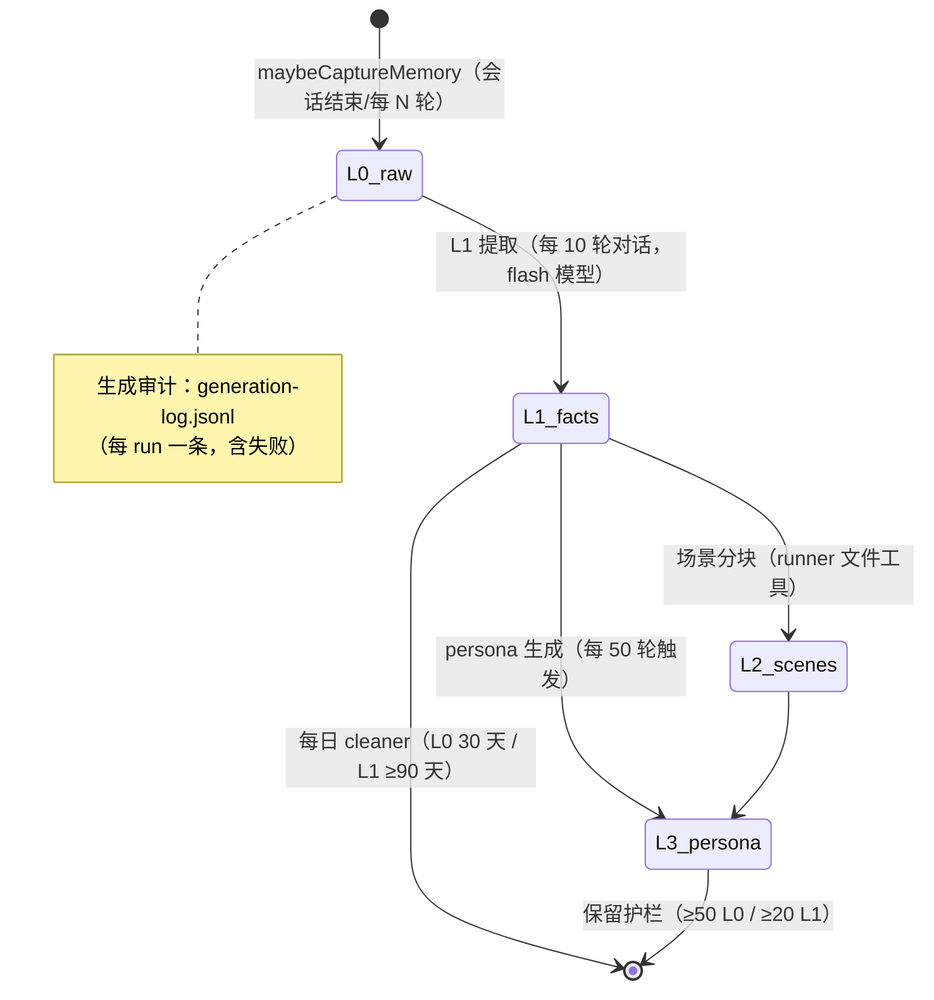

# 记忆流水线（L0–L3 捕获/召回/注入）

跨会话记忆的完整生命周期：会话结束把对话写入 L0，经蒸馏升到 L1/L2/L3；新会话开始时把相关记忆注入系统提示。

## 捕获（写路径）

1. core `SessionManager` 在 `activateSession` 的 finally 调 `maybeCaptureMemory`（`memoryProvider.isAvailable()` 时）。
2. `MemoryProvider.capture` → `MemoryManager.capture({ userText, assistantText, sessionKey, messages })` → `TdaiCore.handleTurnCommitted(completedTurn)`。
3. `messages[]` 必须非空（L0 recorder 只持久化 messages 里的条目）；带真实 id/timestamp 的结构化消息优先。
4. L1 蒸馏：每 `everyNConversations`（默认 10，settings.memory 可覆盖）轮跑一次 flash 提取；L3 persona 每 50 轮。

## 召回（读路径）

1. `createSession`：`memoryProvider.recall(userPrompt.text, sessionId)`，**2s race**——快则同步注入 `getMemoryPrompt(recall)` 为 system 消息；慢则不带记忆继续（记忆永不阻塞会话创建）。
2. 召回策略 "hybrid"：向量（Granite local-onnx 可选）+ 关键词（BM25/FTS，默认）；查询改写（query-variants）+ `fuseByRrf k=60` 融合。
3. **有界注入**（Phase 4/T4.4）：`maxCharsPerMemory: 300`、`maxTotalRecallChars: 2000`——避免单条长原子事实或 persona 永久随行。
4. L1 输出校验器：幻觉 id 重置、批内去重、假精度日期软告警；时间保真与原子性是硬规则。

## 记忆工具（LLM 面）

- `memoryProvider.getToolDefinitions()` 提供只读检索工具（Phase 4/T4.1），经 executor 的记忆桥分发，无权限门（纯读）。
- 可用时并入 `activateSession` 的 tools 列表。

## 生命周期控制（desktop）

- 启停：`startMemory`/`stopMemory`/`reconcileMemory`（module-scope，启动/设置保存/项目切换/关停都会走）。
- 数据目录：`<userConfigRoot>/memory/<projectCode>`（项目隔离）。
- 面板：知识仪表盘 MemoryStats（l0/l1/l2/l3 + usage）、清空按钮（`clearProjectMemory` 后重建）。

## 相关页面与验证

- [memory/overview](../memory/overview.md)、[memory/tdai-core](../memory/tdai-core.md)、[desktop/session-bridge](../desktop/session-bridge.md)
- 聚焦测试：`capture.test.ts`、`query-variants.test.ts`、`l1-validation.test.ts`、`runner-toolloop.test.ts`。
- 窄验证：`node packages/memory/src/tests/run-tests.mjs`
