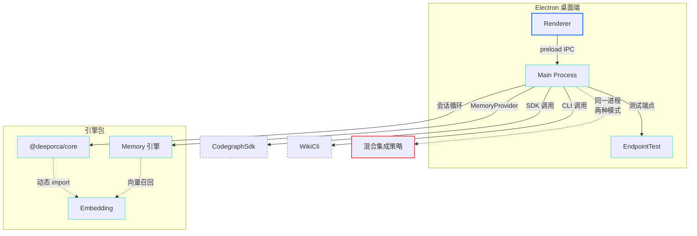
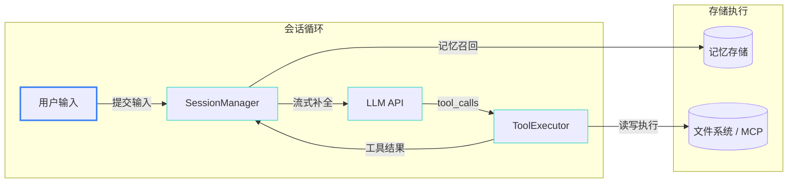
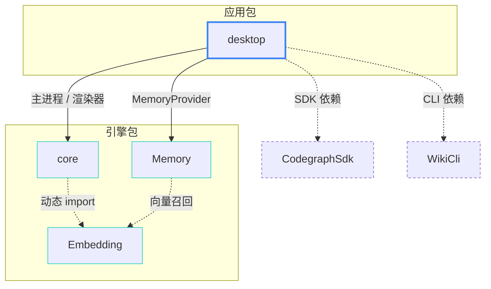

# DeepOrca 架构

npm workspaces monorepo（4 包）：Electron 桌面端 + 共享核心引擎 + 记忆/嵌入流水线，面向 DeepSeek 模型的编码 Agent 框架。

本系统为 Electron 桌面应用 + monorepo 多包 构成的 单体分层架构。

## Overall Architecture 整体架构

桌面端（Renderer + Main Process）通过 preload 桥接 IPC；Main Process 内聚会话引擎调用、记忆提供者注入、端点测试及外部工具适配器（CodeGraph SDK / Wiki CLI），核心引擎与记忆层按需动态加载 Embedding。

## Data Flow 数据流

一轮会话的循环：用户输入 → SessionManager 组装前缀稳定的消息链 → DeepSeek 流式补全 → tool_calls 执行 → 结果回写再循环，直到无工具调用。

## Dependency Map 依赖方向

分层红线：core 不得反向依赖 desktop；UI-free（不 import react/electron、不直接 console）。

## 架构分析

- **混合集成策略增加维护成本**：CodeGraph 已改为 in-process SDK 调用，而 Wiki 仍通过子进程调用 vendored CLI — 证据：`packages/desktop/src/main/tools/codegraph-sdk.ts` 直接 import SDK；`wiki-cli.ts` 使用 `execFileSync`。影响：同一主进程维护两种集成模式，错误传播与生命周期管理逻辑不统一。
- **渲染器通过子路径引用 core 能力模块**：`@deeporca/core/capabilities` 子路径导出被渲染器直接消费，依赖隔离依赖开发者自觉 — 证据：`packages/core/src/common/model-capabilities.ts` 注释要求 dependency-free；`SettingsPanel.tsx` 从子路径导入。影响：若子路径模块意外引入 Node/React 依赖，会破坏渲染器打包或违反 UI-free 红线。
- **Mermaid 渲染串行化队列**：并行 diagram 渲染通过队列串行化，避免 mermaid 内部状态冲突 — 证据：`packages/desktop/src/renderer/mermaid.ts` 注释 "renders are SERIALIZED through a queue"。影响：wiki/架构图页面含多图时，后续 diagram 等待前序完成，感知延迟增加。
- **Endpoint 测试超时硬编码**：`ENDPOINT_TEST_TIMEOUT_MS = 8_000` 为冷 TLS 握手设置固定超时 — 证据：`packages/desktop/src/main/endpoint-test.ts`。影响：高延迟网络或远端负载高时，测试可能误报为不可达，干扰用户配置端点。

## 优化建议

- **P1 统一外部工具集成模式**：针对"混合集成策略"；预期将 Wiki CLI 也改为 in-process SDK 或统一为子进程管理器，降低生命周期管理复杂度。
- **P1 强化子路径导出依赖检查**：针对"渲染器引用 core 子路径"；预期在 CI 中对 `@deeporca/core/capabilities` 子路径做 bundle 分析，确保无 Node/React 依赖泄漏。
- **P2 评估 Mermaid 并行渲染可行性**：针对"Mermaid 渲染串行化"；预期跟踪 mermaid 上游是否修复并行安全，或在前端实现乐观占位+异步刷新，改善多图页面体验。
- **P2 将 endpoint 超时设为可配置**：针对"Endpoint 测试超时硬编码"；预期允许用户在设置中调整超时，或根据网络类型自适应，减少误报。
