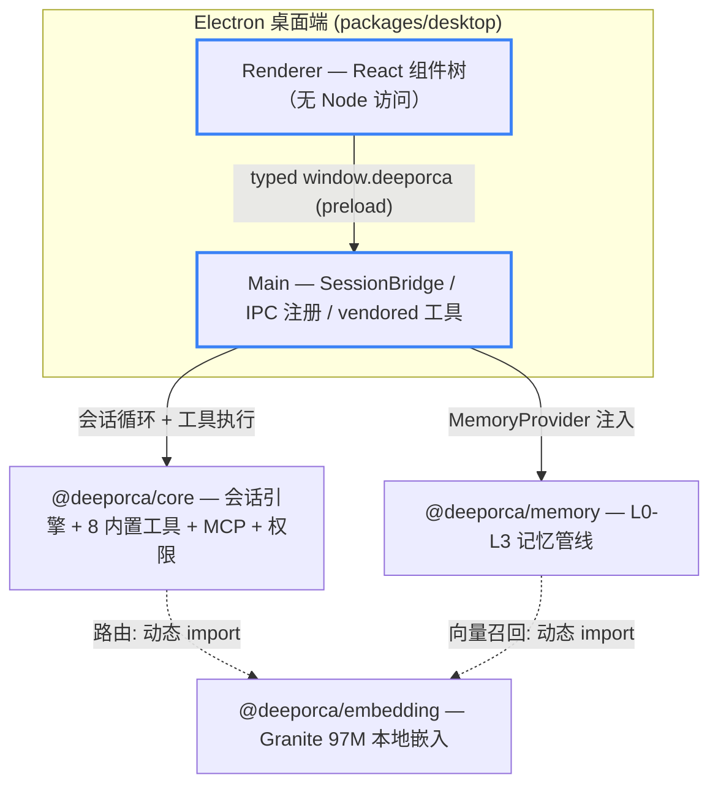
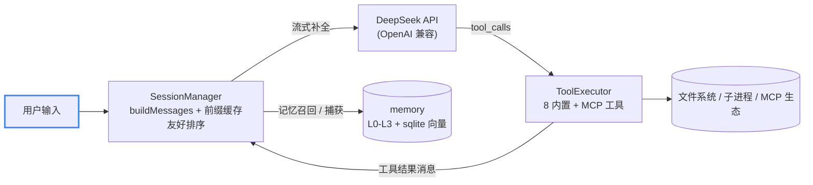
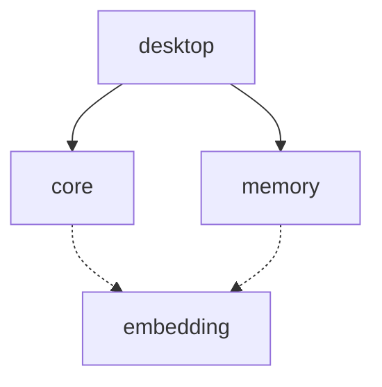

# DeepOrca 架构

npm workspaces monorepo（4 包）：Electron 桌面端 + 共享核心引擎 + 记忆/嵌入流水线，面向 DeepSeek 模型的编码 Agent 框架。

## Overall Architecture 整体架构

四包分层：desktop 依赖 core 与 memory，core/memory 按需动态加载 embedding（进程级单例，持有 onnxruntime 句柄）。

## Data Flow 数据流

一轮会话的循环：用户输入 → SessionManager 组装前缀稳定的消息链 → DeepSeek 流式补全 → tool_calls 执行 → 结果回写再循环，直到无工具调用。

## Dependency Map 依赖方向

分层红线：core 不得反向依赖 desktop；UI-free（不 import react/electron、不直接 console）。

