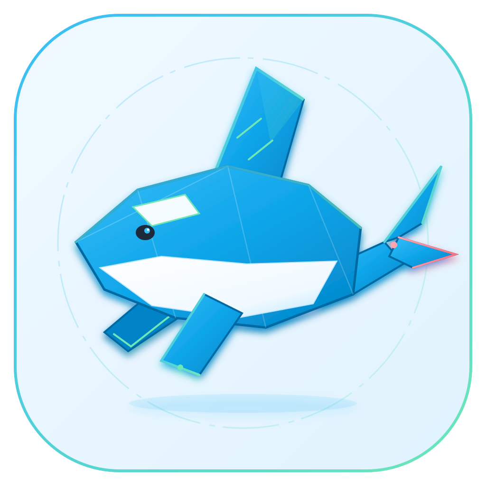

<div align="center">

<br/>
<br/>

<p align="center">
  <a href='https://github.com/asdshuaishuai/deepcode-cli'>
    
  </a>
</p>

# DeepOrca

**AI 驱动的下一代编码助手**

[English](README-en.md) · 中文 · [文档](docs/) · [更新日志](CHANGELOG.md)

<br/>
</div>

---

## 🐋 关于 DeepOrca

**DeepOrca** 是一个 AI 驱动的下一代编码助手，专为 `deepseek-v4` 模型优化，以 Electron 桌面客户端为唯一形态，由两个包组成：

| 包                  | 说明                                                          |
| ------------------- | ------------------------------------------------------------- |
| `@deeporca/core`    | 核心引擎：LLM 会话循环、内置工具、Skills/MCP 扩展、会话持久化 |
| `@deeporca/desktop` | Electron 桌面客户端：完整 GUI，Monaco 编辑器、多面板、多主题  |

### 📦 关于 Deep Code

DeepOrca 起源于 [Deep Code](https://github.com/lessweb/deepcode-cli)（`@vegamo/deepcode`）的 fork，已发展为一个独立项目。我们保留了 Deep Code 优秀的核心引擎架构（LLM 会话循环、内置工具、Skills/MCP 扩展、权限控制），并在此基础上进行了大量扩展——包括桌面客户端 GUI、内置插件系统、GitMCP 模块、Monaco Editor 集成等，并移除了终端 CLI 与 VSCode 插件形态。

Deep Code 基于 MIT 协议开源，本项目依照协议要求完整保留了其原始版权声明（见 [LICENSE](LICENSE)），并在此向原作者致谢。

---

## ✨ 核心特性

### 🧩 强大的扩展系统

DeepOrca 提供三种并列的扩展能力：

| 扩展类型           | 说明                                     | 管理方式                      |
| ------------------ | ---------------------------------------- | ----------------------------- |
| **Skills（技能）** | SKILL.md 驱动的 Agent 能力扩展           | 放入 `.deeporca/skills/` 目录 |
| **MCP 服务器**     | 通过 Model Context Protocol 连接外部服务 | 在 settings.json 中配置       |
| **内置插件**       | 随 DeepOrca 一起发布的核心能力扩展       | 自动加载，不可卸载            |

**当前内置插件**：

- **browser-skill** — 浏览器自动化（访问页面、填写表单、抓取数据、UI 回归测试）
- **open-code-review** — AI 代码审查（读取 Git diff 生成行级精度的结构化审查意见）
- **git-mcp** — 本地 GitMCP 模块（索引 GitHub 仓库，语义搜索文档和代码）

### 🎨 桌面客户端亮点

- **Monaco Editor 集成** — 专业代码编辑器，支持语法高亮、智能提示
- **GitMCP 面板** — 管理 GitHub 仓库索引，语义搜索文档和代码
- **代码审查面板** — 一键审查工作区变更或分支对比，流式输出 + 结构化评论展示
- **代码索引面板** — CodeGraph 代码图谱可视化
- **源码管理面板** — Git 操作（stage/commit/diff/branch）
- **多主题系统** — Aqua 原生 / Glass Prism 玻璃拟态 / Punk 2077 赛博朋克
- **6 语言国际化** — en / zh / ja / ko / zh-HK / zh-TW

### 🧠 本地向量嵌入 + 语义路由

- **Granite 97M 嵌入模型** — IBM Granite Embedding 97M multilingual R2（384 维，200+ 语言含中文），transformers.js + onnxruntime-node 本地推理，构建期 vendor 模型（不走运行时下载）
- **记忆向量召回** — 接入 sqlite-vec 后端，语义同义改写场景向量召回命中率 100%（FTS 关键词 0%）
- **技能/工具语义路由** — 基于 embedding 的上下文压缩：技能数多时召回 top-K 短名单（flash LLM 只精排短名单），MCP 工具按服务器级召回裁剪
- **组合路由（SkillWeaver）** — 复杂查询自动拆解 → 多技能召回 → 兼容性规划 + DAG 组合（忠实复现 [arxiv 2606.18051](https://arxiv.org/abs/2606.18051) 论文的三阶段管线）
- 全程 **fail-open**：模型未就绪/异常 → 回退全量候选，绝不搞挂会话

### 🏗️ 工作区索引三件套

左侧「构建索引」按钮一键顺序执行：

| 步骤      | 工具          | 索引层 | 回答的问题                       |
| --------- | ------------- | ------ | -------------------------------- |
| 1. 索引   | **CodeGraph** | 符号级 | 这个符号在哪？谁调用了它？       |
| 2. Wiki   | **OpenWiki**  | 文档级 | 项目文档说了什么？               |
| 3. 架构图 | **arch-scan** | 架构级 | 整体架构长什么样？数据怎么流动？ |

- **arch-scan** 采用 oh-my-mermaid 的 12 视角目录 + 递归下钻方法论，**渲染用 A2UI**（可嵌套组件树，非静态 Mermaid）

### 🚀 为 DeepSeek 优化

- 专门为 DeepSeek 模型性能调优
- 通过[上下文缓存](https://api-docs.deepseek.com/guides/kv_cache)降低成本
- 原生支持[思考模式](https://api-docs.deepseek.com/guides/thinking_mode)和思考强度控制

---

## 📊 当前功能全景

| 能力域       | 功能                                 | 状态 |
| ------------ | ------------------------------------ | ---- |
| 核心引擎     | LLM 会话循环、7 内置工具、上下文压缩 | ✅   |
| 桌面客户端   | Electron GUI、多面板、多主题         | ✅   |
| 扩展系统     | Skills / MCP / 内置插件              | ✅   |
| 代码编辑器   | Monaco Editor 集成                   | ✅   |
| 代码索引     | CodeGraph MCP Server + 索引面板      | ✅   |
| 代码审查     | Open Code Review 内置插件 + 审查面板 | ✅   |
| GitMCP       | 本地 GitMCP 模块 + 仓库索引面板      | ✅   |
| 浏览器自动化 | browser-skill 内置插件               | ✅   |
| 源码管理     | Git 面板（stage/commit/diff/branch） | ✅   |
| 权限控制     | 细粒度 scope 策略                    | ✅   |
| 会话持久化   | 跨会话恢复、归档、导出               | ✅   |
| 联网搜索     | 内置 WebSearch 工具                  | ✅   |
| 多模态       | 图片粘贴/拖拽输入                    | ✅   |

---

## 🗺️ 发展路线图

### 🎯 近期开发（Feature Dev）

| #   | 特性                      | 说明                                                       | 状态      |
| --- | ------------------------- | ---------------------------------------------------------- | --------- |
| 1   | **远程插件中心**          | 在线插件市场，支持一键安装/更新社区 Skills 和 MCP 服务器   | 🔨 规划中 |
| 2   | **自定义 CLI 与指令**     | 用户可注册自定义斜杠命令和 CLI 子命令，扩展 Agent 工作流   | 🔨 规划中 |
| 3   | **项目图谱与沉浸式 Wiki** | 代码知识图谱可视化 + 项目级知识沉淀（类似 Qoder 知识中心） | 📐 设计中 |
| 4   | **Designer 能力**         | AI 驱动的 UI 设计生成，从自然语言描述到可预览的界面原型    | 🔨 规划中 |

### 🔮 开源项目集成路线图

DeepOrca 计划集成 9 个优秀的开源项目，构建更强大的编码助手生态：

| #   | 项目                                                                | 集成形态                | 核心价值                              | 优先级 | 状态          |
| --- | ------------------------------------------------------------------- | ----------------------- | ------------------------------------- | ------ | ------------- |
| 1   | [flutter/agent-plugins](https://github.com/flutter/agent-plugins)   | 构建时内置 Skills       | Flutter/Dart 开发能力包               | P0     | ✅ **已集成** |
| 2   | [code-review-graph](https://github.com/tirth8205/code-review-graph) | 内置 MCP Server         | 代码图谱 + 爆炸半径 + 简化架构图      | P0     | 📋 规划中     |
| 3   | [serena](https://github.com/oraios/serena)                          | 内置 MCP Server         | 符号级重构/导航/编辑                  | P1     | 📋 规划中     |
| 4   | [mem0](https://github.com/mem0ai/mem0)                              | core 层 SDK             | 跨会话长期记忆                        | P1     | 📋 规划中     |
| 5   | [openwiki](https://github.com/openwiki/openwiki)                    | 内置 CLI 工具           | 项目 Wiki 自动生成与维护              | P1     | ✅ **已集成** |
| 6   | [opencli](https://github.com/jackwener/opencli)                     | 内置插件                | 100+ 网站适配器 + CLI Hub             | P2     | 📋 规划中     |
| 7   | [CLI-Anything](https://github.com/CLI-Anything/CLI-Anything)        | 内置 Skill              | 万能 CLI 生成（Agent 驱动任意软件）   | P2     | 📋 规划中     |
| 8   | [open-design](https://github.com/open-design/open-design)           | MCP Server（设计+展示） | AI 设计生成 + 文件交付给 coding agent | P2     | 📋 规划中     |
| 9   | [obscura](https://github.com/h4ckf0r0day/obscura)                   | MCP Server + 内置 Skill | 轻量级无头浏览器（大规模数据获取）    | P2     | 📋 规划中     |

**已集成项目说明**：

- ✅ **openwiki**：vendored CLI + 内置 Skill + 桌面端 Wiki 面板集成
- ✅ **codegraph**：vendored CLI + 桌面端代码图谱面板（额外项目）

> 📋 **详细路线图**：查看 [docs/features/feature-roadmap.md](docs/features/feature-roadmap.md) 了解完整的集成方案、技术选型和实施计划。

### 🔬 后期特性（Feature Backlog）

以下能力已完成前期调研，列入后期功能层面：

| 特性         | 参考项目                                                                | 方向                                           |
| ------------ | ----------------------------------------------------------------------- | ---------------------------------------------- |
| 代码审查图谱 | [code-review-graph](https://github.com/tirth8205/code-review-graph)     | 将审查意见与代码依赖图关联，可视化影响范围     |
| 语义代码导航 | [serena](https://github.com/oraios/serena)                              | 基于语义的代码理解与导航引擎                   |
| AI 记忆层    | [mem0](https://github.com/mem0ai/mem0)                                  | 跨会话长期记忆，让 Agent 积累项目知识          |
| 代码知识图谱 | [Understand-Anything](https://github.com/Egonex-AI/Understand-Anything) | Tree-sitter + LLM 混合分析，生成可交互知识图谱 |

> 📊 **调研报告**：查看 [docs/research/](docs/research/) 了解详细的技术调研和可行性分析。

---

## 🚀 快速开始

### 安装与构建

```bash
# 克隆仓库
git clone https://github.com/asdshuaishuai/deepcode-cli.git
cd deepcode-cli

# 安装依赖
npm install
```

### 配置

创建 `~/.deeporca/settings.json` 文件（若本机已有 `~/.deepcode` 配置目录则会直接沿用，无需迁移）：

```json
{
  "env": {
    "MODEL": "deepseek-v4-pro",
    "BASE_URL": "https://api.deepseek.com",
    "API_KEY": "sk-..."
  },
  "thinkingEnabled": true,
  "reasoningEffort": "max"
}
```

> 📖 **完整配置说明**：查看 [docs/configuration.md](docs/configuration.md)

### 桌面客户端

```bash
# 开发模式
npm run desktop:dev

# 构建
npm run desktop:build

# 运行
npm run desktop:start
```

---

## 📚 文档导航

| 文档                                                                 | 说明               |
| -------------------------------------------------------------------- | ------------------ |
| [CHANGELOG.md](CHANGELOG.md)                                         | 更新日志和提交历史 |
| [docs/architecture.md](docs/architecture.md)                         | 架构设计和核心流程 |
| [docs/configuration.md](docs/configuration.md)                       | 配置文件详解       |
| [docs/mcp.md](docs/mcp.md)                                           | MCP 服务器配置指南 |
| [docs/agent-skills.md](docs/agent-skills.md)                         | Skills 开发指南    |
| [docs/permission.md](docs/permission.md)                             | 权限控制说明       |
| [docs/features/feature-roadmap.md](docs/features/feature-roadmap.md) | Feature 集成路线图 |
| [docs/research/](docs/research/)                                     | 技术调研报告       |

---

## 🤝 贡献

欢迎贡献代码！以下是参与方式：

```bash
# 克隆仓库
git clone https://github.com/asdshuaishuai/deepcode-cli.git
cd deepcode-cli

# 安装依赖
npm install

# 运行测试
npm test

# core 构建
npm run build

# 桌面客户端本地开发
npm run desktop:dev
```

**提交前检查**：

- 确保 `npm run check` 通过（类型检查 + lint + 格式检查）
- 建议先执行 `npm run format` 自动格式化代码

---

## 📞 获取帮助

- **仓库 Issues**：https://github.com/asdshuaishuai/deepcode-cli/issues
- **文档**：查看 [docs/](docs/) 目录

---

## 📄 开源协议

本项目采用 [MIT License](LICENSE) 开源。

- DeepOrca 源自 [Deep Code](https://github.com/lessweb/deepcode-cli)（Copyright (c) 2026 lessweb，MIT License）。
- 根据 MIT 协议条款，本仓库完整保留原始版权声明与许可声明；你在使用、修改或分发本项目（及其实质部分）时，也需保留 [LICENSE](LICENSE) 中的版权声明与许可声明。
- 软件按“原样”提供，不附带任何形式的担保，详见协议全文。

---

## 🌟 支持我们

如果你觉得 DeepOrca 对你有帮助，请考虑：

- ⭐ 在仓库给我们一个 Star
- 🐛 提交 Bug 报告和功能建议
- 📢 分享给你的朋友和同事
- 🤝 贡献代码和文档
