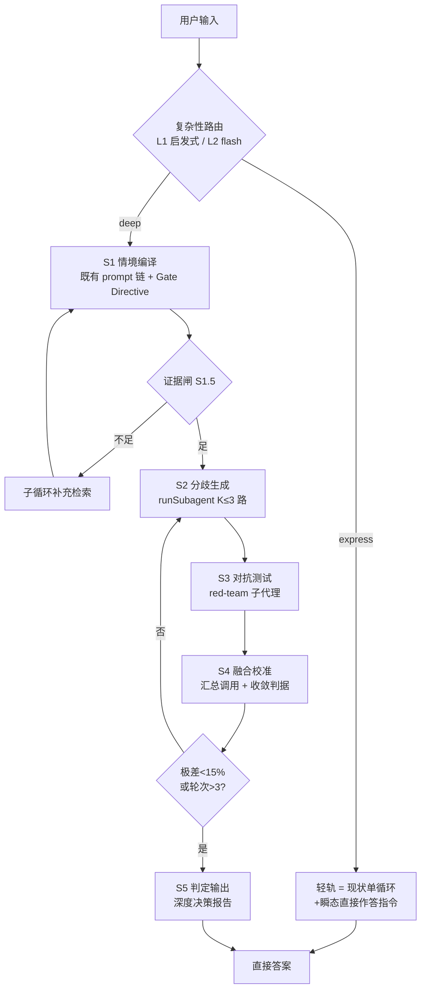

# 2026-09-03 智能网关 × 复杂度双轨（Smart Gateway + Dual Lane）适配预研

> **状态**：⬜ 未消费（纯调研/适配方案，代码零落地）· **对应模块**：`core/session-manager-{skills,lifecycle,tasks,base}.ts`、`core/routing/*`、`core/prompt.ts`、`core/session-types.ts`、`core/settings.ts`、`core/templates/prompts/`、`packages/desktop/src/shared/ipc.ts`（若做 UI 徽标）
> **需求来源**：用户提案「前置智能网关（Smart Gateway）+ 任务复杂度评分（T/P/C/R 四维加权，满分 100，阈值 50）+ 轻轨/重轨双轨制 + 动态阈值自适应」，要求评估与本仓库（DeepOrca 桌面级 coding-agent harness）的适配性，**只出方案不动代码**。
> **总口径**：调研仅供参考，正式实现一律以 `specs/` 为准；本文若被拍板，应立 `specs/next-version/depth-lane/` 三件套再开工。

---

## 一、结论先行（TL;DR）

1. **方案本质还原**：任务复杂度仲裁（Task Complexity Arbitration）——在主循环入口前加一道「动态路由决策」，简单请求走低成本直出路径（轻轨），复杂请求走多阶段推演路径（重轨）。这不是新范式，是**成本-质量权衡的显式化**。
2. **适配判定：机制全部可落地，且本仓已具备约 70% 的「开源件」**。真正需要新写的只有三样：
   - **复杂度评分调用** —— 可与既有的 skill 自动匹配 flash 调用合并为一个调用（类似 `multiIntent` 并入同一调用的先例），近乎零增量成本；
   - **lane 状态记录** —— `SessionEntry` 加一个字段；
   - **重轨 5 阶段状态机** —— 一个新 `session-manager-depth.ts` 层（符合既有按 feature 拆层的模式）。
3. **最大的定位差别**：本仓不是「通用聊天 Agent + 知识库」，而是 **coding-agent harness**。因此：
   - 「轻轨」不是「RAG + 单次生成」，而是**既有的默认单循环**（`createSession → activateSession`）；
   - 「重轨」不需要引入 LangGraph，而是**复用既有原生机制**：Plan Mode、`runSubagent`、`runBackgroundLlmTask`、review 动作、multi-driver spec（下一版 DriverPool）。
4. **必须守住的四条工程红线**：
   - `core` 保持 UI-free（网关与重轨状态机全在 core，UI 最多加一枚 lane 徽标）；
   - **DeepSeek 前缀缓存字节序不可破坏**——`createSession` 的稳定前缀（`lifecycle.ts:163-192` 注释的 MOST→LEAST 排序）一行不动，网关指令只能进「瞬态尾部」（`getCurrentTurnTail` 同款机制）；
   - 所有路由一律 **fail-open**（评分失败 → 视为轻轨 → 行为与现状等价），救援门永不把简单任务拖进重轨；
   - 新增用户可见文案必须进 6 个 i18n 目录（en/zh/zh-tw/zh-hk/ja/ko）。
5. **建议推进路径**：本调研（登记 research README）→ 若拍板，立 `specs/next-version/depth-lane/`（design/tasks，staging 区按 `git mv` 转活跃）→ `next/*` 分支逐个里程碑实施。改造面按 P0/P1/P2 分期见 §八。

---

## 二、提案要点还原（便于对位，非逐字转抄）

- **双轨**：轻轨 = 常规 RAG + 单次 LLM 生成（≤2 次 LLM 调用）；重轨 = 完整 T-DPS 5 阶段（情境编译 → 分歧生成 → 对抗测试 → 融合校准 → 判定输出）。
- **复杂度评分**：网关 LLM 在 ~3 秒内输出 0–100 分，四维加权：时间跨度 T=25、主体博弈 P=30、因果深度 C=25、风险敏感度 R=20；总分 ≥ 50 → 重轨，否则轻轨。
- **评分即提示**：细化得分注入模块 1（情境编译），让深度分析聚焦博弈点与不可逆性。
- **动态阈值**：按「轻轨追问率、重轨负反馈率」自适应 ±5 分：`新阈值 = 旧阈值 + 追问率*0.5 − 负反馈率*0.5`。
- 原始方案建议用 LangGraph StateGraph 实现。

---

## 三、本仓现状对位（哪些已经存在，证据在树）

### 3.1 「轻轨」本来就是默认路径

- `createSession`（`session-manager-lifecycle.ts:100-243`）→ `activateSession` 工具循环（`session-manager-base.ts`）→ 直出答案；工具面 = 8 内建 + MCP，前置 `ToolExecutionGate`（权限监听，`base.ts:150-185`）。
- 提案里「语义检索 / 知识库」的等价物在树上：
  - **语义路由**：`core/routing/`（G1 skill shortlist / G2 tool select / G3 composeRoute / shard 召回，`RoutingFacade` 会话级冻结、全程 fail-open）；
  - **记忆召回**：`@deeporca/memory` L0–L3，`createSession` 内 2s race（`lifecycle.ts:198-213`，慢则不带记忆继续）；
  - **网络检索**：`WebSearch` / `WebFetch` 内建工具（有独立 provider 体系）。
- 结论：**轻轨 = 现状默认路径 + 一枚 lane 标记 + 一条轻量「直接作答」指令**，零新检索基建。

### 3.2 「网关 = 轻量预检 Agent」本仓已有同构先例

`identifyMatchingSkillNames`（`session-manager-skills.ts:24-153`）就是逐字对应「轻量级预检 Agent」的既有实现：

| 提案要求 | 既有实现证据 |
| --- | --- |
| 轻量模型专用调用 | `createBackgroundLlm()`（模型族轻量档） |
| 快、省、低温 | `temperature: 0.1`、`max_tokens: 256`、thinking 显式关闭 |
| 只出结构化 JSON | `response_format: { type: "json_object" }`，解析失败即降级 |
| 3 秒内 | 单次 flash 调用；另有 `SkillMatchCache` 同 prompt 同池直接 replay（零 embedding 零 LLM） |
| 节流记账 | usage-ledger source `"auxiliary"` 独立记账 |
| 先召回缩池 | G1 embedding shortlist 先行，路由故障 fail-open 用全池 |

**关键发现**：复杂度评分应当**并入这同一个 flash 调用**，返回结构扩展为 `{skillNames, multiIntent, lane, tpcr…}`——正如 `multiIntent` 当年并入同一调用（`skills.ts:142-147` 注释：single-intent 回合零额外调用）。这样提案「轻轨 ≤2 次 LLM 调用」的诉求以**零增量调用**达成，还顺带保住前缀缓存与 usage 记账纪律。

### 3.3 「重轨」各阶段在树上已有一一对应的原生机制

| 用户提案阶段 | DeepOrca 原生机制 | 证据 |
| --- | --- | --- |
| 模块 1 情境编译 | 系统提示链（base → AGENTS.md → 默认 skill → 内建插件 → 环境）＋语义路由（skill/shard 召回）＋记忆召回＋技能注入 | `lifecycle.ts:173-238` |
| 证据不足 → ReAct 补充检索 | 主循环本身就是 ReAct（工具调用循环）；review profile 的只读窄工具面是先例 | `base.ts`、`tasks.ts:556` |
| 模块 2 分歧生成 | `runSubagent`（force-load skill 的独立子会话，`silent` 零残留：跑完即删 session）＋`runBackgroundLlmTask`（bg-\* 自持循环）＋ multi-driver spec（`DriverPool`，下一版） | `tasks.ts:459, 841-900`、`specs/next-version/in-process-multi-driver/design.md` |
| 模块 3 对抗测试 | review / review.full 动作（CRG 风险 + OCR 语义组合）＋ red-team 子代理（自证对抗提示）＋ `AskUserQuestion` 用户裁决 | `actions/review*`、`AGENTS.md` |
| 模块 4 融合校准 | 编排者汇总调用（background LLM）＋收敛判据（概率极差 <15% 或轮次 >3） | 需新写（见 §4.4 S4） |
| 模块 5 判定输出 | `<proposed_plan>` 块契约（renderer 特判渲染）已存在；重轨输出复用其「决策完备报告」格式即可 | `templates/prompts/plan.md` |

### 3.4 与本仓工程约束的冲突面（必须适配的点，不能照搬原文）

1. **前缀缓存字节序**：任何新增 system 块都必须遵守 MOST→LEAST 排序（`lifecycle.ts:163-168` 的明确注释）。网关指令若进稳定前缀，会压低跨会话缓存命中率——**只能进瞬态尾部**（像 `getCurrentTurnTail` 一样在消息转换时注入，不写进持久 JSONL）。
2. **分层铁律**：网关与重轨状态机在 `core`（无 UI 依赖、无 `console.*`）；`desktop` 只消费事件。外部编排框架（如 agent-relay，multi-driver spec 已拍板）也只能落在 desktop main，core 保持框架-free。
3. **文件长度 2500 ±10%**：`session-manager-tasks.ts` 已 901 行、`lifecycle.ts` 已 1499 行——重轨状态机必须落**新文件**（`session-manager-depth.ts` 新层，与 tasks 层同模式），不得在旧文件里加长。
4. **usage-ledger 已能按请求记账**（`createChatCompletionStream` 单一咽喉，`source: "auxiliary"` 已区分用途）——重轨 N 路并发 = N 倍消耗天然可见，但需要 **lane 级预算上限**兜底（§六）。
5. **并发护栏已有清单**：multi-driver spec 的 G1–G6（git 串行队列 / pendingIndex 审计 / 中断改按 id / silent 计数化 / 索引互斥 / 速率背压）可直接引用；subagent 并发已有 `activeSessionId` save/restore 先例（`tasks.ts:845, 895`）。

---

## 四、适配设计

### 4.1 名词映射表

| 用户提案概念 | 本仓适配后概念 | 落点 |
| --- | --- | --- |
| 智能网关（预检 Agent） | **复杂性路由**（Complexity Routing）：L1 免费启发式 + L2 flash 评分（并入 skill 匹配调用） | `core/routing/gate/`（新目录） |
| 轻轨（RAG + 单次生成） | **现状默认单循环** + `lane: "express"` 标记 + 瞬态「直接作答」指令 | `lifecycle.ts` / `prompt.ts` |
| 重轨（T-DPS 5 阶段） | **深度车轨（depth lane）状态机**，5 阶段全部由原生机制组装 | `session-manager-depth.ts`（新层） |
| 复杂度评分注入模块 1 | **Gate Directive**：瞬态 system 块注入情境编译开头 | `prompt.ts` 尾部/转换时注入 |
| 动态阈值 | settings 配置 + 遥测报告；自动调参放 P2 | `settings.ts` `complexityGate` 节 |
| LangGraph StateGraph | 不引入；本仓等价物 = 既有 LLM 循环 + 新状态机层 | — |

### 4.2 网关落点与两级（Two-Stage）评分

**位置**：`createSession` 内、skill 匹配同一点（`lifecycle.ts:223-238` 段），复用/扩展 `identifyMatchingSkillNames` 的调用面。

**L1 免费启发式（确定性、零 LLM、O(1)）**，命中即直判，不触发 L2：

- `userPrompt.planMode === true` → 重轨（用户已显式要规划）；
- 首帧无文本/纯图片 → 轻轨；
- 文本特征：长度、`AskUserQuestion` 相关意图词（“方案/权衡/风险/策略/要不要”）、跨步数线索（“先…然后…再…”“如果…则…”）——用轻量关键词/正则，**不做 NLP 推理**；
- 会话上下文：本会话历史追问率（grep 前 N 条用户消息，§4.6 口径）；
- 直接命中规则表（如「解释/翻译/什么是」→ 轻轨）。

**L2 flash 评分（灰色地带才发）**：与 skill 匹配共用一次 flash 调用，响应扩展为：

```json
{
  "skillNames": [],
  "multiIntent": false,
  "lane": "express" | "deep",
  "T": 0 | 25, "P": 0 | 30, "C": 0 | 25, "R": 0 | 20,
  "reason": "一句话判定理由"
}
```

- schema/权重与闸值照提案（T25/P30/C25/R20，≥50 → deep），但 **`lane` 由程序按分计算**，不信任模型自报，避免与四维矛盾；
- JSON 解析失败 / 无 client / 超时 / 中止 → **一律 `lane: "express"`**（fail-open，行为与现状等价）；
- 缓存：复用 `SkillMatchCache` 式签名（同 prompt 同池 replay，`skills.ts:59-63`），重发/重试零成本；
- 若不想改 skill 匹配的既有契约，可做成**并行第二调用**（同 `createBackgroundLlm` 参数面），但推荐合并——这是「单调用双 verdict」，与 `multiIntent` 的演进同构。

### 4.3 轻轨（Express）定义（≈ 现状）

1. `lane: "express"` 写入 `SessionEntry`（观察用，不改变行为）；
2. 转换时注入一条瞬态尾部指令（不落 JSONL、不进缓存前缀）：
   > 本回合为轻轨：基于当前上下文直接作答，无需多路径推演、无需模拟多方博弈；信息不足时照实说明并建议走深度模式。
3. 若 L2 评分携带高 R（风险敏感）但总分 <50，允许指令追加「若涉及金钱/安全/声誉，请提示用户可切换深度模式」——成本仍为零。
4. 可选溯源：沿用既有 `WebSearch`/`WebFetch` 工具面，答案末尾附来源——不需要新检索基建。

**为什么轻轨不再做「Top-5 语义检索」**：本仓的检索是**按需工具调用**（LLM 自己决定是否 read/search），而非先验注入 top-k 段落。顶层 RAG 用法反而会：① 塞入冗余 token 破坏轻轨的低成本属性；② 与语义路由/记忆召回的职责重叠。保持现状即是最优轻轨。

### 4.4 重轨（Depth Lane）5 阶段 → 原生机制组装

**载体**：新增 `session-manager-depth.ts` 层（与 `session-manager-tasks.ts` 同模式，`SessionManager` 组合链尾部加上去）。`lane: "deep"` 的会话在首轮激活时进入 staged 流程；每阶段 = 一个受限工具面的子循环（复用 `runBackgroundLlmTask` 的窄工具面模式：`tasks.ts:549-591` 的 ALLOWED_BUILTIN 过滤 + path 授权）。

- **S1 情境编译**：既有 prompt 链（§3.3 模块 1）即可；新增 **Gate Directive** 瞬态块（T/P/C/R 注入，指向长期利益冲突与不可逆红线），经转换时注入，不进稳定前缀。
- **S1.5 证据闸**：子循环收尾时做「证据充分性」判定——确定性优先（引用文件/搜索结果的条数与覆盖），必要时 flash 判定；不足 → 继续子循环检索（即提案的 ReAct 回边，天然存在）。
- **S2 分歧生成**：K ≤ 3 路并行。实现 A（推荐，零新基建）：`runSubagent({silent: true})` × (K−1) + 主会话 1 路，各自 force-load 一个「立场 skill/prompt」（乐观/保守/反方），每路产出「路径 + 置信度 + 关键假设」；实现 B（multi-driver 落地后）：复用 DriverPool 的并行会话（`specs/next-version/in-process-multi-driver`），`K` 受并发上限与背压约束。串行退化路径：K=1 时跳过对抗，直接 S4。
- **S3 对抗测试**：1 个 red-team 子代理对 K 路候选做「击穿测试」（找反例、找被忽略的约束、找不可逆风险），与 `review.full`（CRG+OCR）共用风险扫描基础；输出「被击穿的路径 + 证据」。用户裁决可选：`AskUserQuestion`（仅在存在真正不可逆决策时调用一次）。
- **S4 融合校准**：单次编排汇总调用（background LLM，thinking 按需开启）输入 = K 路结果 + 对抗发现，输出「收敛后的判定 + 置信度」；**收敛判据**：各路概率（或置信度归一）极差 < 15%，或轮次 > 3；不收敛 → 带对抗反馈回 S2 重生成（轮次上限硬性 3）。
- **S5 判定输出**：产出**深度决策报告**——复用 `<proposed_plan>` 块契约的渲染（renderer 已特判），结构「判定 + 置信度 + 分歧点 + 关键假设 + 风险与红线 + 可执行下一步」，含「轻量结论先行」段，避免重轨「太啰嗦」的负反馈（正是 §4.6 动态阈值的信号来源）。

### 4.5 状态机（映射实际节点名）



### 4.6 阈值自适应（分两期，v1 不自动）

- **信号口径**（从 session JSONL 可计算，写进 spec）：
  - 轻轨追问率 = 轻轨会话 answered 后 10 分钟内出现新用户消息 且 语义相似（embedding 余弦 > 阈值）的比例；
  - 重轨负反馈率 = 重轨汇报后用户消息含「太长/啰嗦/直接点/别废话」等（正则，跨 6 语言保守采样）或 1 星反馈的比例。
- **v1**：只做「记录 + 报告」（遥测进 usage-ledger 旁路审计 + 设置面板只读展示），**人工微调** `complexityGate.threshold`。
- **P2**：才实现 `autoTune`（提案公式 `新阈值 = 旧阈值 + 追问率*0.5 − 负反馈率*0.5`，±5 步进、上下限钳制、每次变更写入审计日志）。

理由：自动调参会**静默改变行为**，与「用户拍板」的项目文化冲突；且误调（把简单任务灌进重轨烧钱）代价高于收益，先收集真实分布再谈自动化。

### 4.7 契约与 UI（桌面侧最小面）

- `SessionEntry` 增 `lane?: "express" | "deep"`（`session-types.ts:96` 附近，可选字段向后兼容）；重轨阶段进度复用既有 `LlmStreamProgress` / `SessionEntryUpdated`（均带 sessionId，`session-bridge.ts:314-334` 已可多路复用）。
- UI 徽标：消息气泡/会话卡一枚 lane 标记（只读展示，不参与路由决策）。
- 若需新 IPC 事件（如重轨阶段明细流），先在 `packages/desktop/src/shared/ipc.ts` 定义通道常量再双边接线——**禁止 renderer 里 ad-hoc ipcRenderer**。
- 新文案进 6 个 i18n 目录（`en.ts` 为源，`Record<MessageKey, string>` 完整性由类型强制）。

---

## 五、改造面清单（文件级）

**core（主体）**

| 文件 | 改动 |
| --- | --- |
| `core/routing/gate/`（新目录：`gate.ts` + `gate-prompt.ts` + 测试） | L1 启发式规则表 + L2 评分 prompt + 严格 JSON 解析（非法即 fail-open）+ 缓存（复用 SkillMatchCache 模式） |
| `core/session-manager-skills.ts` | flash 调用返回扩展 `lane/tpcr`（或并行同参数第二调用）；解析失败降级 express |
| `core/session-manager-depth.ts`（新层） | 重轨 5 阶段状态机 + 证据闸 + 收敛判据 + 预算上限（K≤3、轮次≤3）+ 中止传播 |
| `core/session-manager-lifecycle.ts` | `createSession` 内 lane 记录、Deep 会话转 stage 流程、瞬态尾部注入接线 |
| `core/prompt.ts` + `core/templates/prompts/depth-lane.md` | 轻轨指令块、Gate Directive 块、深度报告模板（模板走 EJS 惯例） |
| `core/session-types.ts` / `core/settings.ts` | `SessionEntry.lane`；`complexityGate: {enabled, threshold, autoTune, maxPaths, maxRounds}` 配置节（仿 `routing` 节，`settings.ts:170`） |
| `core/src/tests/`（新） | `complexity-gate.test.ts`、`depth-lane.test.ts`（桩 LLM）、轻轨回归测试 |

**desktop（最小面）**

| 文件 | 改动 |
| --- | --- |
| `renderer` 会话卡/消息组件 | lane 徽标（只读） |
| `shared/ipc.ts`（可选） | 重轨阶段进度事件（若做） |
| `renderer/i18n/locales/*.ts` ×6 | 徽标/提示文案 |

**文档**：本调研登记进 `docs/research/README.md`；拍板后立 `specs/next-version/depth-lane/`。

---

## 六、成本与风险

- **Token**：重轨 ≈ `2K + 3` 次 LLM 调用量级（K 路分歧 + 1 对抗 + 1 汇总 + 收敛回边）。必须设 lane 预算上限（默认 K=3、轮次≤3），消耗经 usage-ledger `source: "auxiliary"` 按路可见；轻轨为**零增量调用**。
- **前缀缓存**：全部新注入走瞬态尾部；`createSession` 的稳定前缀一行不动——否则全仓跨会话缓存命中率系统性下降（这是本仓最敏感的工程资产之一）。
- **幻觉对抗（反着来）**：网关「误判」的风险方向是**把简单任务判进重轨烧钱**。因此：评分失败一律轻轨；评分只做阈值路由，不用模型自报 lane；重轨输出必须带置信度与分歧点（便于用户与遥测识别误判）。
- **并发护栏**：直接引用 multi-driver spec 的 G1–G6 清单；subagent 的 `save/restore`/深度上限（`MAX_SUBAGENT_DEPTH`）复用。
- **行为回归**：`lane: "off"`（默认关闭）时除 `lane` 字段外与现状字节级等价——这是发布期最重要的回归条件。

---

## 七、验收与测试

- **单元**：gate 解析确定性（JSON 边界/非法输入/无 client/超时四路径全 fail-open）；缓存命中（同 prompt 同池 replay）；L1 规则表逐条；阈值钳制。
- **集成（桩 LLM）**：简单任务（解释、单文件小改动）必走 express，token 计数与现状同量级；复杂任务（跨文件重构、架构评审、多利益方决策）必走 deep 且输出含 5 段结构。
- **收敛**：故意把收敛判据写反 → 测试必须红（变异测试）；轮次上限兜底不再收敛时输出「未收敛 + 已给证据」而不是死循环。
- **回归**：`lane` 关闭时字节级等价；权限/沙盒/中断路径不受影响。
- **真机冒烟（desktop）**：lane 徽标展示、重轨阶段进度流、中断/暂停语义（复用 `interruptSession(sessionId)`）。

---

## 八、分期建议

| 里程碑 | 内容 | 门槛 |
| --- | --- | --- |
| **P0 网关 + 观察** | L1/L2 评分 + `SessionEntry.lane` + 轻轨指令；**不改变任何行为**，只采集真实 lane 分布与成本数据 | 极低（近乎零成本，可随下一版排期） |
| **P1 重轨最小链** | S1 → S2(K=2) → S4 → S5 先通，S3 对抗后补；预算上限与收敛判据随附 | 中（一个 session-manager 层 + 测试） |
| **P2 收敛与自适应** | S3 red-team 完善、轮次回边、`autoTune` 遥测闭环 | 依赖 P1 线上数据 |

**P0 与 P1 之间的决策门**：P0 数据落地后，若真实分布显示 express 占比 >90%（推测值），重轨价值有限，可只保留 P0 的「轻轨指令 + 追问率提示」而砍掉重轨——**以数据决定，不预设结论**。

---

## 九、结论

- 提案的**网关理念成立且高度适配**：本仓既有 `identifyMatchingSkillNames` 就是「轻量预检 Agent」的生产级先例，复杂度评分并入同一 flash 调用后，轻轨侧增量成本趋近于零。
- **重轨 5 阶段无需引入 LangGraph**：Plan Mode / subagent / background task / review 动作 / multi-driver spec 已覆盖 4/5 阶段，新增的只是一个编排状态机层（`session-manager-depth.ts`）与收敛判据。
- 命名建议落地方言改为「**复杂性路由 + 深度车轨（depth lane）**」，与既有 `routing/` 域一致。
- 推进路径：本调研登记 → 拍板后立 `specs/next-version/depth-lane/` → P0（零行为变化的观察期）→ 数据决策门 → P1 重轨 → P2 自适应。