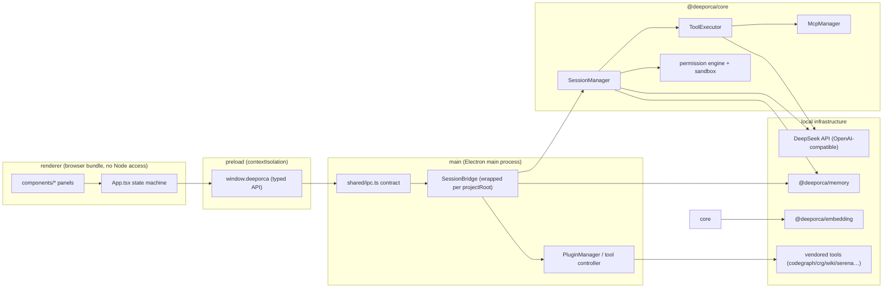

# System Architecture Overview

DeepOrca is a **coding agent harness tuned for DeepSeek models** (the core concept of `docs/architecture.md`): model quality and execution framework together determine coding agent effectiveness. The ultimate goal of this project is to make "DeepOrca + DeepSeek" outperform "Claude Code + DeepSeek" at a lower cost. The design revolves around four core decisions:

1. **Snippet repair tool calls**: `read` returns a `snippet_id`, and `edit` requires that id and only searches within the snippet scope, making correct operations easier to express and ambiguities discoverable.
2. **Cache-aware context management**: Stable prefixes (system prompt → tool documentation → default skills → runtime context) are placed before volatile user content, fully leveraging DeepSeek's prefix cache; sessions are persisted as JSONL for consistent replay.
3. **Context engineering centered on Agent Skills**: Skills are not plugins but structured context, injected on demand, keeping the base context lean.
4. **Permission system based on side-effect classification**: A decision matrix of concrete scopes (read/write/delete inside and outside directories, Git, network, MCP, etc.); `bash` must declare side effects, and file tools are classified by path.

## Packages and Layers

The repository is an npm workspaces monorepo (`package.json` `workspaces: ["packages/*"]`) with four packages:

| Package | Role | Entry | Dependency direction |
| --- | --- | --- | --- |
| `@deeporca/core` | LLM session engine, 8 built-in tools, MCP client, permissions, settings, semantic routing, Actions, task tree. **No UI dependencies** | `packages/core/src/index.ts` → `dist/index.js` | Depends on `@deeporca/embedding` |
| `@deeporca/desktop` | Electron client: main/preload/renderer, Monaco, multi-panel, knowledge index, design tools | `packages/desktop/src/main/index.ts` → `dist/main.js` | Depends on core + memory |
| `@deeporca/memory` | In-process L0–L3 memory pipeline (vendored TDAI Core fork) | `packages/memory/src/index.ts` | Depends on `@deeporca/embedding`, tcvdb-text |
| `@deeporca/embedding` | Local embeddings: transformers.js + ONNX (IBM Granite 97M R2) | `packages/embedding/src/index.ts` | No internal dependencies |

`memory/src/tdai/` is a **fully self-contained fork of TDAI Core** (approximately 17,000 lines, MIT, see `memory/src/NOTICE.md`) and does not import upstream npm packages; `@tencentdb-agent-memory/tcvdb-text` is a **separate** package and is a live runtime dependency (BM25, statically imported and enabled by default) — it cannot be removed.

### Layer rules (AGENTS.md is authoritative)

- **core must remain UI-free**: it must not import react/electron/terminal-GUI-specific things, and must not use `console.*` directly (the host injects loggers: `configureSkillSpectorLogger`, `configureRoutingLogger`). The UI layer (desktop) depends on core, **never the reverse**.
- **Vendored tool paths are injected by the host; core does not derive them**: only the host knows whether it is running from a repository checkout or a packaged app (`Resources/app/vendor`), so `main/index.ts` calls `configureCodegraphVendorRoot`/`configureCrgVendorRoot`/`configureSerenaUvResolver`/`configureSkillSpectorVendorRoot`/`configureRoutingModelDir` at startup. Deriving vendor paths with `__dirname` inside core was exactly the root cause of semantic routing silently pointing to a nonexistent directory.
- **Built-in tools are intentionally minimal**: `bash`, `read`, `write`, `edit`, `AskUserQuestion`, `UpdatePlan`, `WebSearch`, `WebFetch`. External capabilities go through MCP; new built-in tools are not added lightly.
- **The Desktop IPC contract lives in `shared/ipc.ts`**: dependency-free (types + channel constants), bundled on both the main/preload and renderer sides; do not make ad-hoc `ipcRenderer` calls in the renderer.
- **bash requires a POSIX shell**: on Windows, `setShellIfWindows()` points to Git Bash.

## End-to-End Data Flow

For the complete end-to-end sequence, see [workflows/llm-tool-loop](../workflows/llm-tool-loop.md).

## Session/Data Ownership

- Session data: `~/.deeporca/projects/<project-code>/` (sessions-index.json + `*.jsonl` + file-history/.git), see [session-lifecycle](session-lifecycle.md).
- Settings: `~/.deeporca/settings.json` (user) + `<root>/.deeporca/settings.json` (project), see [core/settings](../core/settings.md).
- Memory: `~/.deeporca/memory/<project-code>/` (isolated per project), see [memory/overview](../memory/overview.md).
- Task trees: `<root>/.deeporca/task-trees/<treeId>/`, see [core/task-tree](../core/task-tree.md).

## Branch Strategy and Releases

- Branch strategy (AGENTS.md): `master` is the mainline, `dev` is the integration line, and `test` is the frozen pre-production testing line; new features go through `feat/*` → merged into `dev` (no-ff), and `test` only accepts fix/perf/docs/test/chore.
- CI (`.github/workflows/ci.yml`): `npm run check` (build + typecheck + lint + format:check + license:check) + `npm test`.
- Releases (`.github/workflows/release.yml` + `scripts/version.js` + `scripts/package-desktop.js`): cross-package version increments, Electron builder packaging, and a license-check gate (`scripts/check-licenses.js` wired into `npm run check`).
- OpenWiki scheduled refresh: `.github/workflows/openwiki-update.yml`.
- Skill quality gate: `.github/workflows/skill-evals.yml`, see [desktop/skill-evals](../desktop/skill-evals.md).

## Related Pages

- [Session Lifecycle](session-lifecycle.md), [Prompt System](prompt-system.md), [Message Conversion](message-conversion.md), [Permission System](permission-system.md), [Sandbox](sandbox.md)
- [core overview](../core/overview.md), [desktop overview](../desktop/overview.md), [memory overview](../memory/overview.md), [embedding overview](../embedding/overview.md)
- Cross-package workflows: [llm-tool-loop](../workflows/llm-tool-loop.md), [memory-pipeline](../workflows/memory-pipeline.md), [knowledge-build](../workflows/knowledge-build.md), [design-pipeline](../workflows/design-pipeline.md)