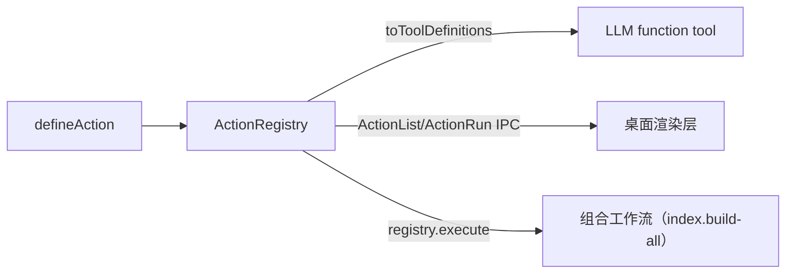

# Actions Capability Layer

`defineAction` / `ActionRegistry` (`actions/registry.ts`, `actions/types.ts`, `actions/define.ts`; design in `specs/define-action/design.md`) defines project capabilities as composable Actions. The Nth capability costs only O(1) — one `defineAction` — with no need to hand-write three bindings.

## ActionRegistry

- Constructor injects `RegistryHost`: `projectRoot`, `spawner` (child process, default `NULL_SPAWNER`), `executeMcpTool`, `runSubagent` (silent subagent), `judgeViaLlm`, `taskTrees`, `activeSessionId`, `setSessionTaskRef`, etc. — **accepts dependencies, does not create dependencies**.
- `register(def, run)`: the id must be lowercase dotted (`ACTION_ID_PATTERN`); duplicate/malformed ids throw (setup-time errors).
- `toToolDefinitions()`: generates LLM function-tool definitions (dotted id → underscore tool name, e.g. `review.run` → `review_run`).
- `actionIdForToolName(toolName)`: **round-trip resolution** from tool name to action id (per id, comparing after replacing `.` with `_`; `actions.test.ts` has round-trip assertions). **Conflicts are unreachable**: the first segment of an action tool name is a pure-lowercase id segment, so it can never start with the `mcp__` prefix — action names and the MCP namespace are naturally isolated.
- `execute(id, input, { signal })`: returns `RunHandle<O>` — `result` (rejects with `ActionError`), `onProgress` (subscribe to progress), `cancel` (idempotent). **Synchronous throws** never happen; progress is buffered until the first subscriber attaches (avoiding async-defer races with test runners).
- `list()`: stable registration order (tool-list stability).
- **`NULL_SPAWNER` semantics**: when the host has not injected a real spawner, a spawn-based action's `spawn()` returns stdout/stderr streams and `exited` that reject immediately (the error message directs callers to `configureActionSpawner`), and `resolveNodeRunner` returns null — the action fails with a clear error rather than silently not running.

## Three-Surface Exposure

- LLM surface: `SessionManager.activateSession` merges `actionRegistry.toToolDefinitions()` into the tool list; `ToolExecutor`'s action branch (parse arguments → `dispatchToolCall` (`actions/mcp-bridge.ts`) → `classifyThrownError` maps action errors to tool-result classifications) dispatches same-named tool calls back to the registry.
- IPC surface: `registerActionIpc` in desktop `action-ipc.ts` — `ActionList` (unprivileged, enumeration) + `ActionRun` (privileged, can spawn child processes); progress is pushed via `event:actionProgress`, returning a structured `ActionRunResult` (`{ ok: true, output } | { ok: false, error, code }`, with a NO_PROJECT error when there is no registry). Test `action-ipc.test.ts` (three-surface proof: ActionRun executes ping through the registry and forwards progress + result).
- Composition surface: `registry.execute` orchestrates directly (BuildJobManager uses `index.build-all` to serially build the knowledge index).

## Built-in Action Families

| Family | Definition/Run | Description |
| --- | --- | --- |
| `ping` | `actions/actions/ping.ts` | Phase-0 proof action |
| `review.*` | `actions/review.ts` + `review-controller.ts` | Open Code Review (OCR CLI); `review.run`/`review.check_available`/`review.full`; `configureReviewController` seam |
| `crg.*` | `actions/crg.ts` + `crg-query.ts` + `crg-controller.ts` | Code risk graph: reindex/visualize/graph query (`CrgGraphQuery` reads SQLite directly); `mergeReviewWithCrgRisk`, `formatCrgContextForOcr` |
| `codegraph.*` | `actions/codegraph.ts` + `codegraph-controller.ts` | reindex/list (`SdkCodegraphController` injected) |
| `wiki.*` | `actions/wiki.ts` + `wiki-controller.ts` | OpenWiki init/update/listPages/readPage (`WikiCliController` injected) |
| `index.build-all` | `actions/index-build.ts` | One-click knowledge index build (serial codegraph→wiki→AGENTS→archmap), `IndexBuildStage` staged output |
| `arch-scan.run` | `actions/arch-scan.ts` | A2UI architecture diagram scan (uses `runSubagent` silent subagent, produces surface JSON) |
| `task.*` | `actions/task.ts` | Task tree operations (create/step/fork/switch/abandon/list/merge/recall, via `TaskTreeService`) |
| `design.*` | `actions/design.ts` | `design.materialize` (A2UI materialization) / `design.extract` (dembrandt brand extraction) |
| `design.audit` | `actions/design-audit.ts` | Three-axis automated check (design-quality audit action) |
| `browser.*` | `actions/browser.ts` | Browser sessions/commands (BrowserSkill integration) |
| `bento.create` | `actions/bento.ts` | bento template generation (vendored templates refreshed at build time) |

## Key Types

- `ActionDefinition` (id/description/parameters zod→JSON Schema), `ActionContext` (emit progress, signal, runSubagent, executeMcpTool, judgeViaLlm, spawner, taskTrees, projectRoot).
- `ActionError` + `ActionErrorCode` (`ACTION_NOT_FOUND`/`INPUT_INVALID`/`ACTION_FAILED`/`CANCELLED`).
- `Spawner`/`SpawnedProcess` (line-buffered stdout/stderr async iterable; desktop `ElectronNodeSpawner` is the production implementation, injected via `configureActionSpawner`).

## Focused Tests

- `actions.test.ts` (15KB): registry registration/execution/progress buffering/cancellation.
- `phase-actions.test.ts`: phase action contract.
- `design-action.test.ts`, `design-audit.test.ts` (10KB), `design-dembrandt.test.ts` (30KB, core).
- `action-ipc.test.ts` (desktop, 10KB): IPC surface.
- `review`-related tests are in `phase-actions.test.ts` + desktop `app-boot.test.ts`.

## Related Pages

- [Architecture/Session Lifecycle](../architecture/session-lifecycle.md) (actionRegistry injection and tool merging)
- [desktop/main-process](../desktop/main-process.md) (action-ipc wiring), [desktop/knowledge-indexing](../desktop/knowledge-indexing.md) (index.build-all consumption)
- [task-tree](task-tree.md) (backend for task.* actions)