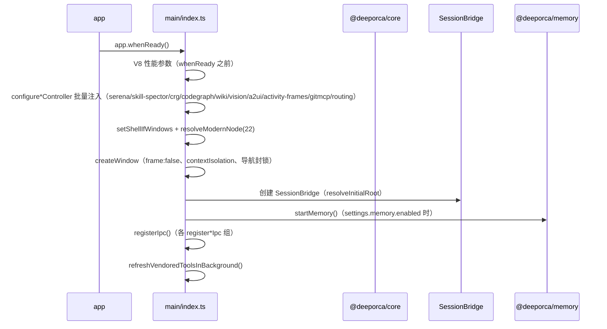

# Main Process Composition Root (main/index.ts)

`packages/desktop/src/main/index.ts` (~2000 lines) is the composition root of desktop: it boots Electron, injects all core seams, registers all IPC, and manages window and process lifecycle.

## Module-Level Singletons

| Singleton | Description |
| --- | --- |
| `bridge` (SessionBridge) | `getBridge()` lazily creates, wraps SessionManager per projectRoot |
| `pluginManager` | Plugin/skill/MCP server management |
| `memoryManager` | In-process memory pipeline (module-level functions `startMemory`/`stopMemory`/`reconcileMemory`) |
| `buildJobs` (BuildJobManager) | Background knowledge indexing build jobs (R2-1) |
| `prototypeWindows` | A2UI prototype popup window registry |

## Startup Sequence

- **Controller injection** (AGENTS.md red line: vendor paths and implementations are provided by the host): `configureSerenaController`, `configureSkillSpectorController`, `configureCrgController`, `configureCodegraphController`, `configureWikiController`, `configureVisionServerBuilder`, `configureA2uiServerBuilder`, `configureActivityFramesServerBuilder`, `configureGitmcpConfigBuilder`, `configureRoutingModelDir`/`configureRoutingLogger`, `configureActionSpawner` (`ElectronNodeSpawner`), `configureDembrandtVendorRoot`/`configureDembrandtCdpEndpointGetter`, `configureUvVendorRoot`/`configureCrgVersionRoot`, `configureSpawnTrackedLogger`（core `spawnTracked` 的 host 日志注入，`console.log`）。
- **Wiki language**: `WikiCliController.getLanguage` returns the **app UI locale** (synced from the renderer via `SessionLocaleSet`, mapped through `APP_LOCALE_TO_BCP47`: zh→zh-CN, zh-TW, zh-HK, ja, ko, en), not the OS locale — wiki pages come out in the language the user reads the app in (see [knowledge-indexing](knowledge-indexing.md)).
- **Window**: 1180×820, `frame:false`, `contextIsolation:true`, `nodeIntegration:false`, `sandbox:false`, `spellcheck:false`; brand icon `applyAppIcon`.
- **Window security**: `will-navigate` interception (only allows its own renderer files or dev origin; external http(s) goes through `shell.openExternal`); `setWindowOpenHandler` always denies and opens externally.

## IPC Registration Groups (`registerIpc`)

Each registration group uses `IpcHelpers` (three tiers: `handle` / `handlePrivileged` / `handleShared`; see [ipc-contract](ipc-contract.md)):

| Group | Responsibility |
| --- | --- |
| `registerCoreIpc` | Session/prompt/permissions/settings/model/skills/MCP/undo/workspace trust |
| `registerPluginsIpc` | Skill search/documentation, MCP server add/remove, built-in plugin enumeration |
| `registerFileScannerIpc` | `@file` mention scanning |
| `registerWorkspaceIpc` | Workspace session list/archive |
| `registerGitIpc` | git-service status/stage/commit/branch/diff/log |
| `registerCodegraphIpc` | Index repository list/reindex (SdkCodegraphController) |
| `registerCrgIpc` | CRG availability/list/reindex/visualization |
| `registerMemoryIpc` | Memory availability/start-stop/search/stats/clear |
| `registerKnowledgeIpc` | Knowledge status aggregation (codegraph/openwiki/AGENTS/archmaps), archmap read (`KnowledgeReadArchmap`: `.md` → markdown / `.html` → board / `.json` → A2UI surface; **多工作区围栏**——目标必须位于已注册工作区 ∪ 当前 projectRoot 的 `.deeporca/prototypes/` 下且 basename 匹配 `arch-*.{md,json,html}`，见 [knowledge-indexing](knowledge-indexing.md)），symbol graph (`KnowledgeSymbolGraph`), KnowledgeBuild |
| `registerDesignIpc` | Design artifacts CRUD/form state/export (ddp/ddu), symbol list (SQLite read-only), AGENTS read; `DesignChanged` 事件（`event:designChanged`，payload `{ root }`）在 design-store 保存/删除时广播，面板据此实时刷新（见 [design-system](design-system.md)） |
| `registerTaskTreeIpc` | All task tree operations — cross-workspace reads (`rootService(workspaceRoot)` spins a fresh `TaskTreeService` over a non-active root's flushed disk state; omitted root = active workspace), plus `TaskTreeTrajectory` (operation trace extraction via `main/task-trajectory.ts`, see [renderer-components](renderer-components.md)) |
| `registerA2uiIpc` | A2UI surface actions/window opening |
| `registerA2uiPrototypeWindowIpc` | Prototype window payload handshake |
| `registerWikiIpc` | OpenWiki availability/init/update/list/read |
| `registerMcpManagementIpc` / `registerGitmcpIpc` / `registerEditorIpc` / `registerAgentChangesIpc` / `registerSessionExportIpc` | MCP management, GitMCP module, Monaco editor, agent changes, session export |
| `registerActionIpc` | ActionList/ActionRun for defineAction ([core/actions](../core/actions.md)) |

## Lifecycle Cleanup

- `killHelperProcesses`: long-running child processes such as ocr/openwiki (`activeHelperProcesses` collection).
- `before-quit`: `closeEmbeddingService()` (onnxruntime handle), memory `destroy`, `cleanupLeakedSubagentSessions`.
- `subagent-cleanup.ts`: cleanup of leaked silent subagent sessions.

## Focused Tests

- `app-boot.test.ts`: boot path (bridge/memory/injection assembly).
- `ipc-security.test.ts`: renderer process policy and privileged channel validation.
- `ipc-contract.test.ts`: channel consistency between preload API and main handlers.

## Related Pages

- [session-bridge](session-bridge.md), [ipc-contract](ipc-contract.md), [preload](preload.md)
- [knowledge-indexing](knowledge-indexing.md), [design-system](design-system.md), [main-tools](main-tools.md)
- [Architecture Overview](../architecture/overview.md) (layer rules)