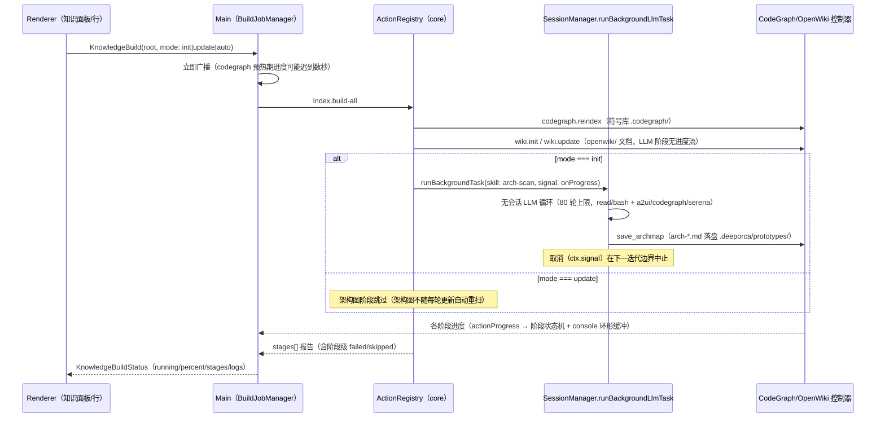

# 知识构建（一键串行流水线）

知识仪表盘的一键构建把知识源串成一条**可观测**的流水线，作业由 **main 进程的 BuildJobManager** 持有（renderer 是只读订阅），驱动 core 的 ActionRegistry 执行 `index.build-all`。



> 图：一键构建的端到端时序——renderer 发起 → BuildJobManager 持有作业 → index.build-all 串行执行三阶段 → init 模式追加无会话后台 arch-scan → 阶段状态机 + console 日志回传 UI。

## 阶段与顺序

1. **CodeGraph 索引**：`codegraph.reindex`（SdkCodegraphController，SDK）→ `.codegraph/`（`codegraph.db` 供符号子 tab SQLite 查询与符号关系图）。
2. **OpenWiki 文档**：`wiki.init`/`wiki.update`（WikiCliController spawn vendored CLI；先写 CodeGraph/Serena connector 配置；**语言取自 app UI locale**）。wiki 阶段自身无进度流，heartbeat 每 20s 报「运行中 Ns · 读取符号索引加速生成」。
3. **架构图**（init only）：`arch-scan.run` 经**无会话后台任务**执行（`runBackgroundTask`，R2-2）→ `save_archmap` 落盘 **Mermaid 文档** `.deeporca/prototypes/arch-<name>.md` → Knowledge 面板「架构图」子 tab 只渲染 ```mermaid 围栏。遗留 `arch-*.json`（A2UI surface）仍经 A2UI 预览路径渲染。

## 阶段可观测（R3-5）

- 每阶段状态机：`pending → running → done | failed | skipped`（`KnowledgeBuildStageState`），加 `detail`/`error`/起止时间；console 日志环形缓冲（500 行）+ `updatedAt` 活性。
- **阶段失败表面化**：`index.build-all` 把阶段错误收进 `stages[]` 正常返回，BuildJobManager 逐阶段核对——失败的 wiki/arch 阶段不再显示为「完成」。
- 首个广播立即发出：codegraph 预热期没有进度行的窗口内，行/知识 tab 也能看到 busy 状态。

## 失败语义与取消

- 每个阶段独立 best-effort：单源失败降级为「空/陈旧」状态，不打断串行剩余阶段。
- 取消传播：构建 action 的 `ctx.signal` 接入后台任务——取消构建在下一迭代边界中止 LLM 循环（否则 80 轮扫描会无视取消跑满）；已产出的 surface 仍 flush。
- 会话零残留（R2-2 约束）：后台任务不建会话、不写消息 JSONL、不进会话列表、不流向会话视图（`background-task.test.ts` 锁定）。

## 入口

- IPC：`KnowledgeBuild`/`KnowledgeBuildStatus`/`KnowledgeStatus`/`KnowledgeListSymbols`/`KnowledgeSymbolGraph`/`KnowledgeReadAgents`/`KnowledgeReadArchmap`/`MemoryRoutingStatus`（[ipc-contract](../desktop/ipc-contract.md)）。
- Action：`index-build-all`、`codegraph.*`、`wiki.*`、`crg.*`、`arch-scan.run`（[core/actions](../core/actions.md)）。

## 相关页面与验证

- [desktop/knowledge-indexing](../desktop/knowledge-indexing.md)、[core/actions](../core/actions.md)、[架构/会话生命周期](../architecture/session-lifecycle.md)（runBackgroundLlmTask）
- 聚焦测试：`build-job-manager.test.ts`（阶段/日志/失败表面化）、`knowledge-build-progress.test.ts`（阶段清单 UI）、core `background-task.test.ts`/`phase-actions.test.ts`。
- 窄验证：`node packages/core/src/tests/run-tests.mjs packages/core/src/tests/background-task.test.ts packages/core/src/tests/phase-actions.test.ts`
