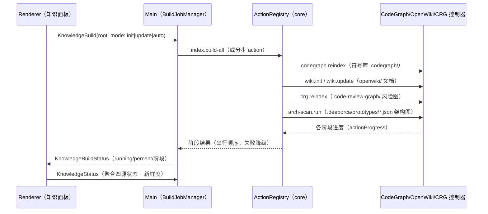

# 知识构建（一键串行流水线）

知识仪表盘的一键构建把四个知识源串成一条可观测的流水线，作业由 **main 进程的 BuildJobManager** 持有（renderer 是只读订阅），驱动 core 的 ActionRegistry 执行。

## 阶段与顺序

1. **CodeGraph 索引**：`codegraph.reindex`（SdkCodegraphController，SDK）→ `.codegraph/`（`codegraph.db` 供符号子 tab SQLite 查询）。
2. **OpenWiki 文档**：`wiki.init`/`wiki.update`（WikiCliController spawn vendored CLI；先写 CodeGraph/Serena connector 配置）。
3. **AGENTS 就位**：就地读取/生成 `<root>/AGENTS.md`（R2 起不再进会话）。
4. **架构图**：`arch-scan.run`（A2UI surface JSON → `.deeporca/prototypes/`）→ `KnowledgeRenderArchmap` 渲染 HTML。

## 失败语义

- 每个阶段独立 best-effort：单源失败降级为「空/陈旧」状态，不打断串行剩余阶段。
- `BuildJobManager.status()` 暴露当前阶段与 percent；会话零残留（R2 约束：静默子代理不污染会话列表）。

## 入口

- IPC：`KnowledgeBuild`/`KnowledgeBuildStatus`/`KnowledgeStatus`/`KnowledgeListSymbols`/`KnowledgeReadAgents`/`MemoryRoutingStatus`（[ipc-contract](../desktop/ipc-contract.md)）。
- Action：`index-build-all`、`codegraph.*`、`wiki.*`、`crg.*`、`arch-scan.run`（[core/actions](../core/actions.md)）。

## 相关页面与验证

- [desktop/knowledge-indexing](../desktop/knowledge-indexing.md)、[core/actions](../core/actions.md)
- 聚焦测试：`app-boot.test.ts`（IPC 装配）、core `actions.test.ts`/`phase-actions.test.ts`（action 执行）。
- 窄验证：`node packages/core/src/tests/run-tests.mjs packages/core/src/tests/actions.test.ts`
