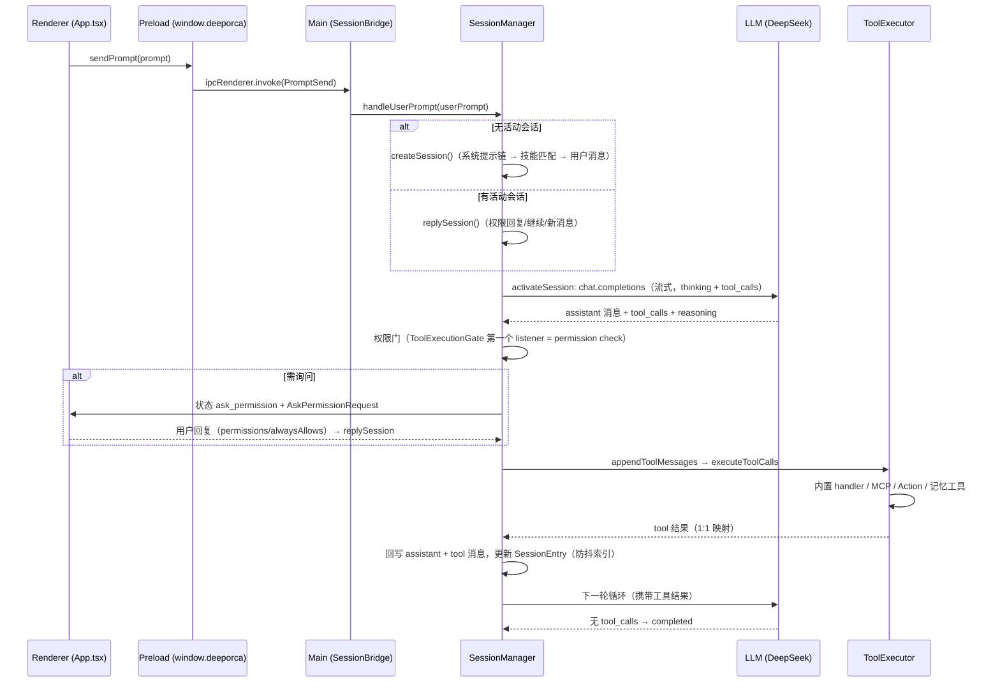

# 用户提示 → LLM 工具循环端到端

这是 DeepOrca 最核心的运行时路径：用户的一条消息如何变成一系列 LLM 请求与工具执行，直到会话收敛。

## 关键阶段

1. **发送**：Composer → `api.sendPrompt` → `PromptSend` IPC → `SessionBridge` → `SessionManager.handleUserPrompt`（挂 AbortController）。
2. **创建/回复**：`createSession` 按缓存稳定顺序写系统消息（system → AGENTS.md → 默认技能 → 内置插件 → 运行时上下文 → 记忆召回 2s race → 行为上下文），LLM 自动技能匹配后注入技能文档；`replySession` 处理权限回复（`hasUserPermissionReplies` + 尾部挂起 tool calls 路径）、`/continue`、普通新消息。
3. **激活循环**（`activateSession`）：`runActivationLoopWithAutoRecovery` 包一层 `runActivationLoop`——最多 80,000 迭代；每轮：检查中断/暂停 → 尾部挂起 tool calls 执行 → 压缩阈值检查 → `OpenAIMessageConverter.buildMessages` → 流式请求（idle 看门狗 `streamIdleTimeoutMs`，默认 300s）→ 规范化 tool_calls → 权限门 → 挂起/询问/执行工具 → 状态更新。
4. **工具执行**：`ToolExecutor.executeToolCalls`（[core/tools](../core/tools.md)）——内置 handler → MCP 回退 → Action 工具（`actionRegistry.toToolDefinitions()`）→ 记忆检索工具（`memoryProvider.getToolDefinitions()`）。
5. **终止**：无 tool_calls → `completed`；refusal → `failed`；`AskUserQuestion` → `waiting_for_user`；权限询问 → `ask_permission`；暂停 → `paused`。
6. **收尾钩子**（finally）：`maybeSyncCodegraphIndex`、`maybeSyncCrgIndex`、`maybeSyncWikiIndex`、`maybeRunDiagnosticsCheck`、`maybeCaptureMemory`、`maybeNotifyTaskCompletion`。

## 自动恢复（`runActivationLoopWithAutoRecovery`）

- 恰好一次恢复：`CONTEXT_WINDOW_EXCEEDED` → 压缩后重试；`TIMEOUT` → 原样重试；其余错误保留原失败路径；abort 永远原样传播；quota 错误不重试（重试无法修复空余额）。

## 消息转换与修复

[架构/消息转换](../architecture/message-conversion.md)：工具配对、中断调用合成、多模态、thinking 字段。

## 权限决策

[架构/权限系统](../architecture/permission-system.md)：`computeToolCallPermissions` 在 assistant 消息之后、工具执行之前同步决定 allow/ask/deny。

## 相关页面与验证

- [session-lifecycle](../architecture/session-lifecycle.md)、[message-conversion](../architecture/message-conversion.md)、[permission-system](../architecture/permission-system.md)
- 聚焦测试：`session.test.ts`（4.2K 行：创建/回复/压缩/权限/中断/恢复）、`tool-handlers.test.ts`、`tool-executor.test.ts`。
- 窄验证：`node packages/core/src/tests/run-tests.mjs packages/core/src/tests/session.test.ts`
