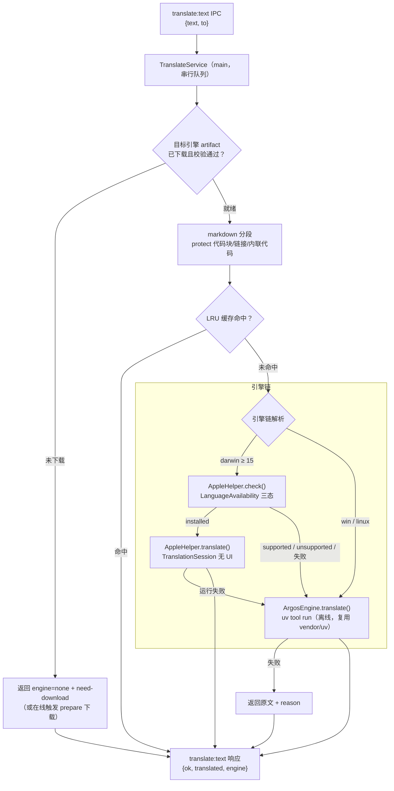

# content-translation 第三方内容翻译引擎 — 技术设计

> 日期：2026-08-28 · 状态：**设计定稿（待实现）**
> 前置调研：2026-08-28 引擎调研（Argos Translate / fast-mlkit-translate-text / Apple Translation framework / Windows 系统能力 / 仓库展示链路），结论已并入本文 §2。
> 命名约定：spec 目录 `content-translation`（kebab-case）；IPC 前缀 `translate:*`；实现全部位于 **desktop 包**（`packages/desktop/src/main/translate/`），**core 零改动**。
> **分发形态（用户定稿）：引擎整体不入安装器**——Argos 引擎包、语言模型、macOS helper 二进制均**首次使用时按需下载**到 userData；安装器零新增体积。

## 0. 结论速览

| 决策点 | 选择 | 理由 |
| --- | --- | --- |
| 定位 | **纯展示辅助**：只译第三方内容（wiki 页 / 插件文档 / 第三方 MCP 工具描述 / skill 描述），内置 UI 文案 i18n 不参与 | core 的 skill/MCP 描述会进 system prompt，翻译不得触碰 core；a17fc6f 已否决 core 层 LLM 翻译 |
| 分发形态 | **运行时按需下载，安装器零新增**：引擎包/模型/helper 发布到 GitHub Releases，首次使用下载到 `userData/translate-engine/`，sha256 校验 + 原子落盘 | 用户定稿；安装器已含 118MB Granite，不再加码；不用翻译的用户零成本 |
| 语言范围 | **仅 zh-Hans ↔ en** 一个语言对，其他语言一律不翻 | 产品决策；源语言用 CJK 字符占比启发式判定，零依赖 |
| macOS 第一选择 | **系统 Translation framework**（`TranslationSession.init(installedSource:target:)` 无 UI 路径），helper 二进制同为运行时下载（~1MB） | 用户第一原则：系统自带优先；离线、质量最好 |
| macOS 可用性检查 | helper `check` 子命令：`LanguageAvailability.status(from:to:)` 三态 | `.installed` → 用系统；`.supported`（缺语言包）→ **不要求用户先去系统设置，直接落到自建兜底**，设置里保留"装系统语言包可切换到系统引擎"的引导 |
| 兜底引擎（全平台） | **Argos Translate**（en↔zh 直接模型，MIT/CC0，离线），标记为试验性 | 沿用 vendor-serena 的 wheel 打包/校验先例（移到 release CI）；uv **复用安装器内 `vendor/uv`**（Serena 已携带） |
| 明确排除 | fast-mlkit-translate-text（纯移动端 RN 库）；Chromium Translator API（Electron 中当前不可用，electron#48567）；云端 API | 平台不符 / 依赖未接通 / 违背离线原则 |
| 架构分层 | desktop main 进程服务 + `translate:*` IPC（照 EndpointQuota 先例）；renderer 四个展示点接入 | core 必须 UI-free；翻译纯展示，不进 agent 循环 |
| 降级策略 | 引擎未下载/不可用 → 明确状态提示 +（在线时）引导下载；翻译失败返回原文 + reason，**绝不阻塞内容展示** | 展示层功能，可用性优先于完整性 |

## 1. 目标与非目标

**目标**

1. 用户在四处第三方内容阅读面点击"翻译"，得到 zh-Hans ↔ en 的本地离线译文，markdown 结构（代码块/链接/表格/内联代码）原样保留。
2. 引擎按需下载：首次点击翻译时在线自动下载（按钮内显示进度），完成后即全离线可用；macOS 15+ 且系统翻译语言包就绪时自动走系统引擎（helper 也按需下载），否则无感落到 Argos 兜底。
3. 引擎状态在设置面板可见（当前引擎、系统语言包三态、Argos 下载状态/磁盘占用），可下载、移除、一键关闭功能。
4. 下载完成后全链路离线：不发起任何网络翻译请求；下载器有严格的主机与 SSRF 防护。

**非目标**

- 不翻译内置 UI 文案（`renderer/i18n/` 现有键零改动；仅按既有流程**新增**少量按钮/状态文案键）。
- 不做 ja/ko 等其他目标语言；不产生 `*.zh.md` 之类的文件变体（不重蹈 a17fc6f 移除的旧链路）。
- 不用 LLM 翻译、不经 core、不进 system prompt。
- 不做整页自动翻译（MVP 为按钮触发；自动翻译留作后续开关）。
- 引擎不入安装器、不进 `vendor/`（`vendor/uv` 除外——它已为 Serena 存在，翻译复用不新增体积）。

## 2. 引擎调研结论（2026-08-28）

| 候选 | 结论 | 关键事实 |
| --- | --- | --- |
| Apple Translation framework | ✅ macOS 第一选择 | macOS 15.0+（Sequoia）；`TranslationSession.init(installedSource:target:)` 为官方无 UI 路径，语言包已装时 `translate()` 无任何 UI；`LanguageAvailability.status(from:to:)` 返回 `.installed/.supported/.unsupported` 三态，可编程检测；语言包由系统设置 → 通用 → 语言与地区 → 翻译语言管理，**系统不提供编程触发下载**；CLI 先例 `hotchpotch/trn`（MIT，stdin→stdout、~512 字符分块、并发保序，其 26.4+ 要求源于 quality 模式，基础 API 15+ 即可） |
| Argos Translate | ✅ 全平台兜底 | 纯 Python + CTranslate2/OpenNMT，离线，MIT/CC0；官方索引有 `zh→en`、`en→zh` 直接模型（v1.9，单包 ~80–110MB）；单句 150 token 限制 → 需分句批处理；依赖闭包重（CTranslate2 等约 180MB+）→ 恰因此更应**按需下载而非入安装器** |
| fast-mlkit-translate-text | ❌ 排除 | Google ML Kit 的 React Native 封装，仅 iOS/Android，无法运行于 Electron/Node；39 stars 低活跃 fork |
| Chromium Translator API | ❌ 暂排除、持续跟踪 | Chrome 138+ on-device API，但 Electron 中 API 面暴露而调用 reject（组件更新器未接通，electron#48567）；若未来 Electron 支持，可作为 Windows 的"系统级"替身 |
| Windows 系统级 API | — | **确认不存在**：无 `Windows.ApplicationModel.Translation` 类公开 WinRT 命名空间；Translator 桌面应用离线包无编程接口；Copilot+ AI 硬件门控且无公开翻译 API |

## 3. 引擎链（Engine Chain）



解析规则：

1. macOS（`os.release()` 主版本 ≥ 24，即 Darwin 24 = macOS 15）且 **helper 已下载** → 先 `check`；`.installed` 则系统引擎优先。
2. helper 未下载/任何失败、check 返回 `.supported`（系统支持但语言包未下载）→ 走 Argos，**不阻断**；`translate:status` 保留 `systemPackStatus` 供设置面板展示引导文案。
3. Argos 未下载 → 状态 `need-download`；在线场景 renderer 提示"首次使用需下载（约 N MB）"并自动触发 `translate:prepare`；离线场景明确报"引擎未下载，需联网一次"。
4. 逐级降级到原文 + reason；状态机幂等，`translate:status` 重新探测（本地检查毫秒级）。

引擎接口（`main/translate/types.ts`）：

```ts
export type TargetLang = "zh-Hans" | "en";
export interface TranslationEngine {
  readonly id: "apple" | "argos";
  status(): Promise<EngineStatus>;          // ready | need-download | missing-config(reason) | unavailable(reason)
  translate(batch: string[], from: SourceLang, to: TargetLang): Promise<string[]>;
}
```

## 4. 运行时下载器（engine-downloader）

引擎 artifact 全部发布到本项目 GitHub Releases，**安装器与 `vendor/` 均不含**（`vendor/uv` 除外，复用）。

**artifact 与来源**（版本 + sha256 + URL 固化在代码内 manifest `main/translate/engine-manifest.ts`，随应用发版更新）：

| Artifact | 内容 | 平台 | 估算体积 |
| --- | --- | --- | --- |
| `translate-engine-argos-<platform>-<arch>.zip` | argostranslate wheel 闭包 + 平台二进制 wheel（ctranslate2、sentencepiece 等）+ 自研入口 `translate_entry.py` | win/mac/linux × x64/arm64 | ~180–250MB |
| `translate-models-zh-en.zip` | `translate-en_zh` / `translate-zh_en` 两个 `.argosmodel` | 全平台通用 | ~160–220MB |
| `translate-helper-macos-universal2.zip` | Swift helper（check / translate） | macOS | ~1MB |

引擎包与模型包**分离**：引擎升级不必重下模型。uv 不在 artifact 内——运行时直接使用安装器内 `vendor/uv`（Serena 先例已随安装器分发，`uv tool run` 目标 venv 建在 userData）。

**磁盘布局**（`userData/translate-engine/`，Electron userData，随卸载清理；设置面板显示占用并支持"移除"）：

```
userData/translate-engine/
├── manifest.json              # 已装组件、版本、下载完成时间
├── helper/trn-helper          # macOS helper（universal2，chmod +x）
├── argos/engine/              # wheel 闭包 + translate_entry.py
├── argos/models/              # en_zh / zh_en .argosmodel
└── .staging/                  # 下载中临时目录（校验通过后原子换名）
```

**下载器实现要点**（`main/translate/downloader.ts`，串行、可取消）：

1. **来源与回退**：主源 GitHub Releases；回退代理域与构建期 `vendor-download.js` 的 githubdog 回退同域策略（运行时自实现，vendor 脚本不入 bundle）。
2. **安全硬约束（验收条件）**：仅允许 http/https；请求前校验 host——域名白名单（Releases 域 + 代理回退域 + PyPI，如需直拉 wheel）之外一律拒绝；解析目标主机 IP，**拒绝 localhost、环回、私有与保留地址**（重定向逐跳复检，沿 `web-fetch-provider` 的 will-redirect SSRF 复检先例）；恒定 sha256 端到端校验（manifest 内固化值），校验失败即弃包重试一次。
3. **原子性**：下载进 `.staging/` → 校验 → 原子换名 + 写 `manifest.json`；中断/失败不污染已装组件；同一时刻仅一个下载任务，`translate:prepare` 幂等。
4. **进度**：按字节回报，经 `IpcEvent.TranslateProgress` 推给 renderer（按钮内进度条 + 设置面板）；MVP 不做断点续传（整包下载 + 失败重试），模型包体积可接受。

## 5. Apple helper（macOS 系统引擎）

- **源码**：`packages/desktop/native/translate-helper/main.swift`（单文件，~200 行，自研 MIT）。
- **构建**：**release CI 打包**（不再进 desktop:build 的 vendor 管线）：`scripts/package-translate-helper.js` 用 `swiftc` 编 universal2（arm64 + x86_64，需 macOS 构建Job + Xcode CLT + macOS 15 SDK），产物 zip 上传 Releases，sha256 回填 manifest。
- **子命令**：
  - `check --from <lang> --to <lang>`：stdout 输出 JSON `{osSupported, status: "installed"|"supported"|"unsupported", sourceInstalled}`；实现为 `LanguageAvailability.status(from:to:)`。
  - `translate --from <lang|auto> --to <lang>`：stdin 全文 → stdout 全文；内部按 ~512 字符分块 + 并发 ≤4 + 保序（trn 先例）；`auto` 用 `NLLanguageRecognizer` 判源（MVP 由主进程 CJK 启发式传入，helper 保留 auto）。
- **翻译实现**：`TranslationSession.init(installedSource:target:)`（无 UI、无下载弹窗）；语言包缺失时 init throw → 进程退出码 3（`missing-language-pack`），main 侧映射为 `missing-config` 并落兜底。
- **进程模型**：MVP 为每请求 spawn（无状态、易测试，会话创建开销毫秒级）；若实测开销显著再演进为长驻行协议 daemon（接口不变）。

## 6. Argos 兜底引擎

- **打包（release CI）**：`scripts/package-translate-engine.js`（照 `vendor-serena.js` 的 wheel 获取 + PyPI 元数据 sha256 校验逻辑，输出从 `vendor/` 改为 Releases 产物 zip，含平台平台矩阵 win/mac/linux × x64/arm64）；`.argosmodel` 从官方索引下载，**打包时计算并固化 sha256** 进 manifest。
- **运行期**：`vendor/uv` 的 `uv tool run` 目标指向 `userData/translate-engine/argos/engine` **纯离线安装**（wheel 已本地），执行自研入口 `translate_entry.py`：
  - stdin/stdout 走 **JSONL**（`{id, text, from, to}` → `{id, ok, text|error}`），绕开官方 CLI 的交互假设；
  - 通过 `argostranslate.package.install_from_path` 把语言包装进 userData 数据目录（env 指定，不污染用户家目录）；
  - 环境变量禁网络（引擎与模型都已本地化，运行期零网络）。
- **已知风险与对策**：
  - 依赖闭包体积/平台 wheel 覆盖是主要工程量 → M0 先做闭包枚举与体积实测，结论回填 manifest 与下载提示文案；
  - stanza 句切分若在运行期尝试联网拉模型 → 用 env 关闭并回退内置分句（M0 验证项，见 §12）；
  - en↔zh 质量为已知短板 → **设置面板标注"试验性"**；引擎接口已抽象，后续可整体替换为 transformers.js + ONNX（仓库 embedding 先例）或 Electron 端 Translator API。
- **分句**：主进程 `markdown-segments.ts` 按块分段后，Argos 引擎内部再按句切分（≤150 token）批量翻译，失败句回退原文。

## 7. main 层服务与 IPC

```
packages/desktop/src/main/translate/
├── types.ts               # 引擎接口、状态、IPC 契约类型（与 shared/ipc.ts 对应）
├── engine-manifest.ts     # 版本 + sha256 + URL/回退域白名单（随发版更新）
├── downloader.ts          # §4：按需下载、host/IP 校验、sha256、原子落盘、进度事件
├── service.ts             # TranslateService：串行队列（仿 web-fetch-provider promise 队列）、超时、上限
├── engine-chain.ts        # 平台判定 + 引擎链解析 + artifact 就绪检查（fail-open）
├── apple-helper.ts        # §5：spawn helper、JSON 解析、退出码映射
├── argos-engine.ts        # §6：uv 子进程、JSONL 协议、句切分
├── markdown-segments.ts   # §8：markdown 分段/还原（纯函数，可单测）
├── cache.ts               # LRU（key = sha1(engine + to + text)，容量 200 条/会话，内存级）
└── register-translate-ipc.ts
```

IPC 契约（`shared/ipc.ts`，照 EndpointQuota 四步先例）：

```ts
IpcRequest.TranslateStatus: "translate:status"    // → { supported, engine: "apple"|"argos"|"none", engineStatus,
                                                  //    downloadState?: { component, receivedBytes, totalBytes } | null,
                                                  //    systemPackStatus?, argosReady?, reason? }
IpcRequest.TranslatePrepare: "translate:prepare"  // 触发缺失组件按需下载（幂等，返回任务受理）
IpcRequest.TranslateText: "translate:text"        // 入参 { text, to: "zh-Hans"|"en" }
                                                  // → { ok, translated?, engine?, reason? }
IpcEvent.TranslateProgress: "translate:progress"  // main → renderer：下载进度 / 引擎状态变化
```

- preload 加三行 invoke 包装 + 事件订阅；`main/index.ts` 装配处调 `registerTranslateIpc`。
- 护栏：单请求输入上限 256KB（超出返回 `too-large`）；单块超时 30s、整请求 120s；队列串行防内存放大；renderer 面板关闭时 fire 取消（同请求 id）→ 弃结果（已开始的下载不取消，后台续跑）。

## 8. 语言方向判定

仅两个语言，零依赖启发式足够：主进程对输入做 CJK 字符占比统计，**≥ 30% 判源为 zh-Hans（目标 en），否则源 en（目标 zh-Hans）**；源 == 目标 → 直接返回 `no-op`。`to` 由 renderer 按界面 locale 映射传入（`zh*` → `zh-Hans`，`en` → `en`；`ja/ko` locale 时翻译按钮禁用并提示仅支持中英互译）。

## 9. Markdown 分段与还原

`markdown-segments.ts` 纯函数 `splitMarkdown(text) → {segments: Array<{kind, text}>, reassemble(segments)}`：

- **不译**：frontmatter、fenced code、inline code、URL、HTML 原子块、图片语法；
- **译**：普通段落、列表项文本、引用文本、表格单元格文本（保留管道结构）、链接的 label 部分；
- 分段以空行/块级语法为界，段内整段送引擎（Apple 自身分块；Argos 再句切），保证译文上下文质量；
- 还原时逐段回填，任何一段失败该段回退原文并标记，整篇永不失败。

译文渲染直接复用现有 `StreamdownView`（内置 rehype-sanitize + harden），**不新增 sanitize 面**。

## 10. renderer 接入（四个展示点）

共享 `useContentTranslation()` hook + `<TranslateButton>`（按钮内联状态：翻译中/下载中 x%/已译/失败/引擎未下载/仅中英）：

| 接入点 | 文件 | 内容来源 |
| --- | --- | --- |
| wiki 页阅读面 | `KnowledgePanel.tsx`（wiki 子 Tab） | `wikiReadPage` 返回的 markdown |
| 插件 / skill 详情 | `PluginDetail.tsx` | `pluginReadSkillDoc` / 内置插件文档 |
| 第三方 MCP 工具描述 | `PluginMcpPanel.tsx` | 工具列表 description |
| skill 卡片描述 | skill 列表卡片（`use-skills.ts` 数据） | frontmatter description |

要求：切换语言/翻页即失效重译（缓存按文本哈希命中）；关闭翻译开关后全部回到原文；MVP 译文不入盘（内存 LRU），后续可选持久化。

## 11. 设置与状态展示

- 设置持久化：走既有 `SettingsGetEditable/SettingsUpdate`（`EditableSettings`，ipc.ts 通路）新增 `translation.enabled: boolean`（默认开）；引擎状态是运行时探测值，不落盘。
- 位置：SettingsPanel **appearance** tab 的界面语言区块旁，新增"第三方内容翻译"section：
  - 总开关 + 当前引擎徽标（Apple 系统 / Argos 试验性）；
  - macOS：系统语言包三态，`.supported` 时给"系统设置 → 翻译语言"下载引导，装好后自动切回系统引擎；
  - 引擎组件状态：已下载版本、磁盘占用、"下载/重新下载/移除"操作（走 `translate:prepare` + 进度事件）；
  - 完全离线且引擎未下载 → 明确提示"首次使用需联网下载一次"。
- 新增的按钮/状态文案为**内置 UI 文案**，按既有流程补进 `i18n/messages.ts` + 4 个 locale 文件——现有键零改动。

## 12. 与既有先例的对齐（评审用）

| 本设计构件 | 复用先例 |
| --- | --- |
| `translate:*` IPC 四步接线 | EndpointQuota（ipc.ts 常量+类型 → preload 一行 → `registerEndpointQuotaIpc` → 服务文件） |
| 串行队列 / 单例子进程 | `main/tools/web-fetch-provider.ts` promise 队列 |
| spawn 外部二进制 | `main/tools/wiki-cli.ts`（ELECTRON_RUN_AS_NODE 先例） |
| wheel 获取 + PyPI 元数据 sha256 校验 | `scripts/vendor-serena.js`（逻辑移入 release CI 打包脚本） |
| 下载 digest 校验 / 原子交换 / 版本标记 / 代理回退域 | `scripts/vendor-download.js` 家族（逻辑运行时自实现，不入 bundle） |
| 下载 SSRF 复检 | `web-fetch-provider` will-redirect 复检先例（§4 安全硬约束） |
| uv 运行时 | 安装器内 `vendor/uv`（Serena 已携带，零新增） |
| 展示层 locale 与 prompt 隔离 | `readSkillDocument(path, locale)` 既有注释约定（session-manager-skills.ts:490） |
| markdown 渲染与消毒 | `StreamdownView`（rehype-sanitize + harden） |

## 13. 开放问题（实现期钉死）

1. **Argos 依赖闭包**：精确 wheel 清单、三平台 × 两架构覆盖、总体积（决定下载提示文案与分包含量）；stanza 离线行为（能否禁用/是否自带分句回退）——M0 实测数据回填。
2. **Releases 分发管线**：CI 打包 job 矩阵（macOS 出 helper，Linux 出引擎包×6）、产物上传与 manifest 回填流程；CN 网络下 Releases 可达性与代理回退域实测。
3. **helper 进程模型**：每请求 spawn 的实测开销；> 50ms 再改长驻 daemon。
4. **Argos en↔zh 质量**：用 wiki 页 + 插件 README 各 5 篇人工评测；不合格则触发备选引擎评估（transformers.js ONNX 路线，`@deeporca/embedding` 先例）。
5. **译文磁盘缓存**：是否按 `userData/translate-cache/` 持久化（MVP 不做，留接口）。

## 14. 验收

- 全新安装（未下载引擎）：安装器体积不变；点击翻译出现"下载中 x%"，完成后出译文；离线状态点击翻译提示"引擎未下载，需联网一次"，原文照常展示。
- macOS 15+（语言包已装、helper 已下载）：`translate:status` 报 `apple`，四处一键出系统引擎译文，断网可用。
- macOS 语言包未装：点击翻译直接出 Argos 译文（无打断），设置面板出现系统语言包引导；装包后自动切 `apple`。
- Windows / Linux：Argos 译文可用；引擎未就绪时按钮报状态且原文照常展示。
- 下载器：仅 https + 域名白名单；对 localhost/环回/私有/保留地址的 URL（含重定向落点）一律拒绝；sha256 不匹配即弃包重试；中断不污染已装组件；"移除"后可重新下载。
- 现有 i18n 文案、core prompt、会话行为零变化；`npm run check && npm test` 全绿；markdown 代码块/链接/表格在译文中完好。
