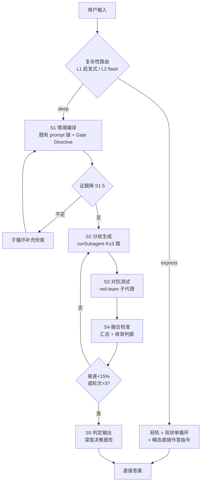

# 深度车轨（depth-lane）· 复杂性路由双轨制 — 技术设计

> **状态**：**提案（未启动）**——2026-09-03 调研定稿（上游：[`docs/research/2026-09-03-smart-gateway-dual-lane-adaptation.md`](../../docs/research/2026-09-03-smart-gateway-dual-lane-adaptation.md)，适配判定：网关理念成立、本仓已有约 70% 开源件）。拍板项见 §7；P0（纯观察、零行为变化）为最低门槛先行。
> **上游提案**：用户「前置智能网关 × 复杂度评分（T/P/C/R 四维加权，阈值 50）× 轻轨/重轨双轨制 × 动态阈值自适应」（任务复杂度仲裁 Task Complexity Arbitration），原始方案建议 LangGraph 实现。
> **对应实现域**：`core/`（gate + depth-lane 状态机）与 `desktop/`（最小 UI 面）；随 `next/*` 分支启动，**开工时 `git mv` 回 `specs/depth-lane/` 转活跃**（按 [`specs/README.md`](../../specs/README.md) 流转口径 5）。

---

## 0. 背景与结论

### 0.1 提案是什么（一句话）

在会话主循环入口前增加一道「任务复杂度仲裁」：简单请求走低成本直出路径（轻轨），复杂请求走多阶段推演路径（重轨），并按历史反馈自适应阈值——本质是**成本-质量权衡的显式化**，不是新范式。

### 0.2 适配判定（TL;DR，详情见 §1）

1. **轻轨 = 现状默认单循环**：本仓是 coding-agent harness，默认路径（`createSession → activateSession`）已是直出；语义检索/知识库的等价物在树上（`core/routing/` 语义路由 + `@deeporca/memory` 记忆召回 + `WebSearch`/`WebFetch` 工具）。轻轨**不做顶层 Top-5 RAG 注入**——本仓检索是按需工具调用，顶层注入只会冗余烧 token 且与路由/记忆职责重叠。
2. **网关 = 并入既有 skill 匹配 flash 调用**：`identifyMatchingSkillNames`（`session-manager-skills.ts:24-153`）就是「轻量预检 Agent」的生产级同构先例（轻量模型/低温/`response_format: json_object`/thinking 关闭/缓存/fail-open）。复杂度评分作为**单调用双 verdict**（`skillNames` + `lane/tpcr`）并入，轻轨侧**零增量 LLM 调用**。
3. **重轨 = 原生机制组装，不引 LangGraph**：5 阶段中 4 个已有开源件（Plan Mode / `runSubagent` / `runBackgroundLlmTask` / review 动作 / multi-driver spec），新增仅一个编排状态机层 `session-manager-depth.ts` + 收敛判据。
4. **四条工程红线**：core 保持 UI-free；`createSession` 稳定前缀（MOST→LEAST）一行不动、网关指令只进瞬态尾部；所有路由 fail-open（评分失败 → 轻轨）；新增用户可见文案进 6 个 i18n 目录。

## 1. 现状与证据（代码取证）

### 1.1 轻轨 = 现状默认路径

- 会话创建链：`session-manager-lifecycle.ts:100-243` —— 系统提示（`173-174`）→ AGENTS.md（`176-179`）→ 默认 skill（`181-184`）→ 内建插件（`187-190`）→ 稳定环境块（`192`）→ 记忆召回 2s race（`198-213`）→ 行为上下文（`215`）→ plan mode 过渡（`217`）→ 用户消息（`220-221`）→ skill 自动匹配（`223-238`）→ 技能注入 → `activateSession`（`240-241`）。
- 检索等价物：`core/routing/`（G1 skill shortlist / G2 tool select / G3 composeRoute / shard 召回，`RoutingFacade` 会话级冻结、全程 fail-open，`routing-facade.ts:44-62`）；`@deeporca/memory` L0–L3；`WebSearch`/`WebFetch` 内建工具。

### 1.2 网关同构先例：`identifyMatchingSkillNames`（`session-manager-skills.ts`）

| 提案要求 | 既有实现证据 |
| --- | --- |
| 轻量模型专用调用 | `createBackgroundLlm()`（模型族轻量档，`85-88`） |
| 快、省、低温 | `temperature: 0.1`、`max_tokens: 256`、thinking 显式关闭（`110-116`） |
| 只出结构化 JSON | `response_format: { type: "json_object" }`，解析失败即降级（`115, 136-141`） |
| 3 秒内 / 去重 | 单次 flash 调用；`SkillMatchCache` 同 prompt 同池 replay 零成本（`59-63`） |
| 先召回缩池 | G1 embedding shortlist（`65-83`），路由故障 fail-open 用全池 |
| 节流记账 | usage-ledger source `"auxiliary"` 独立记账 |

**关键机制**：`multiIntent` 已并入这同一个调用（`142-147`，single-intent 回合零额外调用）——复杂度 verdict 走同一模式，本 spec 沿用（§2.2）。

### 1.3 重轨各阶段的开源件映射

| 提案阶段 | DeepOrca 原生机制 | 证据 |
| --- | --- | --- |
| 模块 1 情境编译 | 系统提示链 + 语义路由 + 记忆召回 + 技能注入 | `lifecycle.ts:173-238` |
| 证据不足 → ReAct | 主循环本身就是 ReAct；review profile 只读窄工具面为先例 | `session-manager-tasks.ts:549-591` |
| 模块 2 分歧生成 | `runSubagent`（silent 零残留：跑完即删 session）/ `runBackgroundLlmTask` / multi-driver spec（DriverPool） | `tasks.ts:459, 841-900`、[multi-driver](../in-process-multi-driver/design.md) |
| 模块 3 对抗测试 | review / review.full 动作（CRG 风险 + OCR 语义组合）+ red-team 子代理 + `AskUserQuestion` 用户裁决 | `core/src/actions/review*` |
| 模块 4 融合校准 | 编排者汇总调用 + 收敛判据（极差 <15% / 轮次 >3） | **需新写**（§2.4 S4） |
| 模块 5 判定输出 | `<proposed_plan>` 块契约（renderer 特判渲染）已存在 | `core/templates/prompts/plan.md` |

### 1.4 工程约束冲突面（适配点，不可照搬原文）

1. **前缀缓存字节序**：`lifecycle.ts:163-172` 明确 MOST→LEAST 排序注释——任何新增 system 块若进稳定前缀会系统性压低跨会话缓存命中率。**网关指令只能进瞬态尾部**（`getCurrentTurnTail` 同款：`prompt.ts:528-530`，转换时注入、不写持久 JSONL）。
2. **分层铁律**（AGENTS.md）：网关与重轨状态机全在 `core`（无 UI 依赖、无 `console.*`）；外部编排框架（multi-driver 已拍板的 `@ekaone/agent-relay`）只能落 desktop main；desktop 只消费事件。
3. **文件长度 2500 ±10%**：`session-manager-tasks.ts` 已 901 行、`lifecycle.ts` 已 1499 行——重轨状态机必须落**新文件** `session-manager-depth.ts`（与 tasks 层同模式），不得在旧文件加长。
4. **记账**：所有 LLM 请求经 `createChatCompletionStream` 单一咽喉计入 usage-ledger（source 区分用途）；重轨 N 路 = N 倍消耗天然可见，但需 **lane 级预算上限**（§2.5）。
5. **并发护栏**：直接引用 multi-driver 的 G1–G6 清单；subagent 的 `activeSessionId` save/restore 与 `MAX_SUBAGENT_DEPTH` 深度上限复用（`tasks.ts:845-899`）。

## 2. 设计

### 2.1 总览与名词映射

| 提案概念 | 本仓适配后概念 | 落点 |
| --- | --- | --- |
| 智能网关（预检 Agent） | **复杂性路由**：L1 免费启发式 + L2 flash 评分（并入 skill 匹配调用） | `core/routing/gate/`（新） |
| 轻轨 | 现状默认单循环 + `lane: "express"` + 瞬态「直接作答」指令 | `lifecycle.ts` / `prompt.ts` |
| 重轨（T-DPS 5 阶段） | **深度车轨状态机**，5 阶段由原生机制组装 | `session-manager-depth.ts`（新层） |
| 评分注入模块 1 | **Gate Directive** 瞬态 system 块 | `prompt.ts` 尾部/转换时注入 |
| 动态阈值 | settings 配置 + 遥测报告；自动调参放 P2 | `settings.ts` `complexityGate` 节 |
| LangGraph StateGraph | 不引入；等价物 = 既有 LLM 循环 + 新状态机层 | — |

### 2.2 复杂性评分（网关）

**位置**：`createSession` 内 skill 匹配同一点（`lifecycle.ts:223-238` 段），在主循环启动前完成，结果落 `SessionEntry.lane`。

**两级评分（Two-Stage）**：

- **L1 免费启发式（确定性、零 LLM、O(1)）**——命中即直判，不触发 L2：
  1. `userPrompt.planMode === true` → `deep`（用户已显式要规划，最高优先级）；
  2. 首帧无文本/纯图片 → `express`；
  3. 文本特征快速规则（关键词/正则，不做 NLP 推理）：「解释/翻译/什么是/如何安装」→ `express`；「方案/权衡/风险/策略/要不要/如果…则/先…然后…再」→ `deep` 候选；
  4. 会话历史追问率（复用 §2.6 口径，仅对 reply 生效）；
  5. 以上未命中 → **进入 L2**。
- **L2 flash 评分（灰色地带）**：并入 `identifyMatchingSkillNames` 的既有调用（**推荐，单调用双 verdict**）；若合并不被接受（§7 拍板项 1），退化为同参数并行第二调用。响应扩展为：

```json
{
  "skillNames": ["..."],
  "multiIntent": false,
  "lane": "express" | "deep",
  "T": 0 | 25, "P": 0 | 30, "C": 0 | 25, "R": 0 | 20,
  "reason": "一句话判定理由"
}
```

- 评分 prompt 扩展规则（追加到既有 skill 匹配 system prompt 尾部，保持字节稳定）：给出四维判定标准原文（T=终局是否 >7 天/依赖未来推断；P=≥2 个独立意志利益方且利益冲突；C=≥3 步因果链或 A→B/C→D 分叉；R=错误代价高或用户点名风险/策略），**禁止模型自报 lane**——`lane` 由程序按 `T+P+C+R ≥ threshold` 计算（防四维与 lane 自相矛盾）。
- **评分判据**：`总分 = T + P + C + R`（各维 0 或满分，无中间值）；`总分 ≥ complexityGate.threshold`（默认 50）→ `deep`，否则 `express`。
- **fail-open 三路径**：无 client / JSON 解析失败或字段非法 / 超时或中止 → 一律 `express`（行为与现状等价）。
- **缓存**：复用 `SkillMatchCache` 模式——同 prompt 同候选池 replay（重发/重试零成本）；`lane` 缓存键与 skill 匹配合并，避免两套缓存。

### 2.3 轻轨（Express）定义

1. `SessionEntry.lane = "express"`（观察用，不改变既有行为）；
2. 消息转换时注入瞬态尾部指令（`getCurrentTurnTail` 同款机制，**不入 JSONL、不进缓存前缀**）：
   > 本回合为轻轨：基于当前上下文直接作答，无需多路径推演、无需模拟多方博弈；信息不足时照实说明并建议切换深度模式。
3. 若 L2 评分携带 `R=20` 但总分 <50，指令追加「若涉及金钱/安全/声誉，请提示用户可切换深度模式」（零成本安全兜底）；
4. 溯源沿用既有 `WebSearch`/`WebFetch` 工具面，答案末尾附来源由 LLM 自行决定，不强制。

### 2.4 重轨（Depth Lane）5 阶段

**载体**：`session-manager-depth.ts` 新层（`SessionManager` 组合链尾部）。`lane === "deep"` 的会话在首轮激活后进入 staged 流程；每阶段为受限工具面子循环（复用 `runBackgroundLlmTask` 的窄工具面模式：ALLOWED_BUILTIN 过滤 + path 授权，`tasks.ts:549-591`）。

- **S1 情境编译**：既有 prompt 链（§1.3）即完成；新增 **Gate Directive** 瞬态块注入：
  > 网关提示：本任务时间跨度长（T=25）、博弈激烈（P=30）…请重点刻画各方的长期利益冲突与红线的不可逆性。
  （按实际得分生成，T/P/C/R=0 的维度不出现；经转换时注入，不进稳定前缀。）
- **S1.5 证据闸**：子循环收尾时判定「证据充分性」——确定性优先（引用文件/搜索结果条数与覆盖 ≥ 阈值），不足则 flash 兜底判定；不足 → 继续子循环补充检索（ReAct 回边，天然存在）。
- **S2 分歧生成**：K ≤ `maxPaths`（默认 3，现值取 2）路并行。实现 A（推荐，零新基建）：`runSubagent({silent: true})` × (K−1) + 主会话 1 路，每路 force-load 一个立场 prompt（乐观/保守/反方），产出「路径 + 置信度 + 关键假设」；实现 B（multi-driver 落地后）：复用 DriverPool 并行会话，K 受并发上限与背压约束。K=1 串行退化：跳过 S3 直接 S4。
- **S3 对抗测试**：1 个 red-team 子代理对 K 路候选做「击穿测试」（找反例、被忽略的约束、不可逆风险），与 `review.full`（CRG+OCR）共用风险扫描基础；输出「被击穿的路径 + 证据」。用户裁决：仅当存在真正不可逆决策时调用一次 `AskUserQuestion`。
- **S4 融合校准**：单次编排汇总调用（background LLM，thinking 按需）输入 = K 路结果 + 对抗发现，输出「收敛后的判定 + 置信度」。
- **S5 判定输出**：深度决策报告——复用 `<proposed_plan>` 块契约渲染（renderer 已特判），结构「判定 + 置信度 + 分歧点 + 关键假设 + 风险与红线 + 可执行下一步」，**轻量结论先行**段置于报告顶部（对抗重轨「太啰嗦」负反馈）。

### 2.5 收敛判据与预算上限

- **收敛**：各路置信度（归一化）极差 < 15%，或轮次 > `maxRounds`（默认 3）；不收敛 → 带对抗反馈回 S2 重生成。
- **预算上限（硬性）**：`maxPaths ≤ 3`、`maxRounds ≤ 3`、每路子循环迭代上限沿用 `runBackgroundLlmTask` 的 80 上限；总消耗经 usage-ledger（source `"auxiliary"` 或新增 `"depth-lane"`）按路与 lane 可见。超标 → 终止并输出「未收敛 + 已给证据」而非死循环。
- 中止传播：沿用 `AbortController` + `throwIfAborted` 惯例，`interruptSession(sessionId)` 按 id 中断（杀进程树语义不变）。

### 2.6 阈值与自适应

- **信号口径**（从 session JSONL 计算，写进测试）：
  - 轻轨追问率 = 轻轨会话答复后 10 分钟内出现新用户消息且与上一轮语义相似（embedding 余弦 > 阈值）的比例；
  - 重轨负反馈率 = 重轨汇报后用户消息命中「太长/啰嗦/直接点/别废话」等正则（跨 6 语言保守采样）或 1 星反馈的比例。
- **v1**：只记录 + 报告（遥测进 usage-ledger 旁路 + 设置面板只读展示），**人工微调** `threshold`。
- **P2**：`autoTune` 才实现提案公式 `新阈值 = 旧阈值 + 追问率*0.5 − 负反馈率*0.5`，±5 步进、上下限钳制（如 [30, 70]）、每次变更写审计日志、默认关闭。
- **原因**：自动调参会静默改变行为，与「用户拍板」的项目文化冲突；误调（简单任务灌进重轨烧钱）成本高于收益，先收集真实分布。

### 2.7 数据模型与设置

- `SessionEntry` 增可选字段（`session-types.ts:96` 附近，向后兼容）：
  ```ts
  lane?: "express" | "deep";        // 复杂性路由判定结果（写入时持久化）
  ```
- `settings.ts` 新增 `complexityGate` 配置节（仿 `routing` 节，`settings.ts:170-171` 模式）：
  ```ts
  complexityGate?: {
    enabled?: boolean;      // 总开关；默认 false（发布默认关 = 字节级回归基准）
    threshold?: number;     // 默认 50
    autoTune?: boolean;     // 默认 false（P2 实现）
    maxPaths?: number;      // 默认 3（P1 生效）
    maxRounds?: number;     // 默认 3（P1 生效）
    depthLaneEnabled?: boolean; // 默认 false：P0 只记 lane 不演重轨
  };
  ```

### 2.8 UI 与契约（desktop 最小面）

- 徽标：会话卡/消息气泡一枚 lane 标记（只读展示，不参与路由决策）。
- 重轨阶段进度：复用既有 `LlmStreamProgress` / `SessionEntryUpdated`（均带 sessionId，已可多路复用）；如需明细事件，先在 `packages/desktop/src/shared/ipc.ts` 定义通道常量再双边接线——禁止 renderer 里 ad-hoc `ipcRenderer`。
- 新文案进 6 个 i18n 目录（`en.ts` 为源，`Record<MessageKey, string>` 完整性由类型强制）。

### 2.9 消息注入与前缀缓存（红线细化）

- 全部新注入（轻轨指令、Gate Directive）走 `getCurrentTurnTail` 同款瞬态尾部机制：`OpenAIMessageConverter` 转换时附加到最后一条 user 消息，**不写持久 JSONL**；
- `SYSTEM_PROMPT_SECTION_ORDER`（`prompt.ts:419`）与 `createSession` 的消息追加顺序（`lifecycle.ts:163-192`）**一律不动**；
- 深轨阶段流程走独立 `session-manager-depth.ts` 的消息构造，不影响主会话前缀。

### 2.10 流程



## 3. 改造面清单（文件级）

**core（主体）**

| 文件 | 改动 |
| --- | --- |
| `core/routing/gate/gate.ts` + `gate-prompt.ts`（新） | L1 规则表 + L2 评分 prompt + 严格 JSON 解析（非法即 fail-open）+ 缓存（SkillMatchCache 模式） |
| `core/session-manager-skills.ts` | flash 调用返回扩展 `lane/tpcr`（或并行同参数第二调用，§7 拍板项 1）；解析失败降级 express |
| `core/session-manager-depth.ts`（新层） | 重轨 5 阶段状态机 + 证据闸 + 收敛判据 + 预算上限 + 中止传播 |
| `core/session-manager-lifecycle.ts` | `createSession` 内 lane 记录、deep 会话转 stage 流程、瞬态尾部注入接线 |
| `core/prompt.ts` + `core/templates/prompts/depth-lane.md`（新模板） | 轻轨指令、Gate Directive 块、深度报告模板（EJS 惯例） |
| `core/session-types.ts` / `core/settings.ts` | `SessionEntry.lane`；`complexityGate` 配置节 |
| `core/src/tests/complexity-gate.test.ts` / `depth-lane.test.ts`（新） | 见 §5 |

**desktop（最小面）**

| 文件 | 改动 |
| --- | --- |
| renderer 会话卡/消息组件 | lane 徽标（只读） |
| `shared/ipc.ts`（可选） | 重轨阶段进度事件（若做，先定义契约再接线） |
| `renderer/i18n/locales/*.ts` ×6 | 徽标/提示文案 |

**文档**：本 spec 登记 `specs/next-version/README.md` 与 `specs/README.md`；开工 `git mv` 转活跃并回写研究台账。

## 4. 成本与风险

- **Token**：重轨 ≈ `2K + 3` 次 LLM 调用量级；预算上限硬性（§2.5）；轻轨**零增量调用**。
- **前缀缓存**：全部新注入走瞬态尾部；`createSession` 稳定前缀一行不动（最高优先级工程资产）。
- **幻觉对抗（反向）**：网关「误判」的风险方向是简单任务判进重轨烧钱——评分失败一律轻轨、lane 由程序计算不由模型自报、重轨输出必须带置信度与分歧点。
- **并发护栏**：引用 multi-driver G1–G6；subagent 深度上限复用。
- **行为回归**：`complexityGate.enabled: false` 时除 `lane` 字段外与现状字节级等价——发布期最重要回归条件。

## 5. 验收与测试

- **单元**（`complexity-gate.test.ts`）：L1 规则逐条；L2 解析确定性（JSON 非法/字段缺失/无 client/超时/中止四路径全 fail-open）；`lane` 由程序按分计算（模型自报 lane 被忽略）；缓存命中（同 prompt 同池 replay）；阈值钳制。
- **集成**（`depth-lane.test.ts`，桩 LLM）：简单任务（解释、单文件小改动）必走 express 且 token 计数与现状同量级；复杂任务（跨文件重构、架构评审、多利益方决策）必走 deep 且输出含 5 段结构；收敛判据写反 → 测试必须红（**变异测试**）；轮次上限兜底输出「未收敛 + 已给证据」。
- **回归**：`enabled: false` 字节级等价（除 `lane` 字段）；权限/沙箱/中断路径不受影响；`identifyMatchingSkillNames` 既有行为（skillNames/multiIntent）不回归。
- **真机冒烟（desktop）**：lane 徽标、重轨阶段进度流、`interruptSession(sessionId)` 中断/暂停语义。

## 6. 分期（P0/P1/P2 与决策门）

| 里程碑 | 内容 | 门槛 |
| --- | --- | --- |
| **P0 网关 + 观察** | L1/L2 评分 + `SessionEntry.lane` + 轻轨指令 + 遥测；**零行为变化**，只采集真实 lane 分布与成本 | 低（随下一版排期） |
| **P1 重轨最小链** | S1 → S2(K=2) → S4 → S5 先通；S3 后补；预算上限与收敛判据随附 | 中（一个新 session-manager 层 + 测试） |
| **P2 收敛与自适应** | S3 完善、轮次回边、`autoTune` 遥测闭环 | 依赖 P1 线上数据 |

**P0→P1 决策门**：P0 数据落地后，若 express 占比 > 90%（推测值），重轨价值有限，只保留 P0 的「轻轨指令 + 追问率提示」而砍掉重轨——**以数据决定，不预设结论**。

## 7. 开放问题（拍板项）

1. **L2 并入 vs 并行**：复杂度 verdict 并入 `identifyMatchingSkillNames` 单调用（推荐：零增量调用、单缓存），还是独立并行调用（隔离职责、多一次调用）。→ 建议采纳并入，与 `multiIntent` 先例一致。
2. **reply 会话的车轨归属**：v1 按会话创建时首条 prompt 定 lane（与 `planMode` 同为会话级语义）；follow-up 的「如果…会怎样」类追问由追问率口径记账、不即时升级。是否允许 express→deep 中途升级。→ 建议 v1 不允许（保持行为可预测），P2 再议。
3. **重轨触发是否需要用户可见确认**：网关判 deep 后直接开跑（无感分流，提案原意），还是先经 `AskUserQuestion` 确认再烧钱。→ 建议 v1 直接开跑但附加预算上限，若 P0 数据显示误判率高再引入确认。
4. **deep 会话的 JSONL/索引归属**：重轨中间产物（K 路子代理）默认 silent 零残留（与 `runSubagent` silent 语义一致），只留主会话报告。→ 采纳，除非拍板要保留审计轨迹。