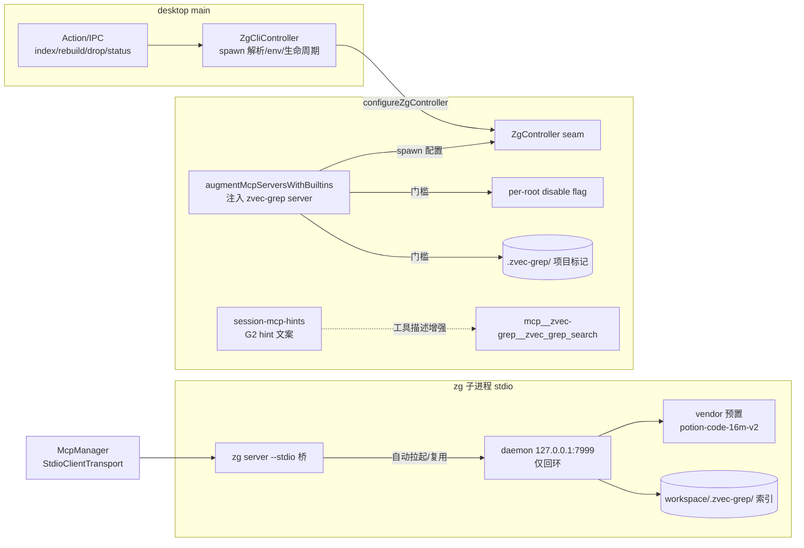

# zvec-grep（zg）语义工作区检索集成 — 技术设计

> 状态：**提案（未启动）**——2026-09-02 调研定稿；P0 Windows 验证通过后方进入实施。
> 上游：https://github.com/zvec-ai/zvec-grep （npm `@zvec/zvec-grep`，Apache-2.0，Node ≥22）

## 0. 背景与调研结论

### 0.1 zg 是什么

阿里 2026-08 底开源的本地优先检索 CLI + MCP server（当前 v0.2.1）。把三层检索统一进一个入口：

| 层       | 底层                           | 适用                           |
| -------- | ------------------------------ | ------------------------------ |
| 精确匹配 | managed ripgrep（免索引）      | 已知符号/字符串/正则，穷尽核验 |
| 词法排序 | BM25 + jieba 分词（FTS）       | 多词组合、按相关性排序         |
| 语义发现 | HNSW 向量（zvec 嵌入式向量库） | 模糊意图、不知道命名           |

索引侧用 Tree-sitter 抽取符号/签名/scope/注释/breadcrumb/行区间；Markdown 按标题层级切分；
长实体拆 outline/major + evidence fragments；embedding 输入拼结构元数据（≤25% 预算）。
混合查询拆 FTS + vector 两路召回，应用层 RRF（k=60）融合，命中 fragment 折叠回 public entity，
返回按文件分组、带行号的紧凑文本结果（专为塞进 Agent 上下文设计）。
增量索引以文件为单位；server 模式带 FS watcher + 每小时全量对账。

上游自报 SWE-QA-Bench 配对实验（Claude Code + Opus，复现脚本开源）：输入 token -47%、
工具调用 -59%、评审分 +1.5。第三方独立评测（v0.2.0 读源码 + 实测）结论与我们的判断一致：
**zg 管"入口发现"，rg 管精确核验，CodeGraph 管显式关系和多跳路径**——三者分工，不互斥。

### 0.2 我们的检索栈与缺口

现有四层（已确认代码位置）：

| 层            | 载体                                                                             | 覆盖                                        |
| ------------- | -------------------------------------------------------------------------------- | ------------------------------------------- |
| 穷尽文本匹配  | bash + rg（内置工具）                                                            | 已知词/正则，无索引                         |
| 结构导航      | CodeGraph（`@colbymchenry/codegraph`，MCP 注入 + hints）                         | 符号/调用链/影响面，`.codegraph/` 索引      |
| LSP 符号语义  | Serena（`--context ide-assistant`，仅暴露语义符号工具）                          | 精准符号定位/引用/语义编辑/诊断，实时无索引 |
| 风险/架构分析 | CRG（code-review-graph，uv 跑 Python；MCP server 已退役，改 CrgGraphQuery 直读） | 风险评分/影响半径                           |

**缺口**：没有"模糊意图 → 工作区定位"的 embedding 语义内容检索层。Granite routing 只做
skill/tool 召回（不碰工作区内容），memory 的 BM25 只管会话记忆。"恢复主题偏好"→`hydratePreferences`
这类查询目前只能靠 LLM 多轮 rg 猜关键词 + read 拼上下文。非代码内容（Markdown/文档/中文）检索同为空白。

### 0.3 上游成熟度风险

- v0.2.x，2026-08 底才开源，CLI 面/API 可能变动 → 版本钉死 + adapter 单文件隔离。
- 测试认真（c8 覆盖率 80% 门禁 + e2e + MCP conformance），Windows x64 在支持列表，
  但官方 benchmark 均为 macOS/Linux 环境 → Windows daemon 表现必须 P0 实测。

## 1. 目标与非目标

**目标**

1. 补齐语义内容检索层：自然语言描述意图，一次 `zvec_grep_search` 拿到带行号的定位结果。
2. 以内置 MCP server 形态接入，复用现有 stdio 传输、controller-seam、per-root 开关、
   plugin-mcp-view 列表、G2 hints 全套既有机制，core 不新增传输层代码。
3. 全程本地：embedding 用本地 Model2Vec（potion-code-16m-v2），不配置任何远程 provider，
   不产生任何数据出域路径。

**非目标（明确不做）**

- 不接 zg 的 managed rg（我们的 bash+rg 已覆盖，避免工具重复）。
- 不暴露 `full` MCP toolset（索引管理工具不给 Agent，索引生命周期归 UI/宿主）。
- 不接远程 embedding（qwen API 路径完全不配置；elicitation 授权流因此不存在）。
- 不替换 CodeGraph/Serena/rg 任何一层。

## 2. 总体架构

数据流：Agent 发起 `zvec_grep_search` → McpManager 经 stdio 桥 → daemon（autoUpdate 增量刷新

- 每小时对账）→ RRF 融合结果按文件分组返回。索引的创建/重建只由用户在 UI 显式触发；
  `.zvec-grep/` 目录存在才注册 server（未索引项目完全无感，Agent 看不到该工具）。

## 3. 接入点详设（文件级）

### 3.1 core 侧（薄壳 + seam，仿 serena-mcp 模式）

| 文件                                               | 改动                                                                                                                                                                                                 |
| -------------------------------------------------- | ---------------------------------------------------------------------------------------------------------------------------------------------------------------------------------------------------- |
| `packages/core/src/common/zg.ts`（新）             | `ZG_MCP_SERVER_NAME = "zvec-grep"`；`hasZgProject(root)`（探测 `<root>/.zvec-grep/`）；per-root disable flag（`setZgDisabled`/`isZgDisabled`，照 crg.ts 薄壳模式）                                   |
| `packages/core/src/actions/zg-controller.ts`（新） | `ZgController` 接口：`buildMcpServerConfig(projectRoot): McpServerConfig \| null`、`indexProject/rebuild/drop/status`；`configureZgController`/`getZgController` seam（照 serena-controller.ts）     |
| `packages/core/src/session-manager-mcp.ts`         | `augmentMcpServersWithBuiltins` 增加一段：`hasZgProject && !isZgDisabled && 用户无同名配置` 时注入 `getZgController()?.buildMcpServerConfig(root)`（门槛组合与 Serena 块同构；配置为 null 则不注册） |
| `packages/core/src/session-mcp-hints.ts`           | `ZG_TOOL_HINTS`：`zvec_grep_search: "（工作区语义/混合检索，模糊意图、不知道命名时优先；已知符号用 codegraph/serena，已知词直接 rg）"`                                                               |
| `packages/core/src/index.ts`                       | 导出上述符号                                                                                                                                                                                         |
| `packages/core/src/tests/zg.test.ts`（新）         | 门槛组合单测：有/无标记、禁用开关、用户同名配置优先、controller 为 null 不注册（仿 codegraph.test.ts）                                                                                               |

### 3.2 desktop 侧（adapter + 生命周期）

| 文件                                                 | 改动                                                                                                                                                                                                                                                                                                                                                                                                                                                                                                                                                                                                          |
| ---------------------------------------------------- | ------------------------------------------------------------------------------------------------------------------------------------------------------------------------------------------------------------------------------------------------------------------------------------------------------------------------------------------------------------------------------------------------------------------------------------------------------------------------------------------------------------------------------------------------------------------------------------------------------------- |
| `packages/desktop/package.json`                      | `"@zvec/zvec-grep": "0.2.1"`（**钉死，不带 ^**）；确认 optionalDependencies（node-llama-cpp）不进产物                                                                                                                                                                                                                                                                                                                                                                                                                                                                                                         |
| `packages/desktop/src/main/tools/zg-cli.ts`（新）    | `ZgCliController`，全部 spawn/config 逻辑集中于此：① spawn 三级兜底（`moduleRequire.resolve` → 系统 Node 22 经 `resolveModernNode` → npx），运行命令为 zg 的 stdio 入口；② env 注入：`ZVEC_GREP_HOME`→app dirs（与用户全局 `~/.zvec-grep` 隔离）、`ZVEC_GREP_MODEL_CACHE`→vendor 预置模型目录、`ZVEC_GREP_EMBEDDING=local/potion-code-16m-v2`、`ZVEC_GREP_MCP_TOOLSET=agent`、`ZVEC_GREP_DEVICE=cpu`；③ `indexProject/rebuild/drop`（`zg index` direct 模式，进度回报）；④ daemon 生命周期：首查询前桥会自动拉起，app quit 钩子补 `zg server off` 防 daemon 泄漏，就绪探测用 `zg server status --check-ready` |
| `packages/desktop/src/main/index.ts`                 | 启动区 `configureZgController(new ZgCliController({...}))`（vendor/模型根路径 host 注入，layer rules：core 不得自行推导）；quit 钩子接线                                                                                                                                                                                                                                                                                                                                                                                                                                                                      |
| `packages/desktop/vendor/zg/`（新，vendor 脚本产出） | 预置 potion-code-16m-v2 模型文件（约 30MB）+ `.vendored-zg-model` 版本标记；`scripts/vendor-zg-model.js`（download 型，仿 vendor-granite 模式）                                                                                                                                                                                                                                                                                                                                                                                                                                                               |

### 3.3 索引生命周期与 IPC

| 文件                                           | 改动                                                                                                                                                                                                                |
| ---------------------------------------------- | ------------------------------------------------------------------------------------------------------------------------------------------------------------------------------------------------------------------- |
| `packages/desktop/src/shared/ipc.ts`           | `ZgStatusEntry` 类型 + `ZgIndex/ZgReindex/ZgDrop/ZgStatus` request（仿 CodegraphList 系列）                                                                                                                         |
| `packages/desktop/src/main/session-bridge.ts`  | 四个 IPC 方法：Index/Reindex 走 action 系统（`index.build-all`/`codegraph.reindex` 旁），Status 解析 `zg status --json`；`pluginUpdateMcpDisabled` 里接 `setZgDisabled`（与 setCrgDisabled/setSerenaDisabled 并排） |
| `packages/desktop/src/main/plugin-mcp-view.ts` | builtin 列表加 `zvec-grep` 条目（enabled 默认取 disable flag 反值，照 Serena 条目）                                                                                                                                 |

### 3.4 产品面

| 文件                                                  | 改动                                                                                                            |
| ----------------------------------------------------- | --------------------------------------------------------------------------------------------------------------- |
| 设置页/插件 MCP 页签                                  | zvec-grep 开关（机制现成）；索引状态卡进知识库 tab 的 `KnowledgeSourceStatus`（索引状态/fragment 数/freshness） |
| `renderer/i18n/messages.ts` + ja/ko/zh-hk/zh-tw       | 新增字符串                                                                                                      |
| `scripts/check-licenses.js` / `ThirdPartyNotices.txt` | 补 Apache-2.0 条目                                                                                              |
| `.gitignore` 引导 / 文档                              | 用户项目应忽略 `.zvec-grep/`（同 `.codegraph/` 先例）；file-history 排除该目录                                  |

## 4. 关键决策与理由

1. **stdio 桥而非直连 HTTP**：`McpManager` 仅支持 `StdioClientTransport`/`InMemoryTransport`
   （见 mcp-manager.ts），为 zg 加 HTTP transport 成本高；`zg server --stdio` 是上游为
   stdio-only host 官方提供的桥（自动拉起/重连 daemon），零新协议代码。
2. **npm 依赖而非 vendor clone**：zg 纯 npm 分发，与 `@colbymchenry/codegraph` 接入方式完全同构
   （resolve + npx 兜底），不走 `vendor-src/` git clone。仅模型文件 vendor（避免首次索引联网）。
3. **版本钉死 0.2.1**：上游太新，CLI 面可能变动；adapter 集中隔离全部 CLI 调用面，升级只改一个文件。
4. **系统 Node 22 而非 Electron 内置 Node**：zg 依赖 `@zvec/zvec`（原生二进制）、tree-sitter wasms、
   `@vscode/ripgrep`，走 Electron ABI 有重编译风险；复用 `resolveModernNode()`（codegraph 的
   node:sqlite 同款先例）。P0 首先验证。
5. **项目标记门槛**（照抄 CodeGraph 模式）：未建索引的项目不注册 server，Agent 看不到工具；
   索引创建是用户显式动作（成本知情），不做后台自动全量索引。
6. **embedding 仅本地 potion-code-16m-v2**：Model2Vec 静态查表，CPU 即可，约 30MB（对比 Granite
   118MB 轻）；不配 provider 则远程授权路径整体不存在，隐私红线由架构保证而非配置约束。
7. **`ZVEC_GREP_HOME` 隔离**：daemon 状态/日志/模型缓存落 app dirs，不与用户自装的全局 zg
   互相踩（也避免读用户个人配置里的远程 provider）。

## 5. 四层检索分工（写进 G2 hint 与工具描述）

| 场景                               | 首选                 | 说明                                                           |
| ---------------------------------- | -------------------- | -------------------------------------------------------------- |
| 已知词/正则/错误串穷尽搜索         | bash + rg            | zg 的 MCP 默认工具集也不暴露 rg 工具，上游同样认为这是 rg 领地 |
| 已知符号：定位/引用/改名/安全编辑  | Serena               | 实时 LSP，无索引新鲜度问题                                     |
| 调用链/多跳路径/影响面             | CodeGraph            | 动态分派跳数可跟；zg 不做结构关系                              |
| 风险评分/架构分析                  | CRG 直读             | zg 不做                                                        |
| **模糊意图/不知道命名/跨文件综合** | **zvec_grep_search** | 本次补齐的层                                                   |
| 中文文档/Markdown/非代码内容       | zvec_grep_search     | jieba BM25 + 标题切分                                          |

## 6. 风险与对策

| 风险                                   | 对策                                                                             |
| -------------------------------------- | -------------------------------------------------------------------------------- |
| 上游 0.2.x API/CLI 变动                | 钉死版本；`zg-cli.ts` 单文件隔离 CLI 面；升级=改一处                             |
| 原生模块 Electron ABI 不兼容           | 一律系统 Node 22 子进程；P0 第一项验证                                           |
| daemon 泄漏/多实例                     | app quit 钩子 `zg server off`；上游 root-lease 单实例保证；`ZVEC_GREP_HOME` 隔离 |
| 首次索引联网下载模型                   | vendor 预置 potion 模型 + `ZVEC_GREP_MODEL_CACHE` 指向                           |
| 索引体积/性能未知                      | P0 在本仓库实测耗时/体积；`zg status` 暴露 truncated_fragments                   |
| Windows daemon 稳定性（中文/空格路径） | P0 实测；异常时降级为 `zg query` CLI（bash 直调）仍可用                          |
| 四层工具选择混乱                       | 单工具 toolset + G2 hint + §5 分工表；P3 后观察会话轨迹再调文案                  |
| 上游弃坑                               | Apache-2.0 + 本地索引；拆 adapter 即可移除，core 无侵入                          |

## 7. 验收标准

1. 已索引项目中，自然语言描述意图（不给符号名），1 次 `zvec_grep_search` 内返回带行号的正确文件。
2. 未索引项目完全无感：工具不出现、无后台进程、无额外文件。
3. 全程断外网可完成索引与检索（模型已 vendor）。
4. `npm run check && npm test` 全绿；core 保持 UI-free、无 console 直调。
5. 退出 app 后无残留 daemon 进程；`ZVEC_GREP_HOME` 下状态可整体删除。

## 8. P0 验证清单（spike，不写仓库代码）

- [ ] 全局安装 `@zvec/zvec-grep@0.2.1`（Windows x64，Node 22）
- [ ] 本仓库 `zg index --embedding local/potion-code-16m-v2`：耗时/索引体积/内存
- [ ] `zg server --stdio` 挂最小 MCP client：initialize/tools list/tools call 跑通
- [ ] daemon Windows 稳定性：启停 ×10、断桥重连、含中文与空格的项目路径
- [ ] 系统非 Electron Node 22 下原生依赖（zvec/tree-sitter/ripgrep）加载正常
- [ ] 5 条模糊查询 vs rg 盲猜基线的主观召回对比（含 1 条中文文档查询）
- [ ] 断网重索引（vendor 模型缓存指向后）验证全本地链路

**退出标准**：全链路通且语义召回明显优于盲猜关键词 → 进入 M1；否则止步，调研结论归档。
